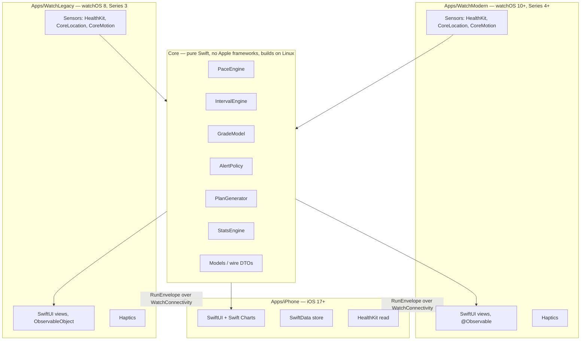
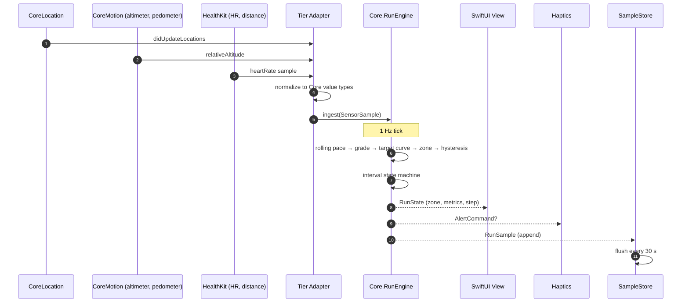
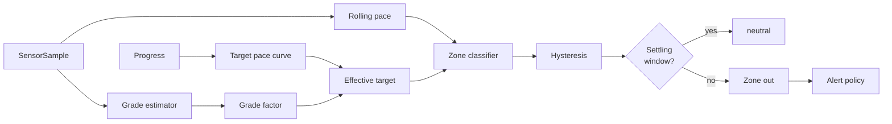
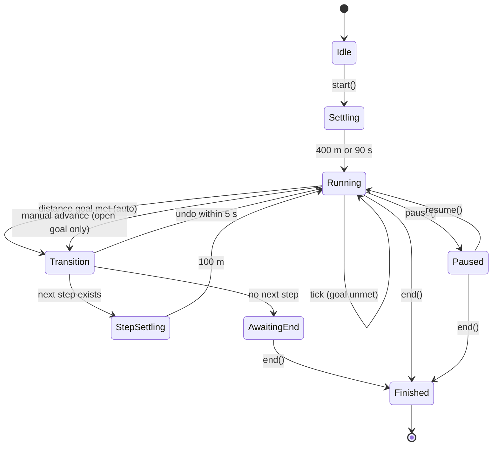

# OptimalRunner — Technical Design

| Field | Value |
|---|---|
| Document | `docs/design.md` |
| Version | 1.0 |
| Status | Draft for implementation |
| Last updated | 2026-07-24 |
| Companions | [`requirements.md`](./requirements.md), [`implementation.md`](./implementation.md) |

---

## Table of contents

1. [Architecture overview](#1-architecture-overview)
2. [Architecture decision records](#2-architecture-decision-records)
3. [Repository layout](#3-repository-layout)
4. [Units and conventions](#4-units-and-conventions)
5. [The pace engine](#5-the-pace-engine)
6. [The interval engine](#6-the-interval-engine)
7. [Alert policy](#7-alert-policy)
8. [Sensor abstraction and tier adapters](#8-sensor-abstraction-and-tier-adapters)
9. [Data models](#9-data-models)
10. [Sync protocol](#10-sync-protocol)
11. [Design system](#11-design-system)
12. [Watch UI](#12-watch-ui)
13. [iPhone app](#13-iphone-app)
14. [Plan generation](#14-plan-generation)
15. [Statistics engine](#15-statistics-engine)
16. [Testing architecture and CI](#16-testing-architecture-and-ci)
17. [Traceability map](#17-traceability-map)
18. [Open questions](#18-open-questions)

---

## 1. Architecture overview

The system is one Swift package of pure logic surrounded by three thin application shells.



### 1.1 The central idea

Every decision the product makes — what pace you should be running, what colour the screen is, whether to buzz, whether the rep is over, what your training plan looks like — is a **pure function of recorded samples and configuration**. None of it needs HealthKit, CoreLocation, SwiftUI, or a watch.

That single constraint buys almost everything else:

- The engine is testable in milliseconds on a Linux container, so CI is fast and cheap.
- The two watch tiers cannot drift in behaviour, because neither owns any judgement logic.
- Recorded runs can be replayed through the engine deterministically, so a bug report becomes a fixture.
- The Series 3 tier can be deleted in 2027 without touching a line of logic.

The application shells are deliberately dumb: they convert platform events into `Core` value types, hand them to an engine, and render the result.

### 1.2 Data flow during a run



---

## 2. Architecture decision records

Short, dated, and stated with their trade-offs. These exist so a future contributor can tell "deliberate" from "accidental".

<a id="adr-001"></a>
### ADR-001 — All judgement logic lives in a pure Swift package

**Decision.** `Core` imports only the Swift standard library and cross-platform Foundation. It never imports HealthKit, CoreLocation, CoreMotion, WatchKit, SwiftUI, or UIKit. CI enforces this by grep.

**Alternatives.** Put the engine in a shared framework that imports CoreLocation and pass `CLLocation` around directly — less conversion code, but the engine then requires a simulator to test and cannot run on Linux.

**Consequence.** A small amount of boilerplate converting `CLLocation` → `LocationSample` in each adapter, paid once per tier, in exchange for a test suite that runs in seconds on the cheapest available CI runner. Satisfies NFR-19.

<a id="adr-002"></a>
### ADR-002 — Two watch targets with zero shared UI or sensor code

**Decision.** `Apps/WatchModern` (watchOS 10.0) and `Apps/WatchLegacy` (watchOS 8.0) are separate targets with separate source trees and separate bundle identifiers. They share `Core` and nothing else. Duplication between them is accepted and intentional.

**Why not one target with availability checks.** A single watch app has exactly one deployment target. Supporting Series 3 from one target means pinning to watchOS 8 and gating every modern API behind `if #available` — precisely the conditional soup the product memo rules out, and the thing that makes an open-source codebase unreadable.

**Why not one target at watchOS 10 and drop Series 3.** Goal G-6 says Series 3 owners are a real audience, and the build window is open today ([CON-2](./requirements.md#con-2)).

**Consequence.** Some duplicated view code. Accepted, because the duplicated part is presentation, and the non-duplicated part is everything that could be wrong. When Xcode 27's SDK becomes mandatory, `rm -rf Apps/WatchLegacy` plus one CI job deletion is the entire removal.

<a id="adr-003"></a>
### ADR-003 — Percentages are defined on pace, not speed

**Decision.** Every tolerance, band, drift, and grade factor is a multiplier on **pace** (seconds per unit distance). `paceRatio = rollingPace / targetPace`; greater than 1 means slower.

**Why.** It matches how runners talk and how the product memo states it — 9:00/mi is "12.5% slower" than 8:00/mi (540/480 = 1.125). Defining bands on speed would make a "5% band" asymmetric in the units the user sees.

**Consequence.** Internal storage is still SI (`metresPerSecond` is available), but all *thresholds* are pace ratios. A single named type, `PaceRatio`, prevents accidental mixing.

<a id="adr-004"></a>
### ADR-004 — Rolling pace is distance-windowed, not time-windowed

**Decision.** Rolling pace is computed over the trailing 200 m, bounded to [20 s, 60 s].

**Why.** A fixed time window produces a window that covers wildly different distances at different speeds, so its noise characteristics change with pace — the display gets jumpier the slower you run, which is exactly backwards. A distance window holds the sample count roughly constant. The time bounds stop the window from becoming useless when stopped (upper bound) or twitchy when sprinting (lower bound).

<a id="adr-005"></a>
### ADR-005 — The prescribed pace curve is near-flat; the band absorbs the natural fast start

**Decision.** Tempo and Easy curves are flat or nearly so. Long carries a real +4% closing drift. The *band* is what accommodates the memo's observed opening-fast/closing-slow shape.

**Why.** The memo's graph describes what a tempo run looks like; the pacing literature describes what it *should* look like, and positive splits are the characteristic recreational error. Prescribing a fast opening would encode the mistake. Tolerating it avoids nagging. Both are satisfied by moving the asymmetry from the curve into the band. Full rationale in [FR-A-2](./requirements.md#fr-a-2--target-pace-curve).

**Consequence.** Users who genuinely want a drifting target can get one — Opening and Closing Offset are user-editable per run type (AC-FR-A-2-8).

<a id="adr-006"></a>
### ADR-006 — Grade adjustment attenuates Minetti rather than applying it raw

**Decision.** `factor = clamp(1 + λ·(C(g)/C(0) − 1))` with `λ_up = 0.90`, `λ_down = 0.50`, grade clamped to ±15%, factor clamped to [0.90, 1.30].

**Why.** Derived and tabulated in [§5.4](#54-grade-adjustment). Raw Minetti prescribes 5:47/mi for an 8:00/mi runner on a −6% grade and places its cost minimum near −18% grade, well below where athlete data puts the practical minimum.

<a id="adr-007"></a>
### ADR-007 — Run samples are stored as packed binary columns, not database rows

**Decision.** `RunRecord` holds a `Data` blob of parallel `Float32`/`UInt8` arrays. Rows exist only for runs and steps.

**Why.** 1 Hz × 90 min = 5 400 samples per run. At 1 000 runs that is 5.4 M rows, which SwiftData will not enjoy, and which nothing ever queries individually — samples are always read as a whole series to draw a chart. A columnar blob is ~30 KB per run compressed, decodes in single-digit milliseconds, and keeps NFR-5 achievable.

<a id="adr-008"></a>
### ADR-008 — Sync is file transfer with application-level acknowledgement

**Decision.** `WCSession.transferFile` carrying a versioned `RunEnvelope`, retained on the watch until the phone ACKs, deduplicated by `runID`.

**Why.** `sendMessage` requires live reachability, which a runner returning from a run does not have. `transferUserInfo` has size limits unsuited to a route plus 5 400 samples. File transfer is queued by the system, survives reboots, and retries on its own.

<a id="adr-009"></a>
### ADR-009 — HealthKit is the interoperability surface; the sidecar is the source of truth for OptimalRunner-specific data

**Decision.** Write a standard `HKWorkout` with route and samples so the data appears in Health and other apps. Separately, carry an OptimalRunner sidecar with zone timeline, grade factors, target curve, and step structure.

**Why.** HealthKit has no representation for "what colour was the screen" or "what was the grade-adjusted target". Storing only in HealthKit would lose the analysis; storing only in the sidecar would make the app a bad citizen.

<a id="adr-010"></a>
### ADR-010 — No backend

**Decision.** Device-local only for 1.0. SwiftData on iPhone, files on watch, no accounts.

**Why.** Route and health data are among the most sensitive categories a phone holds. Not transmitting them is the strongest privacy guarantee available and removes an entire class of security requirements from a volunteer-maintained open-source project. iCloud sync is a candidate for 2.0.

---

## 3. Repository layout

```
OptimalRunning/
├── README.md
├── LICENSE
├── CONTRIBUTING.md
├── docs/
│   ├── requirements.md
│   ├── design.md
│   ├── implementation.md
│   └── adr/                        # ADRs extracted as individual files as they grow
│
├── Core/                           # SPM package — pure Swift. Builds & tests on Linux.
│   ├── Package.swift
│   ├── Sources/
│   │   ├── ORModels/               # value types, wire DTOs, Codable envelopes
│   │   ├── ORPace/                 # rolling pace, target curve, grade, zones, hysteresis
│   │   ├── ORIntervals/            # workout plan model + step state machine
│   │   ├── ORAlerts/               # dwell/cooldown alert policy
│   │   ├── ORTraining/             # VDOT, Riegel, plan generation
│   │   ├── ORStats/                # aggregates, personal bests, time-in-zone
│   │   └── ORColor/                # palette definitions + contrast/CVD math (no UI)
│   └── Tests/
│       ├── ORPaceTests/
│       ├── ORIntervalsTests/
│       ├── ORTrainingTests/
│       ├── ORStatsTests/
│       ├── ORColorTests/
│       └── Fixtures/               # recorded traces + golden outputs
│
├── Apps/
│   ├── iPhone/
│   │   ├── OptimalRunner.xcodeproj
│   │   └── Sources/{App,Features,Persistence,Health,Transport,DesignSystem}
│   ├── WatchModern/                # watchOS 10.0+ — Series 4 and later
│   │   └── Sources/{App,Run,Intervals,Sensors,Transport,DesignSystem}
│   └── WatchLegacy/                # watchOS 8.0 — Series 3 only
│       └── Sources/{App,Run,Intervals,Sensors,Transport,DesignSystem}
│
├── Fixtures/                       # shared recorded traces (JSON), used by all test targets
│   ├── tempo-5mi-rolling.json
│   ├── intervals-4x1000.json
│   ├── hilly-10k.json
│   ├── gps-dropout-tunnel.json
│   └── treadmill-indoor.json
│
├── Tools/
│   ├── check-no-availability.sh    # CON-3 gate
│   ├── check-core-imports.sh       # ADR-001 gate
│   ├── check-traceability.swift    # requirement ↔ task gate
│   └── replay/                     # CLI: replay a fixture through the engine
│
└── .github/workflows/
    ├── core.yml                    # Linux, fast
    ├── apps.yml                    # macOS, builds + simulator tests
    ├── legacy.yml                  # macOS, pinned Xcode 26, watchOS 8 build
    └── gates.yml                   # lint + the three checker scripts
```

Each of `Core/Sources/*`, `Apps/*`, and `Fixtures/` carries a `README.md` stating what belongs there and what does not — satisfying NFR-22 and making ADR-002's separation legible to a newcomer.

---

## 4. Units and conventions

| Concept | Internal type | Unit | Notes |
|---|---|---|---|
| Distance | `Double` | metres | Never miles internally |
| Duration | `Double` | seconds | |
| Pace | `Pace` | seconds per metre | Displayed as min/mi or min/km |
| Speed | derived | m/s | Only for HealthKit interop |
| Grade | `Double` | dimensionless | 0.05 = 5%, not 5.0 |
| Altitude | `Double` | metres | Relative to session start |
| Ratio / factor | `PaceRatio` | dimensionless | > 1 = slower |
| Progress | `Double` | dimensionless | clamped [0, 1] |

```swift
/// Seconds per metre. The single pace representation in the system.
public struct Pace: Hashable, Comparable, Codable, Sendable {
    public let secondsPerMetre: Double

    public init(secondsPerMetre: Double) { self.secondsPerMetre = secondsPerMetre }
    public init(minutesPerMile: Double)  { self.secondsPerMetre = minutesPerMile * 60 / 1609.344 }
    public init(minutesPerKilometre: Double) { self.secondsPerMetre = minutesPerKilometre * 60 / 1000 }

    public var minutesPerMile: Double { secondsPerMetre * 1609.344 / 60 }
    public var minutesPerKilometre: Double { secondsPerMetre * 1000 / 60 }
    public var metresPerSecond: Double { 1 / secondsPerMetre }

    /// Scales pace by a ratio. `ratio > 1` yields a slower pace. See ADR-003.
    public func scaled(by ratio: PaceRatio) -> Pace {
        Pace(secondsPerMetre: secondsPerMetre * ratio.value)
    }
}

/// A dimensionless multiplier on pace. Values above 1 mean slower.
public struct PaceRatio: Hashable, Comparable, Codable, Sendable {
    public let value: Double
    public static let identity = PaceRatio(value: 1.0)
    /// `PaceRatio(percentSlower: 12.5)` == 1.125 — the memo's worked example.
    public init(percentSlower p: Double) { self.value = 1 + p / 100 }
    public init(value: Double) { self.value = value }
}
```

**Every tunable constant lives in `PaceEngineConfiguration`** (NFR-21), a single `Codable` struct with a documented default and a validated range per field. Nothing in the engine reads a literal.

---

## 5. The pace engine

This is the product. It is a pure pipeline evaluated at 1 Hz.



### 5.1 Rolling pace

Implements [FR-A-1](./requirements.md#fr-a-1--rolling-pace-estimation). A ring buffer of accepted samples; the window is the trailing 200 m subject to time bounds.

```swift
public struct RollingPaceEstimator {
    let config: RollingPaceConfiguration   // windowMetres 200, minSeconds 20, maxSeconds 60,
                                           // maxHorizontalAccuracy 20, smoothing 0.30

    /// Returns nil when the window is not yet valid, or the runner is stationary.
    public mutating func ingest(_ sample: DistanceSample) -> Pace?
}
```

Rules:

1. **Reject** samples with `horizontalAccuracy > 20 m` or `< 0` (AC-FR-A-1-2). Rejected samples still advance cumulative distance if that distance came from a trusted source (pedometer or HealthKit), but never define the window's endpoints.
2. **Window selection.** Walk back from the newest sample until either 200 m or 60 s is spanned. If the span is under 20 s, extend until 20 s is covered. If fewer than two valid samples remain, return `nil`.
3. **Raw pace** = `windowElapsedSeconds / windowDistanceMetres`.
4. **Smooth** with an EWMA, `α = 0.30`, giving roughly a 15 s effective response — responsive enough to feel live, damped enough not to chase GPS noise.
5. **Stationary detection.** Window distance < 5 m over ≥ 5 s ⇒ return `nil`, and the zone becomes `neutral` (AC-FR-A-1-5). This is what stops the display reading "48:00/mi" at a traffic light.
6. **Plausibility clamp.** Reject any computed pace outside [2:00/mi, 30:00/mi] as a sensor artefact.

Determinism (AC-FR-A-1-6) comes from the estimator holding no wall-clock or randomness — time enters only through sample timestamps.

### 5.2 Progress

```
if plannedDistance != nil  → progress = clamp(distanceCovered / plannedDistance, 0, 1)
else if plannedDuration != nil → progress = clamp(activeElapsed / plannedDuration, 0, 1)
else → progress = 0
```

`activeElapsed` excludes paused time (AC-FR-D-1-3). Progress of 0 with no plan yields a flat curve and no drift (AC-FR-A-2-7), which is the correct behaviour for an open-ended run.

### 5.3 Target pace curve

Implements [FR-A-2](./requirements.md#fr-a-2--target-pace-curve).

```swift
public struct TargetPaceCurve: Codable, Sendable {
    public let openingOffset: Double      // fraction, e.g. -0.005 = 0.5% faster at start
    public let closingOffset: Double      // fraction, e.g. +0.040 = 4% slower at finish
    public let rampStart: Double          // progress at which drift begins

    /// Piecewise: flat until rampStart, then linear to closingOffset at progress 1.
    public func drift(at progress: Double) -> Double {
        guard progress > rampStart else { return openingOffset }
        let t = (progress - rampStart) / (1 - rampStart)
        return openingOffset + (closingOffset - openingOffset) * t
    }

    public func targetPace(base: Pace, progress: Double) -> Pace {
        base.scaled(by: PaceRatio(value: 1 + drift(at: progress)))
    }
}
```

Presets (AC-FR-A-2-2 … 4):

| Run type | `openingOffset` | `closingOffset` | `rampStart` | Effect on an 8:00/mi base |
|---|---|---|---|---|
| Tempo | 0.000 | +0.015 | 0.50 | flat 8:00 → 8:07 at the finish |
| Easy / Recovery | 0.000 | 0.000 | — | flat 8:00 throughout |
| Long | 0.000 | +0.040 | 0.60 | flat 8:00 → 8:19 over the final 40% |

### 5.4 Grade adjustment

Implements [FR-A-4](./requirements.md#fr-a-4--grade-adjustment) and [ADR-006](#adr-006).

**Grade estimation.** Barometric relative altitude is precise but drifty; GPS altitude is unbiased but noisy. Use barometric deltas over a horizontal-distance window:

```
g_raw = (altitude(now) − altitude(now − 100 m of horizontal travel)) / 100
g_smooth = EWMA(g_raw, α = 0.20)
```

Then require persistence: the applied grade only moves toward `g_smooth` once `g_smooth` has stayed on the same side of the currently-applied grade by more than 0.5 percentage points for 15 s (AC-FR-A-4-2). This is what makes it respond to *a hill* rather than *a kerb*.

**Cost model.** Minetti's cost-of-running polynomial, in J·kg⁻¹·m⁻¹:

$$C(g) = 155.4g^5 - 30.4g^4 - 43.3g^3 + 46.3g^2 + 19.5g + 3.6, \qquad C(0) = 3.6$$

**Applied factor.**

$$\text{factor}(g) = \mathrm{clamp}\left(1 + \lambda_g\left(\frac{C(\mathrm{clamp}(g, -0.15, 0.15))}{3.6} - 1\right),\ 0.90,\ 1.30\right), \quad \lambda_g = \begin{cases} 0.90 & g \ge 0 \\ 0.50 & g < 0 \end{cases}$$

Resulting behaviour, with the raw ratio shown for comparison:

| Grade | Raw `C(g)/C(0)` | Applied factor | 8:00/mi target becomes | Δ |
|---:|---:|---:|---:|---:|
| −10% | 0.598 | 0.900 | 7:12 | −48 s/mi |
| −6% | 0.724 | 0.900 | 7:12 | −48 s/mi |
| −4% | 0.805 | 0.902 | 7:13 | −47 s/mi |
| −3% | 0.849 | 0.925 | 7:24 | −36 s/mi |
| −2% | 0.897 | 0.949 | 7:35 | −25 s/mi |
| −1% | 0.947 | 0.974 | 7:47 | −13 s/mi |
| **0%** | **1.000** | **1.000** | **8:00** | **0** |
| +1% | 1.055 | 1.050 | 8:24 | +24 s/mi |
| +2% | 1.113 | 1.102 | 8:49 | +49 s/mi |
| +3% | 1.174 | 1.156 | 9:15 | +75 s/mi |
| +4% | 1.236 | 1.213 | 9:42 | +102 s/mi |
| +6% | 1.369 | 1.300 | 10:24 | +144 s/mi |
| +10% | 1.658 | 1.300 | 10:24 | +144 s/mi |

**Why these λ values.** They are calibrated against published GAP behaviour in the band where nearly all road running happens. At +2% the model gives 1.102 where reported GAP is ≈1.10; at −2% it gives 0.949 where reported GAP is ≈0.95. Raw Minetti at −2% gives 0.897 — a 7:11/mi prescription that no runner would hold — and it keeps getting worse, reaching 0.50 at −20%. The downhill attenuation is heavier than the uphill because a runner can spend the full metabolic cost of a climb but cannot recover the full metabolic saving of a descent; braking forces and turnover limits bound descent speed. This satisfies AC-FR-A-4-9.

**Effective target:** `effectiveTarget = targetPaceCurve(progress) × gradeFactor`.

### 5.5 Zone classification

Implements [FR-A-3](./requirements.md#fr-a-3--pace-band-and-zone-classification).

```swift
public enum PaceZone: Int, Codable, Sendable, CaseIterable {
    case tooFast = 0, slightlyFast, onTarget, slightlySlow, tooSlow, neutral
}

public struct PaceBand: Codable, Sendable {
    public let fastFar: Double    // fraction faster than target at which we call it "too fast"
    public let fastNear: Double
    public let slowNear: Double
    public let slowFar: Double
}
```

Given `r = rollingPace / effectiveTarget`:

| Condition | Zone |
|---|---|
| `r < 1 − fastFar` | `tooFast` |
| `1 − fastFar ≤ r < 1 − fastNear` | `slightlyFast` |
| `1 − fastNear ≤ r ≤ 1 + slowNear` | `onTarget` |
| `1 + slowNear < r ≤ 1 + slowFar` | `slightlySlow` |
| `r > 1 + slowFar` | `tooSlow` |

Defaults (AC-FR-A-3-4):

| Run type | `fastNear` | `fastFar` | `slowNear` | `slowFar` | On-target range at 8:00/mi |
|---|---:|---:|---:|---:|---|
| Tempo | 2.0% | 5.0% | 2.0% | 5.0% | 7:50 – 8:10 |
| Easy / Recovery | 3.0% | 6.0% | 6.0% | 12.0% | 7:46 – 8:29 |
| Long | 2.5% | 5.5% | 5.0% | 10.0% | 7:48 – 8:24 |

Easy's asymmetry is the point: the fast side is tight because running easy days too hard is the error that actually costs people their training; the slow side is loose because running easy days slower is nearly free.

**Hysteresis** (AC-FR-A-3-6/7). Each boundary is widened by `h = 0.005` in the direction that would *keep* the current zone:

```swift
func classify(ratio: Double, band: PaceBand, previous: PaceZone, h: Double) -> PaceZone {
    // Boundaries shift outward from whichever zone we are currently in, so leaving
    // a zone requires exceeding its edge by h; re-entering requires only the edge.
    let candidate = rawClassify(ratio, band)
    guard candidate != previous else { return previous }
    let edge = sharedBoundary(previous, candidate, band)
    return abs(ratio - edge) > h ? candidate : previous
}
```

### 5.6 Settling window

Implements [FR-A-5](./requirements.md#fr-a-5--settling-window). Zone is forced to `neutral` until `stepDistance ≥ 400 m || stepElapsed ≥ 90 s`. Applied at run start and, with a shorter 100 m threshold, at every step start in an Interval workout (AC-FR-C-5-4). Metrics render normally throughout; only the *judgement* is withheld.

### 5.7 Engine surface

```swift
public struct RunEngine {
    public init(configuration: PaceEngineConfiguration, plan: WorkoutPlan, profile: RunnerProfile)

    /// Pure. Same inputs always produce the same outputs.
    public mutating func tick(_ input: EngineInput) -> EngineOutput
}

public struct EngineInput: Sendable {
    public let timestamp: TimeInterval        // seconds since session start
    public let cumulativeDistance: Double     // metres
    public let location: LocationSample?
    public let relativeAltitude: Double?      // metres
    public let heartRate: Double?             // bpm
    public let isPaused: Bool
    public let manualAdvanceRequested: Bool
}

public struct EngineOutput: Sendable {
    public let zone: PaceZone
    public let rollingPace: Pace?
    public let averagePace: Pace?
    public let effectiveTarget: Pace?
    public let gradeFactor: PaceRatio
    public let smoothedGrade: Double
    public let step: StepState
    public let stepTransition: StepTransition?
    public let alert: AlertCommand?
    public let sample: RunSample
}
```

`tick` is the only entry point. Everything the UI shows and everything the run records comes out of it. Tests drive it with arrays of `EngineInput` and assert on arrays of `EngineOutput`.

---

## 6. The interval engine

Implements [Epic C](./requirements.md#epic-c--structured-and-vo2-max-workouts-p0).

### 6.1 Plan model

```swift
public struct WorkoutPlan: Codable, Sendable {
    public let runType: RunType               // .tempo .easy .long .interval .vo2max
    public let elements: [PlanElement]
}

public indirect enum PlanElement: Codable, Sendable {
    case step(Step)
    case repeatBlock(count: Int, elements: [PlanElement])
}

public struct Step: Codable, Sendable {
    public let kind: StepKind                 // .warmup .work .recovery .cooldown
    public let goal: StepGoal                 // .open .distance(metres) .time(seconds)
    public let target: StepTarget?            // nil ⇒ no colouring for this step
}
```

The memo's canonical VO2 max workout:

```swift
WorkoutPlan(runType: .vo2max, elements: [
    .step(Step(kind: .warmup, goal: .open, target: nil)),
    .repeatBlock(count: 4, elements: [
        .step(Step(kind: .work,     goal: .distance(1000), target: nil)),
        .step(Step(kind: .recovery, goal: .distance(1000), target: nil)),
    ]),
    .step(Step(kind: .cooldown, goal: .open, target: nil)),
])
```

`target: nil` throughout is what produces the memo's required no-colour VO2 max screen (AC-FR-C-4-2). An Interval workout is structurally identical but may carry targets per step.

Flattening expands repeat blocks into a linear `[ResolvedStep]` with `repIndex` and `repCount` attached, so the runtime state machine never recurses and the UI can say "rep 3 of 4".

### 6.2 State machine



Rules that matter:

- **Per-step distance** is measured from the step's own start offset, so rounding never accumulates across reps (AC-FR-C-2-4). `stepDistance = cumulativeDistance − stepStartDistance`.
- **Auto-advance** fires within one tick of `stepDistance ≥ goalMetres` (AC-FR-C-2-3). Because ticks are 1 Hz and a runner covers ~4–6 m/s, the 1 s bound is what makes NFR-9's ±15 m achievable; the countdown in the final 100 m (AC-FR-C-2-7) covers the rest.
- **Manual advance is refused on closed goals** (AC-FR-C-3-4). A tap during a 1000 m rep does nothing. This is the guard that makes full-screen tap safe.
- **Undo** (FR-C-6) keeps one step of history — the previous step's start distance and start time — and restores it wholesale.
- **Pause** freezes elapsed and step-elapsed but not cumulative distance, so a paused runner who drifts forward does not accrue step progress.

### 6.3 VO2 max mode

VO2 max is `RunType.vo2max`, not a flag. The distinction propagates:

| Behaviour | Interval | VO2 max |
|---|---|---|
| Zone colouring | per-step, when the step has a target | never — always neutral |
| Pace haptics | yes | no |
| Transition haptics | yes | yes |
| Metric stack | full | full, plus step / rep / distance-remaining |

---

## 7. Alert policy

Implements [Epic B](./requirements.md#epic-b--alerts-and-haptics-p0). A small state machine, entirely pure, so the "does it nag?" question is answerable by a unit test.

```swift
public struct AlertPolicy {
    let dwell: TimeInterval = 20        // continuous time in a far zone before firing
    let cooldown: TimeInterval = 60     // minimum gap between alerts of the same direction

    public mutating func evaluate(zone: PaceZone, now: TimeInterval, suppressed: Bool) -> AlertCommand?
}

public enum AlertCommand: Sendable {
    case paceTooFast(current: Pace, target: Pace)
    case paceTooSlow(current: Pace, target: Pace)
    case stepTransition(from: ResolvedStep, to: ResolvedStep)
    case workoutComplete
}
```

Transitions:

1. Zone enters `tooFast` or `tooSlow` → start a dwell timer.
2. Zone leaves the far zone → cancel the dwell timer, reset (AC-FR-B-1-5).
3. Dwell reaches 20 s → emit exactly one command, start the cooldown.
4. During cooldown → suppress alerts of that direction; the opposite direction may still fire.
5. `suppressed` is true during the settling window, while paused, in VO2 max mode, and when the user has disabled pace haptics (AC-FR-B-1-4/7).

The AC-FR-B-1-8 bound falls out arithmetically: with a 60 s cooldown, one hour admits at most 60 alerts of a given direction, and the 20 s dwell means a signal oscillating every 25 s never accumulates enough continuous time to fire at all.

**Haptic mapping.** `tooFast` → a descending "slow down" pattern; `tooSlow` → an ascending "speed up" pattern; step transitions → a distinct notification pattern. The three are deliberately dissimilar so they are distinguishable without looking (AC-FR-B-1-3, AC-FR-C-2-2).

**Background delivery** (AC-FR-B-1-6) requires an active `HKWorkoutSession` *and* `UIBackgroundModes` containing `audio` in the watch app's `Info.plist`. Both tiers need this; it is a checklist item in `implementation.md`, not something the engine can enforce.

**Warning screen** (FR-B-2). Presented only when the display is on and not luminance-reduced (AC-FR-B-2-5) — a warning nobody can see should not be queued for later, because by the time it is visible it is stale. Auto-dismiss at 4 s; tap or crown rotation dismisses immediately ([CON-1](./requirements.md#con-1)). Step transitions outrank pace warnings in presentation (AC-FR-B-2-6).

---

## 8. Sensor abstraction and tier adapters

`Core` declares what it needs; each tier supplies it. This is the seam that makes ADR-002 work.

```swift
public protocol RunSensorFeed: AnyObject {
    var onSample: ((EngineInput) -> Void)? { get set }
    func start(activity: RunActivityKind) throws
    func pause()
    func resume()
    func stop() async throws -> WorkoutSummary
    var capabilities: SensorCapabilities { get }
}

public struct SensorCapabilities: Sendable {
    public let hasAltimeter: Bool
    public let hasGPS: Bool
    public let hasAlwaysOnDisplay: Bool
    public let supportsNativeActivitySegmentation: Bool
    public let supportsDoubleTap: Bool
}
```

### 8.1 Tier divergence matrix

This table is normative (AC-FR-K-1-3) and must be kept accurate in review.

| Concern | `Apps/WatchModern` (watchOS 10) | `Apps/WatchLegacy` (watchOS 8) |
|---|---|---|
| Observation | `@Observable` macro | `ObservableObject` + `@Published` |
| Navigation | `NavigationStack` | `NavigationView` |
| Interval segmentation in HealthKit | `HKWorkoutSession.beginNewActivity` | `HKWorkoutEvent(type: .segment)` |
| Speed metric | `HKQuantityTypeIdentifier.runningSpeed` where available, else derived | derived from location + pedometer |
| Always-on | `isLuminanceReduced`-aware dimmed variants | not applicable — no AOD hardware |
| Manual advance | tap, Double Tap (Series 9+), crown detent | tap, crown detent |
| Concurrency | `async`/`await` throughout | `async`/`await` (available on watchOS 8) with completion-handler bridges for older HealthKit APIs |
| Charts in-app | none (watch shows no charts) | none |

### 8.2 Distance fusion

Both tiers fuse three distance sources, in priority order:

1. **HealthKit `distanceWalkingRunning`** from the live workout builder — Apple's own fused estimate, best available.
2. **CoreLocation** cumulative horizontal distance — used when HealthKit lags, and required for the route.
3. **CMPedometer** — the fallback for GPS loss (DEG-1) and the only source indoors (DEG-10).

The adapter emits a single `cumulativeDistance`; `Core` never learns which source produced it. Source is recorded in the sample for post-run diagnostics and to flag degraded runs.

---

## 9. Data models

### 9.1 Wire format — `RunEnvelope`

The versioned payload the watch sends to the phone (ADR-008/009).

```swift
public struct RunEnvelope: Codable, Sendable {
    public static let currentSchemaVersion = 1

    public let schemaVersion: Int
    public let runID: UUID                    // idempotency key (AC-FR-E-1-3)
    public let deviceTier: DeviceTier         // .modern | .legacy
    public let appVersion: String

    public let startedAt: Date
    public let endedAt: Date
    public let runType: RunType
    public let plan: WorkoutPlan?
    public let profileSnapshot: RunnerProfile // paces as they were at run time
    public let configSnapshot: PaceEngineConfiguration

    public let healthKitWorkoutUUID: UUID?
    public let summary: RunSummary
    public let steps: [StepSummary]
    public let zoneTimeline: [ZoneSpan]       // run-length encoded (AC-FR-D-2-3)
    public let samples: PackedSamples         // columnar (ADR-007)
    public let route: [RoutePoint]?
    public let degradations: [DegradationFlag]
}
```

Snapshotting the profile and configuration is deliberate: a run analysed six months later must be interpretable against the targets that were actually in force, not today's.

### 9.2 Packed samples

```swift
public struct PackedSamples: Codable, Sendable {
    public let count: Int
    public let startTimestamp: Date
    public let intervalSeconds: Double        // 1.0 nominal

    // Parallel columns, each `count` elements, little-endian, compressed together.
    public let cumulativeDistance: Data       // Float32 metres
    public let rollingPace: Data              // Float32 s/m, NaN where undefined
    public let heartRate: Data                // UInt8 bpm, 0 = missing
    public let relativeAltitude: Data         // Float32 metres
    public let smoothedGrade: Data            // Int8, grade × 200 (0.5% resolution)
    public let gradeFactor: Data              // UInt8, (factor − 0.85) × 255
    public let effectiveTarget: Data          // Float32 s/m
    public let zone: Data                     // UInt8 raw value
}
```

A 90-minute run is 5 400 samples × ~19 bytes ≈ 103 KB raw, ~30 KB compressed — comfortably inside AC-FR-D-2-4's 1 MB budget with room for the route.

### 9.3 SwiftData schema (iPhone)

```swift
@Model final class RunRecord {
    @Attribute(.unique) var runID: UUID
    var startedAt: Date
    var endedAt: Date
    var runTypeRaw: Int
    var deviceTierRaw: Int

    // Denormalized for list & aggregate queries — never recomputed from samples.
    var distanceMetres: Double
    var activeSeconds: Double
    var averagePaceSecondsPerMetre: Double
    var averageHeartRate: Double?
    var maxHeartRate: Double?
    var elevationGainMetres: Double
    var timeInZoneSeconds: [Double]        // indexed by PaceZone.rawValue

    @Attribute(.externalStorage) var packedSamples: Data
    @Attribute(.externalStorage) var routeData: Data?

    var isDegraded: Bool
    var degradationFlags: [String]

    @Relationship(deleteRule: .cascade) var steps: [StepRecord]
    @Relationship var route: SavedRoute?
    @Relationship var planItem: PlannedWorkout?
}

@Model final class StepRecord {
    var index: Int
    var kindRaw: Int
    var repIndex: Int
    var repCount: Int
    var distanceMetres: Double
    var activeSeconds: Double
    var averagePaceSecondsPerMetre: Double
    var averageHeartRate: Double?
    var maxHeartRate: Double?
    var elevationChangeMetres: Double
}

@Model final class RunnerProfileRecord { /* target paces, units, palette, fitness score */ }
@Model final class TrainingPlanRecord   { /* goal, dates, phases */ }
@Model final class PlannedWorkout       { /* date, plan, completion link */ }
@Model final class SavedRoute           { /* name, polyline, distance, elevation */ }   // P2
@Model final class SavedLap             { /* route ref, repeat count */ }               // P2
@Model final class AggregateCache       { /* lifetime & periodic totals, PBs */ }
```

`@Attribute(.externalStorage)` keeps the sample blobs out of the main store file, so list queries never page them in — this is what makes AC-FR-F-1-3 and NFR-5 achievable.

---

## 10. Sync protocol

```mermaid
sequenceDiagram
    autonumber
    participant W as Watch
    participant FS as Watch file store
    participant WC as WatchConnectivity
    participant P as iPhone
    participant DB as SwiftData

    Note over W: run ends
    W->>FS: write RunEnvelope.json.gz (atomic)
    W->>W: mark pending
    W->>WC: transferFile(url, metadata: {runID, schemaVersion})

    alt phone reachable
        WC->>P: didReceive file
        P->>P: validate schemaVersion
        alt major version unknown
            P-->>W: NACK {runID, reason: unsupportedSchema}
            Note over P: surface a message, never crash (AC-FR-E-1-4)
        else understood
            P->>DB: upsert by runID (idempotent)
            P->>P: update AggregateCache incrementally
            P-->>WC: applicationContext {acked: [runID]}
            WC-->>W: ACK
            W->>FS: delete payload
        end
    else phone unreachable
        Note over WC: system queues; retries on reconnect
    end

    Note over W: storage pressure
    W->>FS: evict oldest ACKed first; never evict unACKed (AC-FR-E-1-5)
```

**Recovery path** (AC-FR-E-1-6). If a payload is lost, the phone can reconstruct a degraded `RunRecord` from the `HKWorkout` alone — distance, duration, heart rate, route — flagged `isDegraded`, with zone timeline and grade data absent. The run detail view renders what it has and says what is missing rather than showing a blank chart.

**Profile and plan flow the other way** via `updateApplicationContext`, which is a latest-value-wins channel — exactly right for a profile, where only the newest matters (AC-FR-I-1-6, AC-FR-G-1-3).

---

## 11. Design system

### 11.1 Zone palette

The memo's palette, with hex values chosen to hit the contrast requirement in [FR-J-1](./requirements.md#fr-j-1--colour-is-never-the-only-channel). All text on zone backgrounds is pure white or pure black, whichever wins contrast, and the choice is fixed per zone.

Every value below is verified against the 4.5:1 requirement; the measured ratio is shown so a future change can be checked against the same bar.

| Zone | Name | Hex | Text | Ratio | Dimmed (AOD) | Text | Ratio |
|---|---|---|---|---:|---|---|---:|
| `tooFast` | Red | `#C1121F` | white | 6.22 | `#5A0A10` | white | 14.14 |
| `slightlyFast` | Amber | `#E8A33D` | black | 9.74 | `#6B4A1A` | white | 8.02 |
| `onTarget` | Green | `#1B7F4C` | white | 5.02 | `#0C3A23` | white | 12.76 |
| `slightlySlow` | Turquoise | `#238180` | white | 4.64 | `#134746` | white | 10.41 |
| `tooSlow` | Blue | `#1D5FA8` | white | 6.45 | `#0D2B4C` | white | 14.31 |
| `neutral` | Graphite | `#2B2F33` | white | 13.49 | `#141618` | white | 18.14 |

Two values are worth explaining, because both are the kind of thing that gets "corrected" back:

- **`tooFast` is not the brand red.** The logo's `#E63946` reaches only 4.17:1 against white — below the bar. `#C1121F` is the nearest darker red that clears it at 6.22:1.
- **`slightlyFast` flips text colour when dimmed.** Black on amber is right at full brightness (9.74:1) but only 2.62:1 once dimmed, because the dimmed amber is dark. White on the dimmed value gives 8.02:1. Text colour is therefore a property of (zone, luminance state), not of zone alone.

### 11.2 Colour-vision-deficiency palette

Selectable at onboarding (AC-FR-J-2-3). An orange↔blue diverging scale on a **dark centre**: the two alarm states are bright, and `onTarget` — the state a runner is in most of the time — is near-black.

| Zone | Hex | Text | Ratio | Dimmed | Text | Ratio |
|---|---|---|---:|---|---|---:|
| `tooFast` | `#FB923C` | black | 9.28 | `#803B03` | white | 8.25 |
| `slightlyFast` | `#9A3412` | white | 7.31 | `#411608` | white | 15.64 |
| `onTarget` | `#1F2937` | white | 14.68 | `#0D1117` | white | 18.92 |
| `slightlySlow` | `#1E40AF` | white | 8.72 | `#0D1B4A` | white | 16.50 |
| `tooSlow` | `#7DD3FC` | black | 12.60 | `#046A9B` | white | 5.93 |
| `neutral` | `#57534E` | white | 7.63 | `#55504A` | white | 7.98 |

The dark centre is a deliberate inversion of the usual light-centred diverging scale, and it earns its place three times over: it puts maximum lightness on the states that need attention, it keeps the most common state easy on the eyes at night, and it spreads lightness widely across the five steps — which is exactly what makes the palette survive colour-vision deficiency.

`neutral` is a warm stone grey rather than the standard palette's graphite. Graphite sits only ΔE 7.8 from this palette's near-black `onTarget`, which would make "settling" and "on target" indistinguishable — the one confusion a runner cannot afford, since it is the difference between "the app is judging me" and "the app is not".

### 11.3 Colour is verified, not eyeballed

`ORColor` is pure maths in `Core` with no UI dependency, so the palette is unit-testable (AC-FR-J-1-4, AC-FR-J-2-2):

- **Contrast** — WCAG relative luminance and contrast ratio; assert ≥ 4.5:1 for every (palette × zone × luminance-state) pairing against its designated text colour. All 24 pairings above are verified; the lowest is 4.64:1.
- **CVD separation** — Viénot–Brettel–Mollon simulation for protanopia, deuteranopia, and tritanopia, converted to CIELAB, asserting ΔE\*ab between every pair of zone colours in the **CVD palette**: ≥ 20 for normal variants, ≥ 15 for dimmed. Measured worst cases are 23.2 (normal, protanopia) and 18.2 (dimmed, protanopia), so both thresholds hold with margin.
- **Dimmed separation** — the same ΔE assertion across dimmed variants of both palettes, threshold 15 (AC-FR-A-6-7). The standard palette's tightest dimmed pair is 16.3.

**One caveat, stated plainly so the test is not over-trusted.** ΔE\*ab includes the lightness term, so two colours that a dichromat cannot distinguish *by hue* can still score a healthy ΔE purely because one is lighter. The default palette scores respectably under simulated deuteranopia for exactly that reason, and it is still the wrong palette for a red-green dichromat to rely on. The ΔE gate therefore proves *distinguishability given the lightness spread we designed in* — it does not prove hue discrimination, and it is not a substitute for either the alternate palette or the redundant glyph and delta. That is why [FR-J-1](./requirements.md#fr-j-1--colour-is-never-the-only-channel) makes redundant encoding unconditional rather than something the CVD palette switches on.

These tests run in the fast Linux lane. A contributor who "improves" a colour and breaks accessibility finds out in 40 seconds.

### 11.4 Redundant encoding

Every zone screen carries, independent of colour (AC-FR-J-1-1/2):

| Zone | Glyph | Caption |
|---|---|---|
| `tooFast` | ⏬ | `SLOW DOWN` + signed delta |
| `slightlyFast` | 🔽 | `EASE OFF` + signed delta |
| `onTarget` | ⏺ | `ON TARGET` |
| `slightlySlow` | 🔼 | `PICK IT UP` + signed delta |
| `tooSlow` | ⏫ | `SPEED UP` + signed delta |
| `neutral` | ⏸ | `SETTLING` / `PAUSED` |

Rendered as SF Symbols, not emoji.

---

## 12. Watch UI

### 12.1 Page structure

Both tiers use a paged layout mirroring the stock Workout app, which is what makes the End gesture safe and familiar ([CON-1](./requirements.md#con-1), AC-FR-A-6-9):

```
◀ Controls  │  Metrics (default)  │  Now Playing ▶
```

- **Controls** — Pause / Resume, End, Lap. Reached by swiping right. End requires this deliberate navigation.
- **Metrics** — the full-screen zone colour. Tap advances open-goal steps.
- **Now Playing** — system-provided.

### 12.2 Metrics page

Layout, top to bottom (AC-FR-A-6-2), over the edge-to-edge zone fill:

```
┌─────────────────────────┐
│        12:34            │  elapsed
│      ♥ 162 bpm          │  heart rate
│                         │
│   ⏺  7:58 /mi           │  rolling pace + zone glyph
│      ON TARGET          │  zone caption
│      target 8:00        │  effective target (shows ⛰ when grade-adjusted)
│                         │
│      avg 8:03 /mi       │  average pace
│      3.42 mi            │  distance
└─────────────────────────┘
```

During a structured workout, a step header replaces the caption line: `WORK · REP 3/4 · 340 m to go`.

Always-on (AC-FR-A-6-6): under `isLuminanceReduced`, the zone colour switches to its dimmed variant, elapsed time and rolling pace stay at full weight, and heart rate, average pace, and distance drop to 40% opacity. The colour remains the dominant fill — that is the requirement.

### 12.3 Warning screen

Full-bleed zone colour, the glyph at maximum size, the direction word, then `current → target` and the signed delta. Auto-dismisses at 4 s; tap or crown dismisses. Never shown while dimmed.

### 12.4 Transition screen

On step change: `1000 m WORK` → `1000 m RECOVERY`, with the completed step's time and average pace, for 3 s. Takes priority over pace warnings.

---

## 13. iPhone app

### 13.1 Structure

```
Tab 1  Runs        list → detail (charts, splits, steps, map)
Tab 2  Statistics  lifetime + periodic totals, weekly chart, personal bests
Tab 3  Plan        today's workout, training plan, scheduling        [P1]
Tab 4  Library     routes, laps, custom workouts                     [P2]
Tab 5  Profile     paces, units, palette, haptics, band tuning
```

MVVM with `@Observable` view models; SwiftData accessed through repository types so the engine-facing code stays testable without a store.

### 13.2 Run detail

Swift Charts, sharing one x-axis (distance, or time by toggle):

1. **Pace vs distance** — actual pace line, target curve, band as a shaded area. Compliance is visible without reading a number (AC-FR-F-2-1).
2. **Heart rate** — overlaid on the same axis (AC-FR-F-2-2).
3. **Elevation** — with raw and grade-adjusted target where adjustment applied (AC-FR-F-2-3).
4. **Time in zone** — horizontal stacked bar plus a table with seconds and percentage (AC-FR-F-2-4).
5. **Splits** — per mile or km (AC-FR-F-2-6).
6. **Steps** — for structured workouts, a table of every rep (AC-FR-F-2-5).
7. **Map** — route polyline coloured by zone (AC-FR-F-2-7).

Charts downsample to at most 1 000 points using largest-triangle-three-buckets, which preserves visual shape far better than naive decimation and keeps AC-FR-F-2-8's 1 s budget.

---

## 14. Plan generation

Implements [FR-G-2](./requirements.md#fr-g-2--training-plan-generation). Pure logic in `ORTraining`, therefore fully unit-testable.

### 14.1 Fitness estimation

1. Find the best recent effort across the trailing 8 weeks, considering every rolling segment at 5 k, 10 k, half, and marathon distances (reusing the personal-best machinery from §15).
2. Normalize to an equivalent 10 k time with **Riegel**: `T₂ = T₁ × (D₂/D₁)^1.06`. Accurate to roughly 2–3% between adjacent distances; degrades across large extrapolations, which is why the trailing window prefers the nearest distance to the goal.
3. Convert to a **VDOT**-style fitness score and derive training paces: Easy (59–74% of vVO₂max), Marathon (~84%), Threshold (~88%), Interval (~98%), Repetition (>100%).
4. If no adequate effort exists, ask for a recent race result (AC-FR-G-2-2).

### 14.2 Periodization

| Phase | Share of weeks | Content |
|---|---|---|
| Base | 40% | Easy volume, 1 quality session/week, long run grows |
| Build | 35% | 2 quality sessions/week — threshold + intervals |
| Peak | 15% | Race-specific work, highest volume, longest long run |
| Taper | 10%, min 1 wk, max 3 wk | Volume falls monotonically; intensity retained |

### 14.3 Constraints, enforced not suggested

These are invariants the generator must satisfy, each with a matching property test (§16.3):

- No week increases volume more than 10% over the previous (AC-FR-G-2-5).
- Every fourth week is a down week at −25% (AC-FR-G-2-6).
- Every week contains at least one full rest day (AC-FR-G-2-7).
- Long run is 20–30% of weekly volume, capped at 150 minutes (AC-FR-G-2-8).
- Taper volume is monotonically non-increasing (AC-FR-G-2-9).
- Quality sessions are never on consecutive days.

If the goal cannot be reached inside these bounds, the generator returns `.infeasible(reason:suggestions:)` rather than a plan (AC-FR-G-2-10). Offering someone an unsafe ramp because they typed an ambitious date is the one failure mode here with a physical cost.

---

## 15. Statistics engine

### 15.1 Incremental aggregates

Recomputing lifetime totals from 1 000 runs on every screen open cannot meet NFR-5. `AggregateCache` holds lifetime, yearly, monthly, and weekly totals; ingest applies a delta. A `rebuildAll()` path exists for migrations and for repairing drift, invoked explicitly and never on a UI path (AC-FR-F-3-5).

### 15.2 Personal bests

Best efforts are computed as the fastest **rolling segment** of each benchmark distance within any run, not merely from runs whose total distance matched (AC-FR-F-3-4) — a 5 k PB inside a 10 k run counts, which is what runners expect.

Two-pointer sweep over the cumulative-distance column: O(n) per run per benchmark distance, computed once at ingest and stored. Six benchmark distances × 5 400 samples is trivial work at ingest and zero work at read.

---

## 16. Testing architecture and CI

The testing strategy follows directly from ADR-001: because everything that can be *wrong* is pure, almost everything can be tested without a simulator.

### 16.1 The pyramid

| Layer | What | Where it runs | Runtime |
|---|---|---|---|
| **Unit** | `Core` — pace, zones, grade, intervals, alerts, plans, stats, colour | Linux container | < 30 s |
| **Golden replay** | Recorded traces → full engine → assert against stored output | Linux container | < 60 s |
| **Property** | Invariants over generated inputs | Linux container | < 60 s |
| **Integration** | Adapters against HealthKit/CoreLocation fakes | watchOS + iOS simulators | ~5 min |
| **Snapshot** | SwiftUI views, per tier, per palette, per zone | iOS/watchOS simulators | ~4 min |
| **UI** | Critical flows end to end | simulators | ~8 min, merge-to-main only |

### 16.2 Golden replay tests

The highest-value tests in the project. A fixture is a recorded JSON trace of `EngineInput` values; the golden file is the corresponding `EngineOutput` series.

```
Fixtures/
├── tempo-5mi-rolling.json        realistic tempo with the memo's drift shape
├── intervals-4x1000.json         the canonical VO2 max session
├── hilly-10k.json                ±8% grades — exercises grade adjustment
├── gps-dropout-tunnel.json       90 s of no GPS — exercises DEG-1
├── treadmill-indoor.json         pedometer only — exercises DEG-10
├── stop-start-traffic.json       repeated stops — exercises stationary handling
└── boundary-oscillation.json     pace hovering on a zone edge — exercises hysteresis
```

Each asserts:
- the zone timeline matches the golden exactly;
- the alert command sequence matches exactly — this is the regression test for "does it nag";
- step transitions occur at the expected distances within tolerance;
- output is bit-identical across repeated runs (AC-FR-A-1-6).

Regenerating goldens is a deliberate act: `swift run replay --update-goldens`, which produces a reviewable diff. A PR that changes a golden without explaining why is a red flag a reviewer can actually see.

Fixtures are also the bug-report format. "The screen went red on my hill" becomes a fixture, a failing test, and then a fix.

### 16.3 Property tests

Invariants that must hold for *all* inputs:

| Property | Statement |
|---|---|
| Zone monotonicity | Holding target fixed, increasing pace never moves the zone toward the fast end |
| Hysteresis stability | A pace series confined within `h` of a boundary produces at most one zone change |
| Alert bound | For any zone series over duration `T`, alert count ≤ `T / cooldown` per direction |
| Grade symmetry | `factor(0) == 1.0` exactly; `factor` is monotonically non-decreasing in grade |
| Grade bounds | `factor(g) ∈ [0.90, 1.30]` for all real `g`, including NaN and infinite input |
| Step conservation | Sum of step distances equals total distance; sum of step active time equals total active time |
| Machine termination | Any input sequence drives the interval machine to `Finished` without deadlock |
| Undo correctness | advance-then-undo restores state identical to pre-advance |
| Plan volume | No generated plan violates the 10% rule, the rest-day rule, or taper monotonicity |
| Plan feasibility | For any infeasible request, the generator returns `.infeasible` and never a plan |
| Pace round-trip | `Pace(minutesPerMile:).minutesPerMile` round-trips within 1e-9 |
| Packing round-trip | `PackedSamples` decode∘encode is identity within each column's stated resolution |

### 16.4 Tier equivalence tests

AC-FR-K-1-2 requires both watch tiers to produce identical engine output. Both tiers' test targets run the same fixtures through their own adapter into the shared engine and assert against the *same* golden files. If a tier diverges, that build fails, and only that tier's.

### 16.5 CI workflows

**`core.yml` — the fast lane. Runs on every push.**

```yaml
name: Core
on: [push, pull_request]
jobs:
  test:
    runs-on: ubuntu-latest
    container: swift:6.1
    steps:
      - uses: actions/checkout@v4
      - run: swift build --package-path Core
      - run: swift test --package-path Core --enable-code-coverage
      - name: Coverage gate (NFR-18)
        run: Tools/coverage-gate.sh Core 85
```

Running the bulk of the suite on Linux rather than a macOS runner is a deliberate cost and latency decision: it is roughly ten times cheaper per minute and starts far faster, and ADR-001 is what makes it possible.

**`gates.yml` — the structural gates. Runs on every push.**

```yaml
name: Gates
on: [push, pull_request]
jobs:
  gates:
    runs-on: ubuntu-latest
    steps:
      - uses: actions/checkout@v4
      - name: No availability conditionals in watch targets (CON-3)
        run: Tools/check-no-availability.sh
      - name: Core imports no Apple frameworks (ADR-001)
        run: Tools/check-core-imports.sh
      - name: Requirements are traceable to tasks
        run: swift Tools/check-traceability.swift
      - uses: realm/SwiftLint@v1
```

`check-core-imports.sh` is four lines and catches an entire class of architectural erosion:

```bash
#!/usr/bin/env bash
set -euo pipefail
if grep -rnE '^import (HealthKit|CoreLocation|CoreMotion|WatchKit|SwiftUI|UIKit)' Core/Sources; then
  echo "::error::Core must not import Apple frameworks (ADR-001)"; exit 1
fi
```

**`apps.yml` — simulator builds and tests. Runs on PR and main.**

Matrix over `{iPhone iOS 17, WatchModern watchOS 10}`, using `xcodebuild build-for-testing` then `test-without-building` so the build is shared across test invocations. Snapshot tests run here.

**`legacy.yml` — the Series 3 lane. Runs on PR and main.**

```yaml
name: Legacy (Series 3)
on: [push, pull_request]
jobs:
  build:
    runs-on: macos-15
    steps:
      - uses: actions/checkout@v4
      - uses: maxim-lobanov/setup-xcode@v1
        with:
          xcode-version: '26.x'      # Xcode 27 drops watchOS 8 targets — see CON-2
      - run: |
          xcodebuild build-for-testing \
            -project Apps/WatchLegacy/OptimalRunnerLegacy.xcodeproj \
            -scheme OptimalRunnerLegacy \
            -destination 'platform=watchOS Simulator,name=Apple Watch Series 4 (40mm),OS=8.5'
```

The Xcode version is **pinned**, with the reason in a comment. When this job starts failing because runners no longer carry Xcode 26, that is the signal from [R-1](./requirements.md#11-risks) that the Legacy tier's window has closed — a planned event with a planned response, not a surprise.

### 16.6 What is deliberately not automated

Honest about the limits: GPS accuracy, battery consumption (NFR-6/7), haptic perceptibility, and always-on legibility in sunlight cannot be tested in CI. These get a written manual protocol in `Tools/manual-test-protocol.md`, executed before each release on real hardware — one Series 3, one Series 7 or later — with results recorded in the release PR.

---

## 17. Traceability map

| Requirement group | Component | Primary tests |
|---|---|---|
| FR-A-1 | `ORPace.RollingPaceEstimator` | `RollingPaceTests`, golden replay |
| FR-A-2 | `ORPace.TargetPaceCurve` | `TargetCurveTests`, property: monotonic drift |
| FR-A-3 | `ORPace.ZoneClassifier` | `ZoneTests`, property: hysteresis stability |
| FR-A-4 | `ORPace.GradeModel` | `GradeTests` (incl. the §5.4 table), `hilly-10k` golden |
| FR-A-5 | `ORPace.SettlingWindow` | `SettlingTests` |
| FR-A-6 | tier `RunView` | snapshot × tier × palette × zone |
| FR-B-1/2 | `ORAlerts.AlertPolicy` | `AlertPolicyTests`, property: alert bound |
| FR-C-1…6 | `ORIntervals.StepMachine` | `StepMachineTests`, `intervals-4x1000` golden |
| FR-D-* | tier `WorkoutController`, `SampleStore` | integration + durability tests |
| FR-E-* | `Transport` both sides | integration: transfer, ACK, dedupe, eviction |
| FR-F-* | iPhone `RunDetail`, `StatsEngine` | `StatsTests`, snapshot, perf tests |
| FR-G-* | `ORTraining.PlanGenerator` | `PlanTests`, property: volume invariants |
| FR-H-* | iPhone `Library` | unit + snapshot |
| FR-I-* | `ORModels.RunnerProfile` | unit + sync integration |
| FR-J-* | `ORColor` | contrast + CVD ΔE tests |
| FR-K-* | both tiers | tier equivalence tests, `gates.yml` |
| NFR-1…5 | — | XCTest performance baselines |
| NFR-6/7 | — | manual protocol (§16.6) |
| NFR-18/19 | — | `gates.yml`, `core.yml` |

---

## 18. Open questions

Flagged for the product owner. None block starting implementation; each has a stated default so work proceeds either way.

| # | Question | Default if unanswered |
|---|---|---|
| Q-1 | Should the Legacy watch app ship as a separate App Store listing, or stay a buildable-from-source target only? | Separate listing, own bundle ID. Revisit if review friction is high. |
| Q-2 | Should tempo runs default to a *flat* curve (ADR-005) or reproduce the memo's opening-fast shape? | Flat, per ADR-005; user-editable either way. |
| Q-3 | Should easy-run bands stay asymmetric, given it means the screen goes blue less readily than red? | Asymmetric. It encodes the coaching intent. |
| Q-4 | Is 20 s the right alert dwell, or should it scale with run type? | 20 s flat for 1.0; revisit after real-world use. |
| Q-5 | Should strides — very short, very fast reps — be a distinct run type? The README mentions them. | Model as an Interval preset for 1.0; promote to a run type if the ergonomics are poor. |
| Q-6 | iCloud sync between iPhone and iPad, or device-local forever? | Device-local for 1.0 (ADR-010). |
