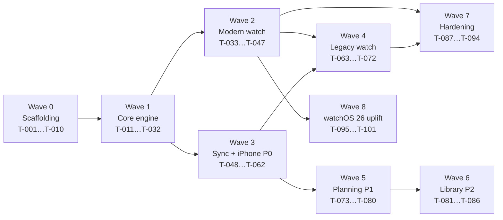

# OptimalRunner — Implementation Plan

| Field | Value |
|---|---|
| Document | `docs/implementation.md` |
| Version | 1.0 |
| Status | Ready to execute |
| Last updated | 2026-07-24 |
| Companions | [`requirements.md`](./requirements.md), [`design.md`](./design.md) |

---

## 0. How to execute this plan

This document is written to be executed by agents working sequentially or concurrently. Each task is self-contained: it names its inputs, its outputs, its dependencies, the requirements it satisfies, and how it is proven done.

### Task contract

Every task carries this block:

| Field | Meaning |
|---|---|
| **ID** | `T-###`. Stable forever. Never reuse or renumber. |
| **Wave** | Which dependency wave it belongs to. Tasks in the same wave with no listed dependency on each other are safe to run concurrently. |
| **Depends on** | Task IDs that must be `completed` first. |
| **Satisfies** | Requirement IDs from `requirements.md`. |
| **Touches** | Paths this task is allowed to create or modify. **A task must not modify paths outside this list** — this is what makes concurrent execution safe. |
| **Done when** | Objective, checkable completion conditions. |

### Rules for concurrent agents

1. **Respect `Touches`.** Two tasks in the same wave never list overlapping paths. If you need to modify a file outside your `Touches` list, stop and raise it rather than editing — the plan is wrong and needs amending.
2. **One task, one PR, one branch** named `t-###-short-slug`.
3. **Never mark a task done with a failing or skipped test.** A blocked task stays `in_progress` and gets a new task describing the blocker.
4. **Never edit golden fixture files to make a test pass.** Regenerating a golden is a deliberate act with a written justification in the PR body (see [T-031](#t-031)).
5. **Tunable constants go in `PaceEngineConfiguration`, never inline** (NFR-21). A literal in engine logic is a review rejection.

### Wave overview

### Milestone mapping

| Milestone | Waves | Tasks | Ships |
|---|---|---|---|
| M1 — Pace core | 0, 1, 2 | T-001…T-047 | Modern watch: tempo/easy/long with colour, haptics, grade adjustment |
| M2 — Analysis hub | 3 | T-048…T-062 | Sync + iPhone run list, detail, global statistics |
| M3 — Intervals | 1, 2 | included above | VO2 max and interval workouts |
| M4 — Legacy tier | 4 | T-063…T-072 | Series 3 app |
| M5 — Planning | 5 | T-073…T-080 | Training plans, today's workout |
| M6 — Library | 6 | T-081…T-086 | Routes, laps, custom workouts |
| Release | 7 | T-087…T-094 | Hardening, performance, manual protocol |
| M7 — watchOS 26 uplift | 8 | T-095…T-101 | Modern watch on a watchOS 26 floor; Double Tap; Legacy frozen ([ADR-014](./design.md#adr-014), [ADR-015](./design.md#adr-015)) |

---

## Wave 0 — Scaffolding and gates

Everything here is prerequisite. **T-001 must complete before anything else.** T-002 through T-010 can then run concurrently.

### T-001 — Create the repository skeleton

| | |
|---|---|
| **Wave** | 0 |
| **Depends on** | — |
| **Satisfies** | NFR-20, NFR-22 |
| **Touches** | `Core/Package.swift`, `Core/Sources/**/README.md`, `Apps/*/README.md`, `Fixtures/README.md`, `Tools/README.md`, `README.md`, `CONTRIBUTING.md`, `.gitignore` |

Create the directory layout from `design.md` §3. Create `Core/Package.swift` declaring the seven library targets (`ORModels`, `ORPace`, `ORIntervals`, `ORAlerts`, `ORTraining`, `ORStats`, `ORColor`) and their test targets, with `swift-tools-version: 6.0` and **no external dependencies**. Each source directory gets a placeholder file so SwiftPM resolves. Each directory gets a `README.md` stating what belongs there and what does not.

Update the root `README.md` with the GitHub description, a build-from-clean-clone section, and the architecture summary. Add the logo as `Assets/running_man_heart.svg`.

**Done when:** `swift build --package-path Core` succeeds on Linux and macOS; every directory in the layout exists with a README; a clean clone builds following only the README.

### T-002 — Core CI workflow

| | |
|---|---|
| **Wave** | 0 |
| **Depends on** | T-001 |
| **Satisfies** | NFR-18, NFR-19 |
| **Touches** | `.github/workflows/core.yml`, `Tools/coverage-gate.sh` |

Implement `core.yml` per `design.md` §16.5: Ubuntu container, `swift build`, `swift test --enable-code-coverage`, then `coverage-gate.sh` failing under 85% line coverage on `Core`.

`coverage-gate.sh` parses `llvm-cov export` JSON, excludes test targets, and prints a per-target table so a coverage failure names the culprit.

**Done when:** the workflow runs green on Linux; deliberately deleting a test drops coverage and fails the gate.

### T-003 — Structural gate scripts

| | |
|---|---|
| **Wave** | 0 |
| **Depends on** | T-001 |
| **Satisfies** | CON-3, NFR-18, NFR-14, NFR-15, AC-FR-K-1-5 |
| **Touches** | `.github/workflows/gates.yml`, `Tools/check-no-availability.sh`, `Tools/check-core-imports.sh`, `Tools/check-no-network.sh`, `.swiftlint.yml` |

Implement the gate scripts from `design.md` §16.5 and wire them into `gates.yml` with SwiftLint.

- `check-no-availability.sh` fails if `#available` or `@available(watchOS` appears under `Apps/WatchModern` or `Apps/WatchLegacy`.
- `check-core-imports.sh` fails if `Core/Sources` imports any Apple framework.
- `check-no-network.sh` fails if any target imports `Network`, references `URLSession`, or declares an `NSAppTransportSecurity` key. This is the mechanical enforcement of the no-backend, no-telemetry guarantee (NFR-14, NFR-15) — a promise that is only credible if something checks it on every push.

**Done when:** all three scripts exit 0 on the clean tree; each fails with a clear `::error::` message when a violation is deliberately introduced in a scratch commit; all three are wired into `gates.yml`.

### T-004 — Traceability checker

| | |
|---|---|
| **Wave** | 0 |
| **Depends on** | T-001 |
| **Satisfies** | §12 of `requirements.md` |
| **Touches** | `Tools/check-traceability.swift` |

A script that parses `requirements.md` for all `FR-*`/`NFR-*` IDs and `implementation.md` for all `Satisfies` entries, then fails if any P0 requirement has no covering task, or any task cites a non-existent requirement ID.

**Done when:** the checker passes against these three documents as written; introducing a bogus requirement ID in a task fails it; deleting a task's coverage of a P0 requirement fails it.

### T-005 — App project scaffolding

| | |
|---|---|
| **Wave** | 0 |
| **Depends on** | T-001 |
| **Satisfies** | §4.1 of `requirements.md`, ADR-002 |
| **Touches** | `Apps/iPhone/**`, `Apps/WatchModern/**`, `Apps/WatchLegacy/**` (project files and Info.plists only) |

Create three Xcode projects with correct deployment targets: iPhone iOS 17.0, WatchModern watchOS 10.0, WatchLegacy watchOS 8.0. Separate bundle identifiers. Each links `Core` via a local package reference.

Both watch targets get `UIBackgroundModes` containing `workout-processing` and `audio` in `Info.plist` — the latter is what permits background haptics (AC-FR-B-1-6) and is easy to omit and hard to debug later.

Add HealthKit, location, and motion usage descriptions with text explaining *why* each is needed.

**Done when:** all three targets build empty and launch in their simulators; `plutil` confirms the background modes and usage descriptions in both watch targets.

### T-006 — App CI workflows

| | |
|---|---|
| **Wave** | 0 |
| **Depends on** | T-005 |
| **Satisfies** | NFR-18 |
| **Touches** | `.github/workflows/apps.yml` |

`apps.yml`: matrix over iPhone (iOS 17 simulator) and WatchModern (watchOS 10 simulator), using `build-for-testing` + `test`.

**`legacy.yml` is out of scope for this task and this MVP.** It has nothing to build against — `Apps/WatchLegacy` does not exist until Wave 4 — so creating it here would be no-op CI for a target that isn't there, which is the exact thing a reviewer would (rightly) flag. It moves to Wave 4, alongside whichever task first creates `Apps/WatchLegacy` (see the note at the top of that wave).

**Done when:** the workflow runs green against the real iPhone and WatchModern projects — build *and* test, not build-for-testing alone, now that the projects genuinely exist (T-005) and have a passing scaffolding test each.

### T-007 — Units and pace primitives

| | |
|---|---|
| **Wave** | 0 |
| **Depends on** | T-001 |
| **Satisfies** | AC-FR-A-1-4, ADR-003, NFR-24 |
| **Touches** | `Core/Sources/ORModels/Units/**`, `Core/Tests/ORModelsTests/UnitsTests.swift` |

Implement `Pace`, `PaceRatio`, `UnitPreference`, and formatting helpers per `design.md` §4.

**Done when:** `PaceRatio(percentSlower: 12.5).value == 1.125` exactly; `Pace(minutesPerMile: 8).scaled(by: PaceRatio(percentSlower: 12.5))` formats as `9:00 /mi`; round-trip property test passes within 1e-9; formatting is correct for both mile and kilometre preferences.

### T-008 — Engine configuration type

| | |
|---|---|
| **Wave** | 0 |
| **Depends on** | T-007 |
| **Satisfies** | NFR-21 |
| **Touches** | `Core/Sources/ORModels/Configuration/**`, `Core/Tests/ORModelsTests/ConfigurationTests.swift` |

`PaceEngineConfiguration`: one `Codable, Sendable` struct holding every tunable from `requirements.md` and `design.md`, each with its documented default and a `validate()` that rejects out-of-range values. Include a `.default` and per-run-type band/curve presets.

**Done when:** every constant marked *(tunable)* in `requirements.md` has a field here; `validate()` rejects each out-of-range value with a specific error; the type round-trips through JSON.

### T-009 — Core domain models

| | |
|---|---|
| **Wave** | 0 |
| **Depends on** | T-007 |
| **Satisfies** | AC-FR-A-7-1, AC-FR-I-1-1 |
| **Touches** | `Core/Sources/ORModels/Domain/**`, `Core/Tests/ORModelsTests/DomainTests.swift` |

`RunType`, `StepKind`, `StepGoal`, `PaceZone`, `RunnerProfile`, `SensorCapabilities`, `DegradationFlag`, `LocationSample`, `EngineInput`, `RunSample`.

**Not `EngineOutput`** — see [ADR-011](./design.md#adr-011). It embeds `StepState`/`StepTransition` (`ORIntervals`) and `AlertCommand` (`ORAlerts`), so it cannot live in `ORModels` without creating a dependency cycle; it is built alongside `RunEngine` in T-031 instead.

> **Gap filled in Wave 3.** `RunSummary` and `StepSummary` were declared here with nothing able to
> *build* one, and three call sites need them — both watch tiers when a run ends, and the phone's
> degraded backfill. Three implementations of "how much climb was that?" would disagree, and the
> disagreement would surface as a run whose lifetime totals shift depending on which path produced
> it. `ORStats/Summary/RunSummaryBuilder` and `ORPace/Engine/StepSummaryAccumulator` now own those
> derivations; `RunSensorFeed` was the same kind of gap and is covered in `design.md` §8.

**Done when:** all types are `Codable, Sendable, Hashable`; `PaceZone` has all six cases; JSON round-trip tests pass for every type.

### T-010 — Fixture format and replay CLI

| | |
|---|---|
| **Wave** | 0 |
| **Depends on** | T-009 |
| **Satisfies** | AC-FR-A-1-6, §16.2 of `design.md` |
| **Touches** | `Tools/replay/**`, `Fixtures/README.md`, `Core/Sources/ORModels/Fixtures/**` |

Define the on-disk fixture format (a JSON array of `EngineInput` plus metadata) and the golden format (a JSON array of the asserted subset of `EngineOutput`). Build `swift run replay` supporting `--fixture`, `--golden`, `--update-goldens`, and `--print-timeline`.

`--update-goldens` must produce a human-reviewable diff, not an opaque blob — this is what makes rule 4 enforceable.

**Done when:** the CLI replays a hand-written 60-sample fixture and prints a zone timeline; `--update-goldens` writes a golden that a subsequent run matches exactly.

---

## Wave 1 — The core engine

The heart of the product. **T-011 through T-030 are highly parallel** — each owns a distinct source directory. T-031/032 integrate.

### T-011 — Rolling pace estimator

| | |
|---|---|
| **Wave** | 1 |
| **Depends on** | T-008, T-009 |
| **Satisfies** | FR-A-1 (all ACs) |
| **Touches** | `Core/Sources/ORPace/RollingPace/**`, `Core/Tests/ORPaceTests/RollingPaceTests.swift` |

Implement `RollingPaceEstimator` per `design.md` §5.1: distance-windowed at 200 m, time-bounded [20 s, 60 s], accuracy rejection above 20 m, EWMA α = 0.30, stationary detection, plausibility clamp.

**Done when:** a constant-8:00/mi synthetic trace converges to 8:00 ± 1 s within 30 s; samples with accuracy 50 m provably do not move the output; a 5 s stop yields `nil`; two identical runs of the suite produce identical output; every AC in FR-A-1 has a named test.

### T-012 — Target pace curve

| | |
|---|---|
| **Wave** | 1 |
| **Depends on** | T-008 |
| **Satisfies** | FR-A-2 (all ACs) |
| **Touches** | `Core/Sources/ORModels/Configuration/**`, `Core/Tests/ORPaceTests/ConformanceTests.swift` |

Implement `TargetPaceCurve` and the three presets from `design.md` §5.3. Lives in `ORModels`, not `ORPace/TargetCurve` — see [ADR-011](./design.md#adr-011): `PaceEngineConfiguration.curves: [RunType: TargetPaceCurve]` requires it.

**Done when:** Tempo yields 8:00 at progress 0.5 and 8:07 at progress 1.0 from an 8:00 base; Easy is flat at every progress; Long yields 8:00 at 0.6 and 8:19 at 1.0; progress-0 with no plan yields no drift; a property test confirms drift is monotonic in progress.

### T-013 — Progress calculator

| | |
|---|---|
| **Wave** | 1 |
| **Depends on** | T-009 |
| **Satisfies** | AC-FR-A-2-5, AC-FR-A-2-6, AC-FR-A-2-7 |
| **Touches** | `Core/Sources/ORPace/Progress/**`, `Core/Tests/ORPaceTests/ProgressTests.swift` |

Distance-based when a planned distance exists, time-based on planned duration otherwise, 0 when neither. Excludes paused time.

**Done when:** all three modes are tested; progress clamps to [0, 1]; a run paused for 10 minutes shows progress unchanged across the pause.

### T-014 — Grade estimator

| | |
|---|---|
| **Wave** | 1 |
| **Depends on** | T-008, T-009 |
| **Satisfies** | FR-A-4, AC-FR-A-4-1, AC-FR-A-4-2, AC-FR-A-4-6 |
| **Touches** | `Core/Sources/ORPace/Grade/Estimator/**`, `Core/Tests/ORPaceTests/GradeEstimatorTests.swift` |

Barometric relative altitude over a 100 m horizontal window, EWMA α = 0.20, plus the 15 s persistence requirement before an applied-grade change.

**Done when:** a synthetic 4% climb converges to 0.04 ± 0.005 within 100 m; a single 2 m altitude spike over 5 m of travel does not move the applied grade; absent altitude input, the estimator reports unavailable rather than 0.

### T-015 — Grade adjustment model

| | |
|---|---|
| **Wave** | 1 |
| **Depends on** | T-008 |
| **Satisfies** | FR-A-4, AC-FR-A-4-3, AC-FR-A-4-4, AC-FR-A-4-5, AC-FR-A-4-9, NFR-11, CON-6, ADR-006 |
| **Touches** | `Core/Sources/ORPace/Grade/Model/**`, `Core/Tests/ORPaceTests/GradeModelTests.swift` |

Implement the Minetti polynomial and the attenuated, clamped factor from `design.md` §5.4.

**Done when:** the full §5.4 table is encoded as a test with 0.001 tolerance; `factor(0) == 1.0` exactly; the factor is monotonically non-decreasing in grade across [−0.5, 0.5]; NaN and ±infinity inputs return 1.0 rather than propagating; the output is clamped to [0.90, 1.30] for all real inputs.

### T-016 — Zone classifier and hysteresis

| | |
|---|---|
| **Wave** | 1 |
| **Depends on** | T-008 |
| **Satisfies** | FR-A-3 (all ACs) |
| **Touches** | `Core/Sources/ORPace/Zones/**`, `Core/Sources/ORModels/Configuration/**`, `Core/Tests/ORPaceTests/ConformanceTests.swift` |

Six-zone classifier with four asymmetric thresholds and 0.5% boundary hysteresis, per `design.md` §5.5. The classifier logic (`ZoneClassifier`) lives in `ORPace/Zones`; the `PaceBand` type it consumes, and the three preset bands, live in `ORModels/Configuration` alongside `PaceEngineConfiguration.bands` — see [ADR-011](./design.md#adr-011). The hysteresis margin itself is `ZoneConfiguration.hysteresis`, also in `ORModels/Configuration` (§4 of `design.md` and NFR-21).

**Done when:** the three preset band tables are encoded as tests; a pace oscillating within 0.4% of a boundary produces at most one zone change over 1 000 ticks; a property test confirms zone monotonicity in pace; all six zones are reachable.

### T-017 — Settling window

| | |
|---|---|
| **Wave** | 1 |
| **Depends on** | T-008 |
| **Satisfies** | FR-A-5 (all ACs), AC-FR-C-5-4 |
| **Touches** | `Core/Sources/ORPace/Settling/**`, `Core/Tests/ORPaceTests/SettlingTests.swift` |

Run-level (400 m / 90 s) and step-level (100 m) settling windows forcing `neutral`.

**Done when:** zone is `neutral` for the first 400 m and correct at 401 m; the 90 s path triggers for a slow runner before 400 m; metrics are unaffected; step-level settling applies at every interval step start.

### T-018 — Workout plan model

| | |
|---|---|
| **Wave** | 1 |
| **Depends on** | T-009 |
| **Satisfies** | FR-C-1 (all ACs) |
| **Touches** | `Core/Sources/ORModels/Domain/**`, `Core/Sources/ORIntervals/Plan/**`, `Core/Sources/ORIntervals/Presets/**`, `Core/Tests/ORIntervalsTests/ConformanceTests.swift` |

`WorkoutPlan`, `PlanElement`, `WorkoutStep` (named to avoid ambiguity with `Step` as an identifier), `StepTarget`, `ResolvedStep`, `StepSummary`, repeat blocks, flattening to `[ResolvedStep]` with rep indices, validation, and the built-in presets including the memo's canonical VO2 max workout.

**Split across two modules, not one** — see [ADR-011](./design.md#adr-011). The data types themselves live in `ORModels/Domain/WorkoutPlan.swift`, because `RunEnvelope.plan: WorkoutPlan?` requires `WorkoutPlan` to live wherever `RunEnvelope` does. The behaviour — `resolvedSteps()` flattening and `validate(config:)` — is a genuine consumer of `IntervalConfiguration`, so it lives as an extension in `ORIntervals/Plan/PlanResolution.swift`. The built-in presets (`WorkoutPresets`, including the canonical VO2 max workout) live in `ORIntervals/Presets/`.

**Done when:** the canonical workout flattens to exactly 10 resolved steps with correct rep indices; repeat counts 1–40 and distances 100 m–42 195 m are accepted and outside those rejected; validation rejects an empty plan; the plan round-trips through JSON.

### T-019 — Step state machine

| | |
|---|---|
| **Wave** | 1 |
| **Depends on** | T-018 |
| **Satisfies** | FR-C-2, FR-C-3, FR-C-6, NFR-9, NFR-10 |
| **Touches** | `Core/Sources/ORIntervals/Machine/**`, `Core/Tests/ORIntervalsTests/MachineTests.swift` |

The state machine from `design.md` §6.2: per-step distance from the step's own origin, auto-advance on distance goals, manual advance refused on closed goals, pause/resume, one-step undo, terminal handling.

**Done when:** a 4×1000 m fixture produces 8 transitions at the correct cumulative distances; total measured distance after 4 reps is within 0.1% of 4 000 m; a manual advance during a closed-goal step is a no-op; advance-then-undo restores exact prior state; a property test confirms the machine always reaches `Finished`; pause freezes step elapsed but not cumulative distance.

### T-020 — VO2 max mode semantics

| | |
|---|---|
| **Wave** | 1 |
| **Depends on** | T-018 |
| **Satisfies** | FR-C-4 (all ACs), FR-C-5 |
| **Touches** | `Core/Sources/ORIntervals/RunTypeSemantics/**`, `Core/Tests/ORIntervalsTests/VO2MaxTests.swift` |

Encode the Interval-vs-VO2max distinction from `design.md` §6.3 as a pure policy type consulted by the engine.

**Done when:** a VO2 max plan yields `zone == .neutral` at every tick regardless of pace; pace alerts are suppressed and transition alerts are not; an Interval plan with per-step targets colours only the targeted steps.

### T-021 — Alert policy

| | |
|---|---|
| **Wave** | 1 |
| **Depends on** | T-008, T-009 |
| **Satisfies** | FR-B-1 (all ACs) |
| **Touches** | `Core/Sources/ORAlerts/**`, `Core/Tests/ORAlertsTests/**` |

Dwell/cooldown machine per `design.md` §7.

**Done when:** 20 s continuous in `tooFast` fires exactly one alert; a 19 s excursion fires none; a second alert within the 60 s cooldown is suppressed while the opposite direction still fires; a sub-dwell oscillation (each excursion shorter than the 20 s dwell) fires zero alerts, and a full-dwell oscillation with 25 s per excursion fires but stays cooldown-bounded well under 60/hour — both are readings of AC-FR-B-1-8's "oscillates … every 25 s" and both must be covered (see the errata note on that AC in `requirements.md`); suppression works for settling, pause, VO2 max, and the user setting; a property test bounds alert count by `T / cooldown` for arbitrary zone sequences, which is the reading-independent guarantee the AC actually rests on.

### T-022 — Colour maths

| | |
|---|---|
| **Wave** | 1 |
| **Depends on** | T-001 |
| **Satisfies** | AC-FR-J-1-3, AC-FR-J-1-4, AC-FR-J-2-2, AC-FR-A-6-7 |
| **Touches** | `Core/Sources/ORColor/**`, `Core/Tests/ORColorTests/**` |

sRGB→linear, WCAG relative luminance and contrast ratio, CIELAB conversion and ΔE*ab, and Brettel–Viénot–Mollon CVD simulation for protanopia, deuteranopia, and tritanopia. **No UI imports.**

**Done when:** contrast ratio of black-on-white is 21.0 ± 0.01; known reference pairs from the WCAG spec match published values; ΔE between identical colours is 0; CVD simulation of a pure red is verifiably shifted under deuteranopia.

### T-023 — Zone palettes and their tests

| | |
|---|---|
| **Wave** | 1 |
| **Depends on** | T-022, T-009 |
| **Satisfies** | FR-J-1, FR-J-2, AC-FR-A-6-7, CON-4 |
| **Touches** | `Core/Sources/ORColor/Palettes/**`, `Core/Tests/ORColorTests/PaletteTests.swift` |

Encode both palettes from `design.md` §11 as data, with normal and dimmed variants. **Text colour is a property of (zone, luminance state), not of zone alone** — the amber `slightlyFast` swatch takes black text at full brightness and white text when dimmed, and modelling it per-zone will silently fail the contrast gate.

**Done when:** all 22 (palette × zone × luminance-state) pairings meet 4.5:1, asserted individually so a failure names the offender; the CVD palette's zone pairs meet ΔE ≥ 20 normal and ≥ 15 dimmed under all three simulations; dimmed variants of both palettes are mutually distinguishable; adding a zone without a colour fails to compile.

### T-024 — Sample packing

| | |
|---|---|
| **Wave** | 1 |
| **Depends on** | T-009 |
| **Satisfies** | AC-FR-D-2-1, AC-FR-D-2-4, ADR-007 |
| **Touches** | `Core/Sources/ORModels/Packing/**`, `Core/Tests/ORModelsTests/PackingTests.swift` |

`PackedSamples` columnar encode/decode per `design.md` §9.2, with the stated per-column resolutions and missing-value sentinels.

**Done when:** a 5 400-sample run packs to under 1 MB uncompressed; decode∘encode is identity within each column's resolution; NaN rolling-pace and 0-bpm heart rate survive as "missing"; a property test covers round-trip over random inputs; decode of a 90-minute run completes in under 10 ms.

### T-025 — Zone timeline RLE

| | |
|---|---|
| **Wave** | 1 |
| **Depends on** | T-009 |
| **Satisfies** | AC-FR-D-2-3 |
| **Touches** | `Core/Sources/ORModels/Timeline/**`, `Core/Tests/ORModelsTests/TimelineTests.swift` |

Run-length-encoded `[ZoneSpan]` with encode, decode, and time-in-zone aggregation.

**Done when:** a 3 600-sample constant-zone run encodes to one span; decode reproduces the input exactly; time-in-zone totals equal total duration.

### T-026 — Run envelope

| | |
|---|---|
| **Wave** | 1 |
| **Depends on** | T-024, T-025, T-018 |
| **Satisfies** | AC-FR-E-1-3, AC-FR-E-1-4, ADR-009 |
| **Touches** | `Core/Sources/ORModels/Envelope/**`, `Core/Tests/ORModelsTests/EnvelopeTests.swift` |

`RunEnvelope` per `design.md` §9.1 with schema versioning, plus a decoder that rejects unknown major versions with a typed error rather than throwing a decoding failure.

**Done when:** round-trips through JSON and gzip; a version-2 payload decoded by version-1 code yields `.unsupportedSchema` and does not crash; profile and configuration snapshots are preserved verbatim.

### T-027 — VDOT and Riegel

| | |
|---|---|
| **Wave** | 1 |
| **Depends on** | T-007 |
| **Satisfies** | AC-FR-G-2-2, AC-FR-G-2-3, AC-FR-I-1-2 |
| **Touches** | `Core/Sources/ORTraining/Fitness/**`, `Core/Tests/ORTrainingTests/FitnessTests.swift` |

Riegel prediction with exponent 1.06, VDOT-style fitness scoring, and derivation of Easy / Marathon / Threshold / Interval / Repetition paces.

**Done when:** Riegel reproduces published worked examples within 1%; a 20:00 5 k derives training paces matching published VDOT tables within 3 s/mi; extrapolation beyond 3× the source distance is flagged low-confidence.

### T-028 — Personal-best sweep

| | |
|---|---|
| **Wave** | 1 |
| **Depends on** | T-024 |
| **Satisfies** | AC-FR-F-3-4 |
| **Touches** | `Core/Sources/ORStats/Bests/**`, `Core/Tests/ORStatsTests/BestsTests.swift` |

O(n) two-pointer sweep finding the fastest rolling segment of each benchmark distance within a run.

**Done when:** a synthetic 10 k containing a deliberately fast 5 k reports that 5 k as the best effort; runs shorter than a benchmark report no best for it; performance is linear — a 5 400-sample run sweeps all six distances in under 5 ms.

### T-029 — Aggregate statistics

| | |
|---|---|
| **Wave** | 1 |
| **Depends on** | T-026, T-028 |
| **Satisfies** | FR-F-3 |
| **Touches** | `Core/Sources/ORStats/Aggregates/**`, `Core/Tests/ORStatsTests/AggregateTests.swift` |

Incremental aggregate application (lifetime, year, month, week), weekly series generation, and a `rebuildAll` path.

**Done when:** applying 1 000 runs incrementally produces the same totals as `rebuildAll`; week boundaries respect the user's first-day-of-week; incremental application of one run is O(1); removing a run correctly reverses its contribution.

### T-030 — Test fixtures

| | |
|---|---|
| **Wave** | 1 |
| **Depends on** | T-010 |
| **Satisfies** | §16.2 of `design.md` |
| **Touches** | `Fixtures/*.json` |

Author all seven fixtures from `design.md` §16.2. Generate synthetically but realistically: include GPS noise, heart-rate drift, and altitude noise consistent with real hardware. `tempo-5mi-rolling` must reproduce the memo's observed shape — opening faster than target, drifting slower, crossing target near halfway.

**Done when:** all seven exist and load; each is documented in `Fixtures/README.md` with what it exercises; each produces the intended engine behaviour when replayed.

### T-031 — Engine integration and golden tests

| | |
|---|---|
| **Wave** | 1 |
| **Depends on** | T-011…T-021, T-030 |
| **Satisfies** | AC-FR-A-1-6, FR-A-*, FR-B-*, FR-C-* |
| **Touches** | `Core/Sources/ORPace/Engine/**`, `Core/Tests/ORPaceTests/GoldenTests.swift`, `Fixtures/golden/**` |

Assemble `RunEngine.tick` per `design.md` §5.7, wiring the pipeline in order. `EngineOutput` is defined here, alongside `RunEngine` — not in `ORModels/Domain` with `EngineInput` (T-009); see [ADR-011](./design.md#adr-011). Generate and commit goldens for all seven fixtures. Write the golden test harness.

**Done when:** all seven fixtures pass against committed goldens; `hilly-10k` demonstrably shifts its target on climbs; `gps-dropout-tunnel` degrades to pedometer without a zone flap; `boundary-oscillation` produces at most one zone change; running the suite twice produces identical output; the PR body documents each golden.

### T-032 — Core property test suite

| | |
|---|---|
| **Wave** | 1 |
| **Depends on** | T-031 |
| **Satisfies** | §16.3 of `design.md` |
| **Touches** | `Core/Tests/PropertyTests/**` |

Implement every property from the `design.md` §16.3 table. Hand-rolled generators — no external dependency (T-001 forbids them).

**Done when:** all twelve properties are implemented and passing with at least 1 000 cases each; each names the requirement it defends; the suite runs in under 60 s; a deliberately introduced off-by-one in the hysteresis logic is caught.

---

## Wave 2 — Modern watch app

Depends on Wave 1. T-033…T-037 are sequential (they build the sensor stack); T-038…T-046 are largely parallel once T-037 lands.

### T-033 — HealthKit workout session controller (Modern)

| | |
|---|---|
| **Wave** | 2 |
| **Depends on** | T-005, T-009 |
| **Satisfies** | AC-FR-D-1-1…4, AC-FR-D-1-7, DEG-8 |
| **Touches** | `Apps/WatchModern/WatchSupport/Sources/WatchSupport/Workout/**` (orchestration + the `WorkoutBackend` seam), `Apps/WatchModern/Sources/Sensors/Workout/**` (the `HKWorkoutSession` conformer) — see [ADR-012](./design.md#adr-012) |

`HKWorkoutSession` + `HKLiveWorkoutBuilder` lifecycle: authorization, start, pause, resume, end, save with route. Handle authorization denial by running locally with a clear indication.

**Done when:** a workout starts, records, and saves a readable `HKWorkout`; pause/resume produce correct active time; denial path records locally and states so; unit-tested against a HealthKit protocol fake.

### T-034 — Location and motion providers (Modern)

| | |
|---|---|
| **Wave** | 2 |
| **Depends on** | T-005 |
| **Satisfies** | AC-FR-A-1-2, AC-FR-A-1-3, AC-FR-A-4-1, DEG-1, DEG-2, DEG-3, DEG-10, NFR-16 |
| **Touches** | `Apps/WatchModern/WatchSupport/Sources/WatchSupport/Location/**` (the GPS-drought tracker), `Apps/WatchModern/Sources/Sensors/Feed/**` (the `CLLocationManager` / `CMAltimeter` / `CMPedometer` glue, which is in the feed rather than in separate provider files) — see [ADR-012](./design.md#adr-012) |

`CLLocationManager` configured for fitness, `CMAltimeter` relative altitude, `CMPedometer` fallback. Emit normalized `Core` value types only.

**Done when:** location samples convert correctly to `LocationSample`; altimeter unavailability is reported through `SensorCapabilities` rather than crashing; pedometer fallback engages after 10 s without usable GPS; indoor mode uses pedometer distance and disables grade.

### T-035 — Distance fusion (Modern)

| | |
|---|---|
| **Wave** | 2 |
| **Depends on** | T-033, T-034 |
| **Satisfies** | §8.2 of `design.md`, DEG-1 |
| **Touches** | `Apps/WatchModern/WatchSupport/Sources/WatchSupport/Fusion/**` — see [ADR-012](./design.md#adr-012) |

Fuse HealthKit, CoreLocation, and pedometer distance in the priority order from `design.md` §8.2, emitting one monotonic `cumulativeDistance` and recording the active source.

**Done when:** cumulative distance is monotonically non-decreasing under all source-switch sequences; a source switch never causes a jump greater than 5 m; the active source appears in the sample record.

### T-036 — Sensor feed adapter (Modern)

| | |
|---|---|
| **Wave** | 2 |
| **Depends on** | T-035 |
| **Satisfies** | AC-FR-K-1-2, §8 of `design.md` |
| **Touches** | `Core/Sources/ORModels/Sensors/**` (the protocol declaration — see §8 of `design.md`), `Apps/WatchModern/WatchSupport/Sources/WatchSupport/Fusion/SensorPipeline.swift`, `Apps/WatchModern/Sources/Sensors/Feed/**`, `Apps/WatchModern/WatchSupport/Tests/WatchSupportTests/TierEquivalenceTests.swift` — see [ADR-012](./design.md#adr-012) |

Implement `RunSensorFeed`, emitting `EngineInput` at 1 Hz.

**Done when:** the adapter replays all seven shared fixtures into the engine and matches the same goldens `Core` uses — this is the tier-equivalence test (AC-FR-K-1-2); `SensorCapabilities` reports correctly per device.

### T-037 — Run controller (Modern)

| | |
|---|---|
| **Wave** | 2 |
| **Depends on** | T-036, T-031 |
| **Satisfies** | FR-D-1, FR-D-2, NFR-8 |
| **Touches** | `Apps/WatchModern/WatchSupport/Sources/WatchSupport/Run/RunSessionModel.swift` — see [ADR-012](./design.md#adr-012) |

The `@Observable` object owning the feed, engine, sample store, and haptics; exposing `RunState` to views.

**Done when:** a simulated run drives state end to end; pause/resume/end work; samples accumulate at 1 Hz; zone changes propagate to observers; no timer, location update, or wake lock remains active once the session ends (NFR-8), asserted by a test that ends a run and checks every subscription is torn down.

### T-038 — Sample store and durability (Modern)

| | |
|---|---|
| **Wave** | 2 |
| **Depends on** | T-037, T-024 |
| **Satisfies** | FR-D-6 (all ACs), DEG-6, NFR-12 |
| **Touches** | `Apps/WatchModern/WatchSupport/Sources/WatchSupport/Storage/**` — see [ADR-012](./design.md#adr-012) |

Append-only sample capture with atomic flush every 30 s, orphan detection on launch, and a storage precondition before starting a run.

**Done when:** a simulated crash loses at most 30 s; the orphan is detected on next launch and offered for save or discard; a full-storage condition refuses the run with a clear message rather than starting and failing later.

### T-039 — Design system (Modern)

| | |
|---|---|
| **Wave** | 2 |
| **Depends on** | T-023 |
| **Satisfies** | FR-J-1, AC-FR-A-6-6 |
| **Touches** | `Apps/WatchModern/Sources/DesignSystem/**` (the SwiftUI `Color` bridge and typography), `Apps/WatchModern/WatchSupport/Sources/WatchSupport/Presentation/**` (swatch, glyph and string resolution) — see [ADR-012](./design.md#adr-012) |

Bridge `ORColor` palettes to SwiftUI `Color`, the SF Symbol glyph set, typography, and `isLuminanceReduced` handling.

**Done when:** every zone renders its exact palette hex; luminance-reduced state selects dimmed variants; `Reduce Motion` cross-fades instead of animating; no colour literal appears outside `ORColor`.

### T-040 — Metrics view (Modern)

| | |
|---|---|
| **Wave** | 2 |
| **Depends on** | T-037, T-039 |
| **Satisfies** | FR-A-6 (all ACs), FR-J-1 |
| **Touches** | `Apps/WatchModern/Sources/Run/Views/Metrics/**`, `Apps/WatchModern/WatchSupport/Sources/WatchSupport/Presentation/MetricsScreen.swift` — see [ADR-012](./design.md#adr-012) |

The full-screen zone-coloured metrics page from `design.md` §12.2, with the five-metric stack, glyph, caption, signed delta, and hill indicator.

**Done when:** the background fills edge to edge with no inset; all five metrics render without truncation at 40 mm and at the largest Dynamic Type size; heart rate shows `--` after a 10 s dropout; colour transitions take 400 ms; snapshot tests cover every zone × palette × luminance state.

### T-041 — Controls page and End flow (Modern)

| | |
|---|---|
| **Wave** | 2 |
| **Depends on** | T-037, T-039 |
| **Satisfies** | AC-FR-A-6-9, AC-FR-D-1-3, CON-1 |
| **Touches** | `Apps/WatchModern/Sources/Run/Views/Controls/**`, `Apps/WatchModern/Sources/Run/Views/RunPagerView.swift` |

The paged layout from `design.md` §12.1 with Controls, Metrics, and Now Playing; Pause / Resume / End / Lap on Controls.

**Done when:** swiping right reveals Controls; End saves and returns to the start screen; the crown press is never relied upon anywhere; a UI test covers start → run → pause → resume → end.

### T-042 — Haptics (Modern)

| | |
|---|---|
| **Wave** | 2 |
| **Depends on** | T-037, T-021 |
| **Satisfies** | FR-B-1 (all ACs) |
| **Touches** | `Apps/WatchModern/Sources/Run/Haptics/**` (the `WKHapticType` mapping), `Apps/WatchModern/WatchSupport/Sources/WatchSupport/Run/HapticDispatcher.swift` — see [ADR-012](./design.md#adr-012) |

Map `AlertCommand` to distinct `WKHapticType` patterns; verify background delivery during an active session.

**Done when:** the three alert kinds are audibly and tactilely distinct on hardware; haptics fire with the app backgrounded during a workout; disabling pace haptics in settings leaves interval haptics working; verified on device and recorded in the manual protocol.

### T-043 — Warning screen (Modern)

| | |
|---|---|
| **Wave** | 2 |
| **Depends on** | T-040, T-042 |
| **Satisfies** | FR-B-2 (all ACs) |
| **Touches** | `Apps/WatchModern/Sources/Run/Views/Warning/**`, `Apps/WatchModern/WatchSupport/Sources/WatchSupport/Run/AlertPresenter.swift` — see [ADR-012](./design.md#adr-012) |

The full-screen warning from `design.md` §12.3: direction, current, target, signed delta; 4 s auto-dismiss; tap or crown rotation dismisses; never shown while dimmed; step transitions take priority.

**Done when:** all six FR-B-2 ACs have a test; dismissal returns to the prior scroll position; a warning raised while dimmed is dropped, not queued.

### T-044 — Interval UI and transitions (Modern)

| | |
|---|---|
| **Wave** | 2 |
| **Depends on** | T-040, T-019 |
| **Satisfies** | FR-C-2, FR-C-3, FR-C-6, AC-FR-C-4-5 |
| **Touches** | `Apps/WatchModern/Sources/Intervals/Views/**`, `Apps/WatchModern/WatchSupport/Sources/WatchSupport/Presentation/IntervalPresentation.swift` — see [ADR-012](./design.md#adr-012) |

Step header, rep counter, distance-remaining, final-100 m countdown, the 3 s transition screen, tap-to-advance, Double Tap, crown detent, and the undo affordance.

**Done when:** a simulated 4×1000 m shows correct rep numbers and transitions; tap advances only open-goal steps; Double Tap works on a Series 9 simulator; undo appears for 5 s and restores state; the countdown appears in the final 100 m.

> **Deviation — Double Tap was not implementable under Wave 2's constraints. RESOLVED 2026-08-09 by [T-096](#t-096); kept here because the conflict is the reason the task sat open for six waves.** Three requirements of this plan were jointly unsatisfiable:
>
> 1. T-044 asks for Double Tap as a manual-advance gesture.
> 2. T-005 pinned `Apps/WatchModern` to a **watchOS 10.0** deployment target.
> 3. [CON-3](./requirements.md#con-3) forbids availability conditionals in a watch target, mechanically enforced by `Tools/check-no-availability.sh`.
>
> The explicit opt-in — `handGestureShortcut(.primaryAction)` — is **watchOS 11.0+**. Under watchOS 10 the system routes Double Tap to a view's prominent primary *button*, and the metrics page's advance affordance is a full-screen tap target rather than a button, so there was nothing for it to bind to. Calling the API anyway failed the build; guarding it with `#available` failed the gate.
>
> **How it was resolved.** [ADR-014](./design.md#adr-014) raised the floor to watchOS 26, which dissolves requirement 2 rather than working around it. `handGestureShortcut` is then unconditionally available and **no `#available` was added** — `check-no-availability.sh` still passes untouched, which is the structural evidence that the conflict is gone rather than hidden.
>
> Option 2 of the three below turned out to be mispriced, and [T-096](#t-096) took it *as well as* the floor bump: manual advance is now a `Button`, and it did **not** cost the full-screen tap target. What that option would have cost is a *prominent, aimable* button; making the button's label the entire page, under a `ButtonStyle` that renders the label untouched, keeps the whole screen tappable and adds no chrome. The control exists for the system to bind to and the runner cannot tell it is there.
>
> **Correction to the record.** The first option below was written as "drops Series 4–8 hardware". That is wrong: watchOS 11 runs on Series 6, 7 and 8. What it drops is **Series 4, Series 5 and SE (1st generation)** — which is also exactly what watchOS 26 drops, since the two share the Series 6 floor. The mistake mattered, because it made watchOS 11 look like a far more expensive step than it was and thereby made the whole conflict look less tractable than it was.
>
> **The three ways out, as they were recorded at the time:** raise the deployment target to watchOS 11 (~~drops Series 4–8 hardware~~ — see the correction above — contradicting T-005); restructure manual advance as a prominent primary `Button` so watchOS 10 routes the gesture to it natively (fits CON-3, costs the full-screen tap target that AC-FR-C-3 wants); or accept the omission and strike Double Tap from T-044 and AC-FR-C-3. This was a product decision, not an implementation one, so it was recorded rather than resolved.
>
> **Shipped state before the fix:** tap-to-advance and the opt-in crown detent (AC-FR-C-3-3) worked; Double Tap did not. `SensorCapabilities.supportsDoubleTap` is reported `true` because there is no public API to query the sensor — see the note in `LiveSensorFeed`. That remains true and is unrelated: it reports whether the *hardware* has the sensor, which the app still cannot ask about.

### T-045 — VO2 max mode UI (Modern)

| | |
|---|---|
| **Wave** | 2 |
| **Depends on** | T-044, T-020 |
| **Satisfies** | FR-C-4 (all ACs) |
| **Touches** | `Apps/WatchModern/Sources/Intervals/Views/IntervalOverlays.swift` (`VO2MaxStepStack`) — no separate `VO2Max/` directory, because the no-colour behaviour is resolved in `MetricsScreen` rather than by a parallel view; see the T-045 note below |

The no-colour VO2 max screen with the full metric stack plus step, rep, and distance-remaining.

**Done when:** the background is neutral at every pace; no pace haptic ever fires; transition haptics do; a snapshot test proves no zone colour appears under any pace input.

> **Note — implemented as data, not as a parallel screen.** There is no separate VO2 max view and no `if runType == .vo2max` anywhere in the view layer. `MetricsScreen.make` asks `RunTypeSemantics.permitsColouring` and resolves the **neutral** swatch for any run type that does not permit colouring; `WorkoutPresets.vo2Max4x1000()` carries `target: nil` on every step, so there is no target to judge against in the first place. VO2 max therefore cannot "collapse into Interval's behaviour" through a missed branch, because there is no branch to miss.
>
> **On the "snapshot test".** Not implemented as a snapshot. `MetricsScreenTests.testVO2MaxRendersTheNeutralSwatchAtEveryZone` asserts the exact resolved swatch equals the palette's neutral swatch for **every** `PaceZone` under **both** palettes, and `testIntervalModeStillColoursUnlikeVO2Max` asserts Interval does colour under identical input. That is a stronger guarantee than a snapshot at less cost: it covers all twelve combinations rather than the handful a snapshot suite would capture, it names the reason on failure instead of showing an image diff, and it needs no simulator or recorded baselines. `ScaffoldingTests.testVO2MaxNeverColoursOnWatchOS` repeats the check compiled for watchOS.

### T-046 — Start screen and run selection (Modern)

| | |
|---|---|
| **Wave** | 2 |
| **Depends on** | T-039, T-018 |
| **Satisfies** | FR-A-7 |
| **Touches** | `Apps/WatchModern/Sources/App/Start/**`, `Apps/WatchModern/Sources/App/AppCoordinator.swift`, `Apps/WatchModern/WatchSupport/Sources/WatchSupport/Presentation/StartScreenModel.swift` — see [ADR-012](./design.md#adr-012) |

Five run types, target and band preview, per-run target adjustment, and a slot for today's planned workout.

**Done when:** a run starts in two taps for the default type; adjusting the target does not mutate the stored profile; every run type is reachable and starts correctly.

### T-047 — Watch settings (Modern)

| | |
|---|---|
| **Wave** | 2 |
| **Depends on** | T-046 |
| **Satisfies** | AC-FR-B-1-7, AC-FR-C-3-3, AC-FR-J-2-3, AC-FR-I-1-4 |
| **Touches** | `Apps/WatchModern/Sources/App/Settings/**`, `Apps/WatchModern/WatchSupport/Sources/WatchSupport/Settings/SettingsStore.swift` — see [ADR-012](./design.md#adr-012) |

Pace haptics toggle, crown-detent-advance toggle, palette selection, units.

**Done when:** each setting persists across launches, takes effect immediately, and syncs from the phone profile.

---

## Wave 3 — Sync and the iPhone hub

Runs concurrently with Wave 2 after Wave 1. T-048…T-051 are the transport; T-052 onward are the app.

### T-048 — Watch transport

| | |
|---|---|
| **Wave** | 3 |
| **Depends on** | T-026, T-038 |
| **Satisfies** | AC-FR-E-1-1, AC-FR-E-1-2, AC-FR-E-1-5, DEG-7 |
| **Touches** | `Apps/WatchModern/WatchSupport/Sources/WatchSupport/Transport/**` (queue, coordinator, envelope builder), `Core/Sources/ORModels/Sync/**` (the shared wire types and payload codec) — see [ADR-012](./design.md#adr-012) |

`WCSession.transferFile` of a gzipped `RunEnvelope`, a pending queue retained until ACK, and eviction that never drops an unacknowledged payload in favour of an acknowledged one.

**Done when:** a run enqueues with the phone unreachable and transfers on reconnect; ACK deletes the payload; the eviction policy is unit-tested including the unacknowledged-priority rule; the queue survives app relaunch.

> **Note — eviction ranks rejected payloads too.** AC-FR-E-1-5 names only the
> acknowledged-versus-unacknowledged rule. The implemented order is **acknowledged → rejected →
> pending**, oldest first within each rank, and the reasoning is recorded in `design.md` §10: a run
> the phone has definitively refused cannot become deliverable by waiting, so keeping it while
> dropping a deliverable run would trade recoverable data for unrecoverable.
>
> **The reconciliation rules are a deviation worth knowing.** On load the on-disk index is
> reconciled against the filesystem rather than trusted. A payload file with no index entry is
> *adopted as pending* — it is a real recorded run, and idempotent ingest makes a duplicate send
> free, whereas deleting it loses the run. An index entry with no file is *dropped*, or the
> coordinator would hand a nonexistent path to the transport on every reconnect.

### T-049 — Phone transport and ingest

| | |
|---|---|
| **Wave** | 3 |
| **Depends on** | T-026, T-053 |
| **Satisfies** | AC-FR-E-1-3, AC-FR-E-1-4, AC-FR-E-1-7, NFR-13 |
| **Touches** | `Apps/iPhone/PhoneSupport/Sources/PhoneSupport/Ingest/**` (validation and upsert), `Apps/iPhone/Sources/Transport/**` (the `WCSession` conformer) — see [ADR-013](./design.md#adr-013) |

Receive, validate, upsert by `runID`, update aggregates, ACK. Unknown major schema versions produce a message, never a crash.

**Done when:** duplicate delivery creates exactly one record; a version-2 payload is rejected gracefully; end-to-end delivery completes within 60 s of reachability in an integration test.

> **Deviation — the 60 s delivery bound (AC-FR-E-1-7) is not automated, and cannot be here.**
> Delivery time is a property of `WCSession`'s own scheduling between two *paired physical devices*.
> The Simulator does not model it: an iOS test run logs `WCErrorCodeDeviceNotPaired` on every
> `updateApplicationContext`, which is exactly the honest answer. What is automated is everything
> either side of the wire — the watch hands payloads over the instant reachability returns, with no
> artificial delay, and the phone stores and acknowledges synchronously on receipt. The wire itself
> is on the manual protocol in `Apps/iPhone/README.md`.
>
> Also note the receipt path reads the transferred file's bytes **synchronously in the delegate
> callback**. WatchConnectivity deletes the file as soon as that method returns, so hopping to the
> main actor first and reading there races the deletion — intermittently losing runs on a path with
> no error to report.

### T-050 — Profile and plan downlink

| | |
|---|---|
| **Wave** | 3 |
| **Depends on** | T-048, T-049 |
| **Satisfies** | AC-FR-I-1-6, AC-FR-G-1-3, AC-FR-A-7-4 |
| **Touches** | `Apps/WatchModern/WatchSupport/Sources/WatchSupport/Transport/DownlinkApplier.swift`, `Apps/iPhone/PhoneSupport/Sources/PhoneSupport/Downlink/**`, `Core/Sources/ORModels/Sync/SyncMessages.swift` (`PhoneContext`) — see [ADR-013](./design.md#adr-013) |

`updateApplicationContext` carrying profile and upcoming planned workouts.

**Done when:** a profile edit on the phone reaches the watch; the watch operates correctly on the last-synced profile with the phone off; today's planned workout appears on the watch start screen.

> **Scope — the plan half carries nothing yet, deliberately.** Plan generation is Wave 5. The wire
> format (`PlannedWorkoutDescriptor`), the store model, the publisher and the watch-side applier are
> all built and tested end to end with a real `WorkoutPlan`, so the channel needs no change when
> Wave 5 lands. Nothing *generates* one, and publishing today returns an empty list — fabricating a
> planned workout to demonstrate the channel would put a feature on the watch's start screen that the
> product does not have.
>
> **The "with the phone off" guarantee is tested by relaunching, not by mocking.** A synced profile
> is written through to storage on arrival, and the test builds a fresh `SettingsStore` over the same
> backing — which is what a watch reboot is. A profile held only in memory would leave a runner
> judged against a default target they never set.

### T-051 — HealthKit backfill

| | |
|---|---|
| **Wave** | 3 |
| **Depends on** | T-049 |
| **Satisfies** | AC-FR-E-1-6, DEG-4 |
| **Touches** | `Apps/iPhone/PhoneSupport/Sources/PhoneSupport/Health/**` (reconstruction and reconciliation), `Apps/iPhone/Sources/Health/**` (the `HKWorkout` query) — see [ADR-013](./design.md#adr-013) |

Reconstruct a degraded `RunRecord` from an `HKWorkout` when no sidecar arrives, flagged `isDegraded`.

**Done when:** a run with a deleted payload still appears with distance, duration, heart rate, and route; the detail view states what is missing rather than rendering an empty chart; backfill never overwrites a complete record.

> **The third ordering, which the Done-when does not name.** "Backfill never overwrites a complete
> record" covers two of the three cases. The dangerous one is the sidecar arriving *after* a
> backfill: the placeholder was created under a `runID` this app invented — the watch's own was
> unknowable once its payload was gone — so an upsert keyed on `runID` cannot see it, and the store
> ends up holding **two records for one run**, with every lifetime total counting it twice.
> Reconciliation is therefore keyed on `healthKitWorkoutUUID`, the only identifier the watch and
> HealthKit share, and runs inside the ingest transaction.
>
> **Deliberately no heuristic fallback.** A payload with no `healthKitWorkoutUUID` is left as a
> second record rather than matched to a placeholder by start time — that guess would silently merge
> two different runs recorded minutes apart, and a visible duplicate the user can delete beats an
> invisible merge they cannot undo.
>
> A backfilled run also sets **no personal best**: HealthKit gives whole-run totals only, so
> awarding a 5 k best from an average pace over 10 km would be fiction.

### T-052 — iPhone app shell

| | |
|---|---|
| **Wave** | 3 |
| **Depends on** | T-005 |
| **Satisfies** | §13.1 of `design.md` |
| **Touches** | `Apps/iPhone/Sources/App/**`, `Apps/iPhone/Sources/DesignSystem/**` |

Five-tab structure, navigation, launch, and onboarding entry.

**Done when:** all five tabs exist and navigate; the app launches to Runs; empty states render.

### T-053 — SwiftData store

| | |
|---|---|
| **Wave** | 3 |
| **Depends on** | T-052, T-026 |
| **Satisfies** | §9.3 of `design.md`, R-8 |
| **Touches** | `Apps/iPhone/PhoneSupport/Sources/PhoneSupport/Persistence/**` — see [ADR-013](./design.md#adr-013) |

The schema from `design.md` §9.3 with `.externalStorage` blobs, repository types, and a migration plan from v1.

**Done when:** all models persist and fetch; sample blobs live in external storage, verified by inspecting the store; a 1 000-run fetch for the list view does not page in blobs; repository types are unit-tested against an in-memory container.

> **Finding — `.externalStorage` only applies above ~128 KiB, and real runs straddle that line.**
> Measured on both macOS and iOS: the threshold is Core Data's documented 131 072 bytes, which a
> JSON-encoded `PackedSamples` reaches at about 4 900 samples — roughly 82 minutes at 1 Hz. A
> 40-minute run is stored *inline*. The list-fetch guarantee therefore rests on **never touching the
> property** (`RunListItem` is a value-type projection), not on externalisation; see `design.md`
> §9.3. The threshold itself is now pinned by a test in both suites.
>
> **The 1 000-run test proves this structurally, not by timing.** Its first version compared the
> list fetch against a blob-reading fetch and asserted the list was faster; it reported the list as
> 8× *slower*, because whichever fetch ran first paid the cold-cache cost of opening the store. It
> was measuring filesystem cache warmth. The test now deletes every external blob file and requires
> the list fetch to return all 1 000 rows with correct values — it cannot read what no longer
> exists — with a final assertion that `packedSamples` then reads `nil`, which is what stops the
> first half being vacuous.

### T-054 — Run list

| | |
|---|---|
| **Wave** | 3 |
| **Depends on** | T-053 |
| **Satisfies** | FR-F-1 (all ACs) |
| **Touches** | `Apps/iPhone/Sources/Features/RunList/**`, `Apps/iPhone/PhoneSupport/Sources/PhoneSupport/Persistence/RunStore.swift` (`RunListItem`, `RunListFilter`) |

Newest-first list with type, distance, duration, average pace, heart rate; filters by type and date range; empty state.

**Done when:** 1 000 seeded runs scroll at 60 fps, asserted by a performance test; filters work in combination; the empty state explains how to record a first run.

### T-055 — Chart downsampling

| | |
|---|---|
| **Wave** | 3 |
| **Depends on** | T-024 |
| **Satisfies** | AC-FR-F-2-8, NFR-4 |
| **Touches** | `Core/Sources/ORStats/Downsample/**`, `Core/Tests/ORStatsTests/DownsampleTests.swift` |

Largest-triangle-three-buckets downsampling to at most 1 000 points.

**Done when:** 5 400 points reduce to 1 000 preserving visible peaks and troughs; first and last points are always retained; it runs in under 5 ms; a property test confirms output length never exceeds the threshold.

> **Note on the timing bound.** The 5 ms figure is asserted as a generous ceiling rather than a
> tight one — observed cost is sub-millisecond. A threshold set near the real figure fails on a
> loaded CI runner without indicating a regression; what the assertion is actually protecting is
> that the algorithm stays linear, and 5 ms leaves enough margin to catch an accidental quadratic
> while being immune to machine speed.

### T-056 — Pace and heart-rate charts

| | |
|---|---|
| **Wave** | 3 |
| **Depends on** | T-053, T-055 |
| **Satisfies** | FR-F-2, AC-FR-F-2-1, AC-FR-F-2-2, AC-FR-F-2-9 |
| **Touches** | `Apps/iPhone/Sources/Features/RunDetail/RunDetailView.swift`, `Apps/iPhone/PhoneSupport/Sources/PhoneSupport/Analysis/RunAnalysis.swift` — the charts share one detail view rather than a file per chart; see the T-056 note |

Swift Charts pace-over-distance with the target curve and shaded band, heart rate on a shared axis, and a distance/time axis toggle.

**Done when:** the band renders as a shaded region matching the run's actual configuration snapshot; VoiceOver reads underlying values; the chart is legible in greyscale.

### T-057 — Elevation and grade chart

| | |
|---|---|
| **Wave** | 3 |
| **Depends on** | T-056 |
| **Satisfies** | AC-FR-F-2-3, AC-FR-A-4-8 |
| **Touches** | `Apps/iPhone/Sources/Features/RunDetail/RunDetailView.swift`, `Apps/iPhone/PhoneSupport/Sources/PhoneSupport/Analysis/RunAnalysis.swift` (`elevationSeries`) |

Elevation profile with raw and grade-adjusted target overlaid where adjustment applied.

**Done when:** a `hilly-10k`-derived record shows the adjusted target diverging on climbs; runs without altimeter data hide the overlay rather than showing a flat line.

> **Two implementation notes, both from tests that failed and were right to.**
>
> "Has grade adjustment" is read from the **grade factor**, not by differencing the raw and effective
> target columns. Both targets are `Float32` in `PackedSamples`, so after a store round-trip two
> values that were bit-identical differ by ~1e-8 of quantisation noise; differencing them against a
> 1e-9 tolerance reported grade adjustment on *every* run, including a treadmill. The grade factor's
> resolution is documented, which makes "meaningfully different from 1.0" exactly answerable.
>
> "Has elevation data" is keyed on the engine's `altimeterUnavailable` flag, not on whether the
> ground varied. Those are different facts, and conflating them is wrong in both directions: a
> genuinely flat outdoor run has real data and deserves its (flat) profile, while a treadmill run has
> none and must hide the chart.

### T-058 — Time in zone

| | |
|---|---|
| **Wave** | 3 |
| **Depends on** | T-053, T-025 |
| **Satisfies** | AC-FR-F-2-4 |
| **Touches** | `Apps/iPhone/Sources/Features/RunDetail/RunDetailView.swift`, `Apps/iPhone/PhoneSupport/Sources/PhoneSupport/Analysis/RunAnalysis.swift` (`zoneShares`) |

Stacked bar plus a table in seconds and percentage.

**Done when:** percentages sum to 100 ± 0.1; zone colours match the user's selected palette; the table is VoiceOver-navigable.

### T-059 — Splits and step table

| | |
|---|---|
| **Wave** | 3 |
| **Depends on** | T-053 |
| **Satisfies** | AC-FR-F-2-5, AC-FR-F-2-6 |
| **Touches** | `Apps/iPhone/Sources/Features/RunDetail/RunDetailView.swift`, `Apps/iPhone/PhoneSupport/Sources/PhoneSupport/Analysis/RunAnalysis.swift` (`splits`, `repRows`), `Core/Sources/ORPace/Engine/StepSummaryAccumulator.swift` |

Per-mile/km splits and, for structured workouts, a per-rep table.

**Done when:** splits respect the unit preference; a 4×1000 m run shows four work reps with correct distance, time, average pace, and heart rate; a partial final split is labelled as partial.

> **`ResolvedStep.repIndex` is one-based**, as `WorkoutPlan.flatten` produces it and the declaration
> states. This is recorded here because both tiers got it wrong: the watch's interval header and the
> phone's rep table each added 1, displaying "REP 2/4" through "REP 5/4" for a four-rep workout. The
> Wave 2 test that should have caught it hand-built `repIndex: 0` — a value the real resolver never
> emits — so it confirmed the author's belief rather than the resolver's behaviour. Both tiers' tests
> now drive `WorkoutPresets` through the real resolver.
>
> Splits interpolate to the exact unit boundary rather than snapping to the nearest 1 Hz sample, and
> the tests assert the splits sum to the run's total distance *and* duration — the check that catches
> an interpolation losing a fraction of a unit at every boundary.

### T-060 — Route map

| | |
|---|---|
| **Wave** | 3 |
| **Depends on** | T-053 |
| **Satisfies** | AC-FR-F-2-7 |
| **Touches** | `Apps/iPhone/Sources/Features/RunDetail/RunDetailView.swift`, `Apps/iPhone/PhoneSupport/Sources/PhoneSupport/Analysis/RunAnalysis.swift` (`routeSegments`) |

MapKit polyline coloured by zone.

**Done when:** the route renders coloured by zone; runs without a route hide the map; the map is omitted from any diagnostic export (NFR-17).

### T-061 — Global statistics

| | |
|---|---|
| **Wave** | 3 |
| **Depends on** | T-029, T-053 |
| **Satisfies** | FR-F-3 (all ACs), NFR-5 |
| **Touches** | `Apps/iPhone/Sources/Features/Statistics/**`, `Apps/iPhone/PhoneSupport/Sources/PhoneSupport/Persistence/AggregateRepository.swift`, `.../RunLibrary.swift` |

Lifetime and periodic totals, 52-week chart, personal bests.

**Done when:** the screen renders in under 300 ms with 1 000 runs, asserted by a performance test; totals match a `rebuildAll` recomputation; personal bests reflect in-run segments, not just whole runs.

> **"Totals match `rebuildAll`" is asserted as a fuzz property, not a scenario.** Twelve seeded
> random sequences of ingests, re-deliveries, deletions and backfill-then-sidecar upgrades — 288
> operations — each verified against a full recomputation **after every single operation** at
> lifetime, per-month and per-week granularity, plus cache-versus-store run count. Checking only at
> the end would let two errors cancel. The generator is seeded rather than system-random so a
> failure is reproducible, which is the one thing a fuzz test cannot do without.
>
> Bests are excluded from that comparison by design: `AggregateCache.remove` cannot restore a best a
> deleted run had held, which `Core` documents. `RunLibrary.delete` therefore triggers a re-sweep
> when the deleted run was long enough to have held one — otherwise a deleted run keeps claiming the
> user's record.
>
> **The 300 ms render bound is not automated.** The screen reads one decoded `AggregateCache` blob
> rather than scanning runs, so the work it does is independent of run count by construction; what
> remains is SwiftUI layout, which needs a simulator and a stopwatch. On the manual protocol.

### T-062 — Profile and onboarding

| | |
|---|---|
| **Wave** | 3 |
| **Depends on** | T-053, T-027 |
| **Satisfies** | FR-I-1 (all ACs), AC-FR-J-2-3, DEG-9, R-6 |
| **Touches** | `Apps/iPhone/Sources/Features/Profile/**`, `Apps/iPhone/Sources/Features/Onboarding/**`, `Apps/iPhone/PhoneSupport/Sources/PhoneSupport/Profile/PaceDerivation.swift`, `.../Downlink/PhoneContextPublisher.swift` (`ProfileRepository`) |

Onboarding: units, palette choice, pace derivation from a race result or recent runs, and a medical disclaimer. Profile: per-type target paces, band tuning, curve editing, overrides.

**Done when:** paces derive correctly from a race result; every derived pace is overridable; the palette choice is offered during onboarding, not buried; the pace-suggestion flow after five runs requires explicit confirmation; the disclaimer is acknowledged before plan generation is reachable.

---

## Wave 4 — Legacy watch app

Depends on Wave 2 (as the reference implementation) and Wave 3 (for transport). **No file in this wave may be shared with `Apps/WatchModern`** (AC-FR-K-1-4).

**`legacy.yml` is created in this wave**, deferred here from T-006 (Wave 0) because it has nothing to build against until `Apps/WatchLegacy` exists. Add it — pinned to Xcode 26 via `maxim-lobanov/setup-xcode`, with a comment citing [CON-2](./requirements.md#con-2) — as part of whichever task in this wave first produces a buildable `Apps/WatchLegacy` project.

### T-063 — Legacy sensor stack

| | |
|---|---|
| **Wave** | 4 |
| **Depends on** | T-005, T-036 |
| **Satisfies** | AC-FR-K-1-1, AC-FR-A-4-1 |
| **Touches** | `Apps/WatchLegacy/Sources/Sensors/**` |

The full sensor stack against watchOS 8 APIs: `HKWorkoutSession`, `HKLiveWorkoutBuilder`, `CLLocationManager`, `CMAltimeter`, `CMPedometer`, and distance fusion. Series 3 has the barometric altimeter, so grade adjustment is in scope.

**Done when:** builds against the watchOS 8 SDK with zero `#available`; grade adjustment functions; `SensorCapabilities` reports no always-on and no Double Tap.

### T-064 — Legacy feed adapter and tier equivalence

| | |
|---|---|
| **Wave** | 4 |
| **Depends on** | T-063 |
| **Satisfies** | AC-FR-K-1-2 |
| **Touches** | `Apps/WatchLegacy/Sources/Sensors/Feed/**`, `Apps/WatchLegacy/Tests/FeedTests.swift` |

Implement `RunSensorFeed` for Legacy and run the **same shared fixtures against the same goldens** used by `Core` and by T-036.

**Done when:** all seven fixtures produce output identical to the Modern tier and to the committed goldens; any divergence fails only this tier's CI job.

### T-065 — Legacy run controller

| | |
|---|---|
| **Wave** | 4 |
| **Depends on** | T-064 |
| **Satisfies** | FR-D-1, FR-D-2, FR-D-6 |
| **Touches** | `Apps/WatchLegacy/Sources/Run/Controller/**`, `Apps/WatchLegacy/Sources/Run/Store/**` |

`ObservableObject`-based controller and the sample store with 30 s flush and orphan recovery. Record step boundaries as `HKWorkoutEvent(.segment)` — the watchOS 8 equivalent of the Modern tier's native activities (AC-FR-D-1-6).

**Done when:** a simulated run drives state end to end; crash recovery loses at most 30 s; segment events appear in the saved workout.

### T-066 — Legacy design system

| | |
|---|---|
| **Wave** | 4 |
| **Depends on** | T-023 |
| **Satisfies** | FR-J-1, AC-FR-A-6-8 |
| **Touches** | `Apps/WatchLegacy/Sources/DesignSystem/**` |

The same palettes bridged to watchOS 8 SwiftUI. No always-on handling — Series 3 has no such hardware.

**Done when:** every zone renders its exact palette hex; contrast is verified by the same `ORColor` tests; the correct zone colour restores within 500 ms of wrist raise.

### T-067 — Legacy metrics view

| | |
|---|---|
| **Wave** | 4 |
| **Depends on** | T-065, T-066 |
| **Satisfies** | FR-A-6 |
| **Touches** | `Apps/WatchLegacy/Sources/Run/Views/Metrics/**` |

The metrics page for the 38 mm and 42 mm Series 3 displays — a tighter layout than Modern.

**Done when:** all five metrics render without truncation at 38 mm; the background fills edge to edge; snapshot tests cover every zone at both case sizes.

### T-068 — Legacy controls, warnings, haptics

| | |
|---|---|
| **Wave** | 4 |
| **Depends on** | T-067, T-021 |
| **Satisfies** | FR-B-1, FR-B-2, AC-FR-A-6-9 |
| **Touches** | `Apps/WatchLegacy/Sources/Run/Views/Controls/**`, `Apps/WatchLegacy/Sources/Run/Views/Warning/**`, `Apps/WatchLegacy/Sources/Run/Haptics/**` |

Paged layout, warning screen, and haptics on watchOS 8.

**Done when:** parity with T-041/T-043 minus always-on behaviour; background haptics verified on Series 3 hardware.

### T-069 — Legacy interval and VO2 max UI

| | |
|---|---|
| **Wave** | 4 |
| **Depends on** | T-068, T-019, T-020 |
| **Satisfies** | FR-C-2, FR-C-3, FR-C-4, FR-C-6 |
| **Touches** | `Apps/WatchLegacy/Sources/Intervals/**` |

Interval and VO2 max screens. Manual advance by tap and crown detent only — no Double Tap on Series 3.

**Done when:** a simulated 4×1000 m behaves identically to Modern; the VO2 max screen shows no colour; tap advances only open-goal steps.

### T-070 — Legacy start screen and settings

| | |
|---|---|
| **Wave** | 4 |
| **Depends on** | T-066 |
| **Satisfies** | FR-A-7, AC-FR-B-1-7, AC-FR-J-2-3 |
| **Touches** | `Apps/WatchLegacy/Sources/App/**` |

**Done when:** parity with T-046/T-047 minus Double Tap settings.

### T-071 — Legacy transport

| | |
|---|---|
| **Wave** | 4 |
| **Depends on** | T-065, T-049 |
| **Satisfies** | FR-E-1 |
| **Touches** | `Apps/WatchLegacy/Sources/Transport/**` |

WatchConnectivity uplink and downlink on watchOS 8, emitting the identical `RunEnvelope`.

**Done when:** a Legacy-produced envelope is ingested by the phone indistinguishably from a Modern one except for `deviceTier`; the same integration tests pass.

### T-072 — Legacy performance validation

| | |
|---|---|
| **Wave** | 4 |
| **Depends on** | T-069, T-071 |
| **Satisfies** | NFR-1, NFR-2, NFR-3 |
| **Touches** | `Apps/WatchLegacy/Tests/PerformanceTests.swift`, `Tools/manual-test-protocol.md` |

Validate the performance NFRs on actual Series 3 hardware — the slowest device the product supports and the one where the 1 Hz pipeline is most at risk.

**Done when:** zone evaluation is under 5 ms per tick on device; the run screen holds its refresh without dropped frames; launch to start screen is under 2 s; results are recorded in the manual protocol.

---

### Wave 4 — as built

Deviations from what this document and `design.md` stated before the wave, recorded here rather than left in commit messages. The tier divergence matrix in [design.md §8.1](./design.md#81-tier-divergence-matrix) gained seven rows; this section covers what is not a divergence but a correction.

**The toolchain findings, established by measurement before any code was written.** Xcode 26.6 ships only the watchOS 26.5 SDK, and this wave's feasibility rested on three questions that were answered empirically rather than assumed:

- **A watchOS 8.0 deployment target still builds.** The SDK's `SupportedTargets.watchos.MinimumDeploymentTarget` is 4.0.
- **armv7k still compiles and links** — Series 3's 32-bit architecture — even though the SDK omits it from `SupportedTargets.watchos.Archs`. The stub libraries still carry armv7k slices. A full SwiftUI + HealthKit + `Core` link was verified to produce `armv7k / minos 8.0` before the tier was committed to. `ARCHS` is pinned explicitly as a result, and `legacy.yml` asserts the produced binary's architecture rather than trusting the build to have succeeded for the right reason.
- **There is no watchOS 8 simulator runtime**, and Apple ships none for Xcode 26. This is the finding with the widest consequences: it means `swift test` on the macOS host is the Legacy tier's *only* automated verification. `LegacySupport` therefore carries more of the tier than `WatchSupport` does, the extension target is kept to framework glue, and `Tools/manual-test-protocol.md` is as long as it is because that length is honest rather than thorough.

**T-063 — `Core` now declares platform floors.** `Core/Package.swift` deliberately carried no `platforms:` for three waves, on the correct principle that it is platform-agnostic. With none declared, Xcode compiles a package target for watchOS against the *SDK's* minimum (4.0) rather than the client app's, and Swift concurrency requires watchOS 6 — so `RunSensorFeed.stop() async throws` failed to compile with "concurrency is only available in watchOS 6.0.0 or newer". The Modern tier never surfaced this; Legacy's watchOS 8 target did. Floors are now stated (`watchOS 8`, `iOS 17`, `macOS 13`). Linux is unaffected — SwiftPM ignores `platforms:` there, so `core.yml`'s fast lane is unchanged.

**T-064 — the tier-equivalence harness was unfaithful on both tiers, and the Modern test could not see it.** The original decomposition offered every distance source the fixture's `cumulativeDistance` and let priority pick. `treadmill-indoor` declares `distanceSource: .pedometer`, so feeding HealthKit a reading made HealthKit win, the reconstructed stream carried `.healthKit`, and `RunEngine` never inferred an indoor run — it reads "pedometer and no location" as the indoor signal. The committed golden's `indoorRun` degradation was therefore **absent from the Modern tier's replay for the whole of Waves 2 and 3**, undetected because that test compared five named fields and omitted `degradations` entirely while its name claimed it "matches its committed golden". Both tiers now derive source availability from the fixture's recorded source, and both compare the **whole `EngineGolden`** with no tolerance. The `accuracy: 1e-6` the Modern test allowed on `finalCumulativeDistance` turned out to be unnecessary: both tiers reach a bit-identical `5083.640774955034`.

**T-065 — the crash-recovery test does not establish atomicity, and says so.** FR-D-6's bound is proved by launching a real capture process and sending it `SIGKILL` (`legacy-capture-harness`), not by asserting `flushIntervalSeconds == 30`. But sabotage testing showed that replacing atomic-replace with a plain in-place `write(to:)` leaves all of those tests **passing**: the kill is synchronised to the append loop, so it lands between flushes and never inside one. The claim is therefore split — recoverability is tested at four kill points, "a partial file is never mistaken for a good one" is tested by constructing a truncated file directly, and atomicity itself rests on `FileManager.replaceItemAt`'s documented contract. The over-claiming test name was corrected.

**T-066/T-067 — two Legacy-specific presentation facts.** `MetricsScreen` here has no `luminance`, `secondaryOpacity` or `isDimmed`: Series 3 cannot enter a dimmed state, and keeping the parameter to always pass `.normal` would have left a permanently dead branch suggesting dimming is something this hardware does. Separately, T-067's exhaustive case-size matrix found a real layout bug — `A BIT FAST +24` is 14 characters against a 13-character budget on the 136 pt panel — so the signed delta moves to its own row at 38 mm rather than the captions being shortened, which would have broken cross-tier string equality for no benefit.

**T-069 — a `Core` bug in the undo window, found by the shared presentation golden.** `StepState.isUndoAvailable` was defined as `undoSnapshot != nil`, with no time check, while `undo(atActiveElapsed:)` correctly enforced `config.undoWindowSeconds`. The action expired on time; the *affordance* did not. On the `intervals-4x1000` fixture the undo control stayed on screen for 231 s after a warmup advance — a visible, tappable control that silently did nothing after 5 s, violating AC-FR-C-6-1. Both now read one predicate, `StepMachine.isUndoAvailable(atActiveElapsed:)`. `ORConformance` gained a check on the affordance's *lifetime* rather than only its onset; the existing check tested expiry through the action alone, which is why this survived. Live in shipped Wave 1 code and affecting both tiers.

**T-069 — cross-tier UI equivalence is asserted against a committed presentation golden.** `Fixtures/golden/intervals-4x1000.presentation.json` records what the interval screen renders — header, rep numbers, countdown, tap and undo permissions — at every tick where any of it changes. The **Modern tier generates it and both tiers compare**, because implementation.md makes Wave 2 the reference implementation; the Legacy tier has no regeneration path deliberately, so a red test cannot be resolved by regenerating from the tier under suspicion. The type is duplicated per tier (AC-FR-K-1-4) and only the JSON is shared, exactly as `FixtureLocating` already is.

**T-071 — the ingest tests are reused, not reimplemented.** T-071 asks that "the same integration tests pass" for a Legacy envelope. Rather than a parallel suite in the Legacy tier that could drift, `EnvelopeProductionTests` writes the exact bytes this tier transmits to `Fixtures/legacy-tier-envelope.payload`, and `PhoneSupport`'s `LegacyEnvelopeIngestTests` ingests that artifact through the same `RunLibrary` surface T-049 established. No import crosses between `Apps/iPhone` and `Apps/WatchLegacy`; the artifact is the seam, as the goldens are between the watch tiers.

**T-072 — the performance suite asserts no thresholds.** Series 3 is roughly two orders of magnitude slower than the macOS host and there is no simulator in between, so `XCTAssertLessThan(elapsed, 0.005)` would pass trivially off-device and report success for the wrong reason. The suite measures, prints, and asserts only that the work happened; the thresholds are checked by a human against the manual protocol. It is deliberately excluded from the scheme's `test` action so CI cannot appear to cover NFR-1/2/3.

**New gate: `Tools/check-tier-isolation.sh`** (AC-FR-K-1-4). Fails on a symlink or hard link shared between the tiers, on a cross-tier module import, and on a build-configuration path reference into the sibling tree. Verified against four planted violations — one of which it initially *missed*: the symlink check `cd`'d into the link's directory before calling `readlink` on a still-repo-relative path, so the resolved target was always empty and the check silently passed. It deliberately does **not** flag similar or identical file *content*, which is what ADR-002 sanctions.

---

## Wave 5 — Planning (P1)

### T-073 — Plan generator core

| | |
|---|---|
| **Wave** | 5 |
| **Depends on** | T-027 |
| **Satisfies** | FR-G-2, AC-FR-G-2-1, AC-FR-G-2-4 |
| **Touches** | `Core/Sources/ORTraining/Generator/**`, `Core/Tests/ORTrainingTests/GeneratorTests.swift` |

Periodization into base / build / peak / taper per `design.md` §14.2, producing a week-by-week schedule.

**Done when:** a 12-week half-marathon plan produces 12 weeks with correct phase proportions; phases scale sensibly for plans from 4 to 24 weeks.

### T-074 — Plan safety constraints

| | |
|---|---|
| **Wave** | 5 |
| **Depends on** | T-073 |
| **Satisfies** | AC-FR-G-2-5…9, R-6 |
| **Touches** | `Core/Sources/ORTraining/Constraints/**`, `Core/Tests/PropertyTests/PlanPropertyTests.swift` |

Enforce every invariant from `design.md` §14.3, each with a property test over generated inputs.

**Done when:** no generated plan, over 1 000 randomized inputs, violates the 10% rule, the down-week rule, the rest-day rule, the long-run proportion, taper monotonicity, or the consecutive-quality-days rule.

### T-075 — Infeasibility handling

| | |
|---|---|
| **Wave** | 5 |
| **Depends on** | T-074 |
| **Satisfies** | AC-FR-G-2-10 |
| **Touches** | `Core/Sources/ORTraining/Feasibility/**`, `Core/Tests/ORTrainingTests/FeasibilityTests.swift` |

Return `.infeasible(reason:suggestions:)` rather than an unsafe plan, with the nearest achievable date or distance.

**Done when:** "marathon in 3 weeks from 5 mpw" returns infeasible with a concrete suggestion; a property test confirms the generator never returns a plan violating T-074's constraints — it returns infeasible instead.

### T-076 — Plan UI

| | |
|---|---|
| **Wave** | 5 |
| **Depends on** | T-075, T-053 |
| **Satisfies** | AC-FR-G-2-11, FR-G-3 |
| **Touches** | `Apps/iPhone/Sources/Features/Plan/**` |

Plan creation, week-by-week display, today's-workout card, adherence over the trailing 4 weeks, regenerate / shift / delete.

**Done when:** a plan generates and displays; today's card shows a one-line summary like `4 × 1000 m` or `4 mi easy`; rest days say so; regenerating preserves run history; adherence computes correctly.

### T-077 — Single-run scheduling

| | |
|---|---|
| **Wave** | 5 |
| **Depends on** | T-053 |
| **Satisfies** | AC-FR-G-1-1, AC-FR-G-1-3 |
| **Touches** | `Apps/iPhone/Sources/Features/Plan/Schedule/**` |

Schedule an individual run on a future date and push it to the watch.

**Done when:** a scheduled run appears on the watch start screen on the correct day and starts with the right configuration.

### T-078 — Custom workout builder

| | |
|---|---|
| **Wave** | 5 |
| **Depends on** | T-018, T-053 |
| **Satisfies** | AC-FR-G-1-2, AC-FR-G-1-4 |
| **Touches** | `Apps/iPhone/Sources/Features/Plan/Builder/**` |

Compose arbitrary steps and repeat blocks with validation.

**Done when:** the memo's canonical workout is buildable in the UI; invalid plans are rejected with a specific message; a built plan runs correctly on the watch.

### T-079 — Planned-workout completion matching

| | |
|---|---|
| **Wave** | 5 |
| **Depends on** | T-076, T-049 |
| **Satisfies** | AC-FR-G-3-4 |
| **Touches** | `Apps/iPhone/Sources/Features/Plan/Matching/**` |

Mark a planned workout complete when a matching run is ingested.

**Done when:** a run on the planned day of the planned type marks it complete; a clearly different run does not; matching is unit-tested against edge cases including two runs in one day.

### T-080 — Pace suggestion from history

| | |
|---|---|
| **Wave** | 5 |
| **Depends on** | T-027, T-029 |
| **Satisfies** | AC-FR-I-1-5 |
| **Touches** | `Apps/iPhone/Sources/Features/Profile/Suggestions/**` |

After five runs of a type, offer an updated target pace requiring explicit confirmation.

**Done when:** the suggestion appears only at five or more runs; declining changes nothing; accepting updates the profile and syncs to the watch.

---

## Wave 6 — Routes and laps (P2)

### T-081 — Route storage

| | |
|---|---|
| **Wave** | 6 |
| **Depends on** | T-060 |
| **Satisfies** | AC-FR-H-1-1, AC-FR-H-1-2 |
| **Touches** | `Apps/iPhone/Sources/Features/Library/Routes/**` |

Save a completed run's route with a name, distance, and elevation gain.

**Done when:** a route saves and lists; its distance and elevation match the source run.

### T-082 — Route matching and comparison

| | |
|---|---|
| **Wave** | 6 |
| **Depends on** | T-081 |
| **Satisfies** | AC-FR-H-1-2, AC-FR-H-1-3 |
| **Touches** | `Core/Sources/ORStats/RouteMatch/**`, `Apps/iPhone/Sources/Features/Library/Routes/Compare/**` |

Detect that a new run took a saved route (Fréchet-style similarity with a tolerance) and compare efforts over time.

**Done when:** a repeat of a saved route is detected; a different route is not; the comparison view shows every past effort with pace and time.

### T-083 — Saved laps

| | |
|---|---|
| **Wave** | 6 |
| **Depends on** | T-081 |
| **Satisfies** | FR-H-2 (all ACs) |
| **Touches** | `Apps/iPhone/Sources/Features/Library/Laps/**` |

Designate a route as a lap and compose a route as a lap × *n*, with derived distance and elevation.

**Done when:** a lap × 4 reports 4× the distance and elevation; the composed route is usable as the distance basis for a planned run.

### T-084 — Library UI

| | |
|---|---|
| **Wave** | 6 |
| **Depends on** | T-083, T-078 |
| **Satisfies** | FR-H-1, FR-H-2 |
| **Touches** | `Apps/iPhone/Sources/Features/Library/**` |

The Library tab bringing routes, laps, and custom workouts together.

**Done when:** all three are browsable, editable, and deletable, with deletion never orphaning a run record.

### T-085 — Strides preset

| | |
|---|---|
| **Wave** | 6 |
| **Depends on** | T-018 |
| **Satisfies** | Q-5 of `design.md` |
| **Touches** | `Core/Sources/ORIntervals/Presets/**` |

Strides as a built-in Interval preset — short, fast reps with generous recovery — resolving open question Q-5.

**Done when:** the preset exists and runs; if its ergonomics prove poor in the manual protocol, a follow-up task promotes it to a run type.

### T-086 — Data export

| | |
|---|---|
| **Wave** | 6 |
| **Depends on** | T-053 |
| **Satisfies** | NFR-17 |
| **Touches** | `Apps/iPhone/Sources/Features/Profile/Export/**` |

Export run data as JSON and GPX, with route data excluded by default and an explicit opt-in to include it.

**Done when:** export produces valid GPX importable elsewhere; routes are excluded unless explicitly opted in; the opt-in states plainly what is being shared.

---

## Wave 7 — Hardening and release

### T-087 — Degraded-mode coverage

| | |
|---|---|
| **Wave** | 7 |
| **Depends on** | T-047, T-062 |
| **Satisfies** | DEG-1, DEG-2, DEG-3, DEG-4, DEG-5, DEG-6, DEG-7, DEG-8, DEG-9, DEG-10, CON-5 |
| **Touches** | `Apps/*/Sources/**/Degradation/**`, `Core/Tests/DegradationTests/**` |

Confirm every degraded mode from `requirements.md` §8 is handled and surfaced, with a test per mode.

**Done when:** each of the ten modes has a named test proving the required behaviour; each surfaces a clear message rather than a raw error; no degraded mode causes data loss.

### T-088 — Low-power mode

| | |
|---|---|
| **Wave** | 7 |
| **Depends on** | T-087 |
| **Satisfies** | DEG-5, NFR-7 |
| **Touches** | `Apps/WatchModern/Sources/Run/LowPower/**`, `Apps/WatchLegacy/Sources/Run/LowPower/**` |

Offer reduced GPS duty cycle and 0.2 Hz sampling below 10% battery, keeping colour and haptics.

**Done when:** the offer appears at the threshold; enabling it reduces consumption by at least 30%, measured on device; colour and haptics keep working.

### T-089 — Accessibility audit

| | |
|---|---|
| **Wave** | 7 |
| **Depends on** | T-062, T-070 |
| **Satisfies** | FR-J-3 (all ACs) |
| **Touches** | `Apps/*/Sources/**` (accessibility modifiers only), `Tools/manual-test-protocol.md` |

VoiceOver labels everywhere, zone-change announcements, Reduce Motion, largest Dynamic Type.

**Done when:** every interactive element is labelled; zone changes announce; Reduce Motion cross-fades; every screen is usable at the largest Dynamic Type size; a VoiceOver walkthrough of the critical flow is recorded in the manual protocol.

### T-090 — Localization pass

| | |
|---|---|
| **Wave** | 7 |
| **Depends on** | T-089 |
| **Satisfies** | NFR-23, NFR-24 |
| **Touches** | `Apps/*/Resources/**`, all files containing user-facing strings |

Extract every string to catalogs; eliminate concatenation; verify units everywhere including charts and VoiceOver.

**Done when:** no user-facing string literal remains in view code; a pseudolocalization build shows no truncation or concatenation artefacts; unit preference is respected in every surface.

### T-091 — Performance baselines

| | |
|---|---|
| **Wave** | 7 |
| **Depends on** | T-061, T-072 |
| **Satisfies** | NFR-1…NFR-5 |
| **Touches** | `Apps/*/Tests/PerformanceTests/**`, `.github/workflows/apps.yml` |

XCTest performance baselines for every performance NFR, wired into CI so regressions fail the build.

**Done when:** each of NFR-1 through NFR-5 has a baseline test; baselines are committed; a deliberately introduced 2× slowdown fails CI.

### T-092 — Manual test protocol

| | |
|---|---|
| **Wave** | 7 |
| **Depends on** | T-088 |
| **Satisfies** | §16.6 of `design.md`, NFR-6, NFR-7 |
| **Touches** | `Tools/manual-test-protocol.md` |

The written protocol for what CI cannot check: GPS accuracy against a measured course, battery over a 60-minute GPS run, haptic perceptibility while running, always-on legibility in direct sunlight, and the tap-to-advance gesture with sweaty hands and in rain.

**Done when:** the protocol covers every item from `design.md` §16.6; it names the required hardware (one Series 3, one Series 7 or later); it has a results template attached to the release PR.

### T-093 — Open-source readiness

| | |
|---|---|
| **Wave** | 7 |
| **Depends on** | T-091 |
| **Satisfies** | G-5, NFR-20, NFR-22 |
| **Touches** | `README.md`, `CONTRIBUTING.md`, `.github/ISSUE_TEMPLATE/**`, `.github/PULL_REQUEST_TEMPLATE.md`, `docs/adr/**` |

Contributor guide, architecture overview, issue and PR templates, and ADRs extracted into `docs/adr/`. The bug-report template asks for a fixture where possible — turning reports directly into tests.

**Done when:** a contributor unfamiliar with the project builds and runs the full suite from a clean clone in under 15 minutes using only the README, verified by someone who has not worked on it.

### T-094 — Release checklist

| | |
|---|---|
| **Wave** | 7 |
| **Depends on** | T-092, T-093 |
| **Satisfies** | CON-2, R-1 |
| **Touches** | `docs/release-checklist.md` |

The release process, including App Store submission for both bundle IDs, the Xcode-version pin rationale, and the documented trigger and response for the Legacy sunset.

**Done when:** the checklist is complete and has been executed once end to end; the Legacy sunset trigger (`legacy.yml` failing because runners no longer carry Xcode 26) has a written response plan.

---

## Wave 8 — The watchOS 26 uplift

**This wave continues `Apps/WatchModern`, which this document already owns.** It is not a new
track and gets no new identifier prefix: the standalone work earned its own `S-` numbering because
it added a genuinely new capability — a phone that records a run with no watch — whereas this
raises the floor of an app Wave 2 already built and spends the API budget that unlocks. So the task
numbers continue from Wave 7's T-094.

The wave is bounded by two decisions, both recorded as ADRs before any code was written:
[ADR-014](./design.md#adr-014) (the floor moves to watchOS 26, and three models fall between the
tiers) and [ADR-015](./design.md#adr-015) (`Apps/WatchLegacy` is frozen).

### T-095 — Raise the `Apps/WatchModern` floor to watchOS 26

| | |
|---|---|
| **Wave** | 8 |
| **Depends on** | — |
| **Satisfies** | [ADR-014](./design.md#adr-014), and unblocks [T-044](#t-044) |
| **Touches** | `Apps/WatchModern/project.yml`, `Apps/WatchModern/WatchSupport/Package.swift`, `.github/workflows/apps.yml`, `docs/design.md` §2 and §8.1, `Apps/WatchModern/README.md`, `README.md` |

Move the deployment target from watchOS 10.0 to 26.0 in all four places it is declared, raise
`WatchSupport`'s platform floor to match, and make CI able to build the result.

**Done when:** the built binary reports `minos 26.0`; `swift test --package-path
Apps/WatchModern/WatchSupport` and the watchOS simulator suite both pass; the tier matrix and both
READMEs state the new floor and name the three models that now fall between the tiers.

> **As built — the CI half was not automatic, and is the reason this is its own task.**
>
> The Modern jobs in `apps.yml` selected no Xcode, so they used the runner image default. On
> `macos-15` that default is **Xcode 16.4 (16F6)**, whose watchOS SDK is 11.x. A watchOS 26
> deployment target does not build there, and `WatchSupport`'s manifest does not even *parse*
> there: `SupportedPlatform.WatchOSVersion.v26` is `@available(_PackageDescription 6.2)`, so the
> package had to move to `swift-tools-version: 6.2`, which Xcode 16.4's Swift 6.1 cannot read. Two
> independent failures, both before a single test runs, both invisible until CI is actually tried.
>
> Both watch jobs therefore move to `macos-26`, whose default is Xcode 26.6 (17F113) — the same
> toolchain `legacy.yml` pins and the same one this was developed against. The iPhone job stays on
> `macos-15`; its floor did not move, and there is no reason to make it wait for a scarcer image.
>
> **And it is gated rather than promised**, because the last time a toolchain was assumed here it
> cost a CI outage. The gate asserts the watchOS SDK's *major version* and the project's declared
> `WATCHOS_DEPLOYMENT_TARGET`, so it catches both a runner image regressing below the floor and
> someone quietly lowering the target to make something compile. It is deliberately looser than
> `legacy.yml`'s exact-build pin: armv7k linkage is a fragile property of one specific SDK, whereas
> this tier needs only "new enough", and a pin that breaks on every routine image refresh is a pin
> that gets deleted. Verified in both directions — green at 26.0, red when the floor is reverted to
> 10.0.

### T-096 — Double Tap, and closing T-044 for real

| | |
|---|---|
| **Wave** | 8 |
| **Depends on** | T-095 |
| **Satisfies** | [T-044](#t-044)'s outstanding clause, AC-FR-C-3 |
| **Touches** | `Apps/WatchModern/Sources/Run/Views/Metrics/MetricsView.swift`, `Apps/WatchModern/Sources/Run/Views/RunPagerView.swift` |

Implement Double Tap as a manual-advance gesture, and close the deviation that has stood on T-044
since Wave 2.

**Done when:** `handGestureShortcut(.primaryAction)` is bound to the advance control; **no
`#available` conditional exists anywhere in the tier** and `Tools/check-no-availability.sh` passes
unchanged; the full-screen tap target is unchanged; a double tap on a closed-goal step is inert
rather than routed elsewhere.

> **As built.** Manual advance became a `Button` whose label is the entire metrics page, under a
> `ButtonStyle` that returns the label untouched. Double Tap binds only to a control, so a control
> had to exist — but the page's dominant colour *is* the product, and `.plain` is not neutral
> enough (it still applies a pressed appearance). Rendering the label unchanged gives the system
> something to bind to and the runner nothing to notice.
>
> The overlays — countdown, undo affordance, VO2 max stack — are siblings of that button in
> `RunPagerView`'s `ZStack` rather than children of it, which keeps undo an independently tappable
> control instead of a button nested inside a button.
>
> **`isEnabled: tapAdvances` was considered and rejected**, which is the one judgement call here
> worth recording. A closed-goal step's tap is deliberately inert rather than disabled, and the
> gesture follows the same rule for a sharper reason than symmetry: with the shortcut disabled, the
> system is free to route Double Tap to whatever control is next in line, and on a closed step
> that is the undo affordance. A double tap silently undoing the previous rep is far worse than one
> that does nothing.
>
> A second, redundant `.onTapGesture` on the pager — calling the same already-gated method — was
> removed. It was harmless, and two handlers for one gesture is one more than can be reasoned about.
>
> **The confirmation T-095 was asked for:** zero availability conditionals were needed. The gate
> that would have caught one is untouched and still green.

### T-097 — Scope the rest of the watchOS 26 uplift

| | |
|---|---|
| **Wave** | 8 |
| **Depends on** | T-095 |
| **Satisfies** | — (planning task) |
| **Touches** | `docs/implementation.md` |

Establish what watchOS 26 offers a running app beyond Double Tap, against current sources rather
than memory, and record the outcome as concrete tasks with stated reasons — or record that there is
nothing else worth adopting, which is a legitimate result and a cheaper one to act on than a vague
intention to modernise.

**Done when:** each candidate API is either scoped as a task with a named requirement it serves, or
listed as considered-and-declined with the reason.

> **As scoped, 2026-08-09.** Every availability claim below was checked against the **watchOS 26.5
> SDK this repository actually builds against**, not against release notes — twice that changed the
> answer, once in each direction.
>
> **The headline finding is a decline, and it is the most important line in this wave.** The single
> most relevant API Apple has shipped for a product like this one — **HealthKit workout zones**,
> with `zoneGroupsByType` and `HKLiveWorkoutBuilderDelegate.didUpdateWorkoutZone` — is **watchOS 27,
> not 26**. `grep` finds no `WorkoutZone` symbol anywhere in the watchOS 26.5 SDK's HealthKit
> headers. That is close to this app's entire premise expressed as a first-party API, and it is one
> floor above where [T-095](#t-095) just landed. It is recorded here so the *next* floor decision
> starts from a concrete reason rather than from "keep current".
>
> **What is genuinely worth taking at watchOS 26**, in priority order — and the honest shape of this
> list is that the two that matter most are *defensive*, not new features:

### T-098 — Audit the tier against the watchOS 26 design system

| | |
|---|---|
| **Wave** | 8 |
| **Depends on** | T-095 |
| **Satisfies** | AC-FR-A-6-1, AC-FR-A-6-3, AC-FR-A-6-5, AC-FR-B-2-1, and design.md §11.3 |
| **Touches** | `Apps/WatchModern/Sources/**`, `Apps/WatchModern/README.md` |

watchOS 26 restyles toolbars and controls system-wide, and applies automatically to anything built
against watchOS 10 or later. Audit every surface this tier draws against it.

**This is first because it is the only item that can make the product worse without anyone changing
a line.** The whole design premise is that the screen's dominant colour answers "am I running this
correctly?" in under 250 ms, with contrast ratios that §11.3 verifies numerically rather than by
eye. A system restyle that puts a translucent material behind or in front of that fill is a
regression in the one thing the product does, and it would arrive through a toolchain update rather
than a commit.

**Done when:** the metrics page still fills edge to edge with no material, inset or letterbox at
every zone colour; the warning overlay and transition screen remain legible over each palette; the
Controls page and settings list are checked against the new styling; anything that changed is either
accepted with a reason or pinned with an explicit style. The existing contrast assertions in
`MetricsScreenTests` must still pass unchanged — they are computed from `ORColor` and cannot see a
system restyle, which is exactly why this audit is by hand.

### T-099 — Gate that both watch architectures ship

| | |
|---|---|
| **Wave** | 8 |
| **Depends on** | T-095 |
| **Satisfies** | [ADR-014](./design.md#adr-014) |
| **Touches** | `.github/workflows/apps.yml` |

Assert that the built watch binary contains **both `arm64_32` and `arm64`** slices.

**Why this is worth a gate rather than a check.** The new floor spans two architectures for the
first time: Series 6, 7, 8 and SE (2nd generation) are `arm64_32`, while Series 9 and later, SE 3
and Ultra 2 and later are `arm64`. A wrong `ARCHS` therefore produces an app that installs
perfectly on the developer's own SE 3 and cannot install on a Series 7 — invisible until someone
with the other watch tries it. That is the same class of failure `legacy.yml` already gates with
`lipo -archs` for armv7k, and the same reasoning applies with more hardware behind it.

Currently correct — `ARCHS = arm64 arm64_32` resolves from the standard setting — which is the best
time to pin it, while the gate can be verified green rather than written against a broken build.

**Done when:** CI runs `lipo -archs` on the built app binary and fails unless both slices are
present; the gate is verified to go red with one architecture removed.

> **Built.** The simulator lane could not carry this — an Apple Silicon runner's simulator build is
> a single `arm64` slice and says nothing about what installs on a watch — so the gate does its own
> `generic/platform=watchOS` build with `CODE_SIGNING_ALLOWED=NO` (a device *build* needs no signing,
> and requiring a team would make the gate un-runnable on a fork). It asserts both slices and, while
> it has the binary open, re-reads `minos` from the Mach-O rather than from build settings — the
> earlier check reads what the project claims, this one reads what the linker recorded.
>
> Verified red by thinning the real built binary to `arm64` alone with `lipo -thin`, which is
> exactly the "installs on my SE 3, fails on a Series 7" regression it exists to catch.
>
> **Extended after the first real install, which failed.** The bundle carried no
> `WKApplication` key, so the watch refused it outright — `MIInstaller` error 92,
> `InvalidWatchKitApp`, "missing either the WKWatchKitApp or WKApplication key set to true".
> [design.md §8.1](./design.md#81-tier-divergence-matrix) had listed `WKApplication` as this tier's
> bundle layout since Wave 2 and `project.yml` never set it.
>
> **Nothing could have caught it**: the Simulator does not run the installer's WatchKit
> verification, so every simulator lane installed the bundle happily, and this job built a device
> binary but never *installed* it. `legacy.yml` has asserted its own layout key since Wave 4 — the
> gate existed for the tier that could not use a simulator at all, and not for the tier that could.
> So the same assertion now runs here, on the produced bundle, and is verified red both with the key
> removed and with it set to `false`.
>
> **Extended again after the second real install, which also failed** — `MIInstaller` error 97,
> `InvalidCompanionAppBundleIdentifier`, "Missing WKCompanionAppBundleIdentifier key in WatchKit 2.0
> app's Info.plist", raised from `_validateCompanionAppStateInWatchKitApp`. The bundle was missing
> `WKWatchOnly`.
>
> `WKApplication` and `WKWatchOnly` answer two different questions and the installer asks both:
> which bundle *layout* this is, and whether it has a companion iPhone app. Clearing error 92 bought
> nothing against 97. A WatchKit app must declare either a companion via
> `WKCompanionAppBundleIdentifier` or the deliberate absence of one via `WKWatchOnly`; this bundle
> declared neither, so the installer held it to the companion contract and found no identifier.
>
> **The first diagnosis was wrong and is recorded here rather than quietly replaced.** Error 97 was
> attributed to a stale `WKRunsIndependentlyOfCompanionApp` key, which was removed on the theory that
> it dragged the bundle onto the companion path. The next install failed identically, which disproved
> that: the key was never the cause. Removing it was still correct — it is a WatchKit 2.0 *extension*
> key claiming a companion exists but is not required, which contradicts watch-only — but it was
> hygiene, not the fix. The real evidence came from Xcode's own watchOS App template, which offers
> exactly three variants: two set `INFOPLIST_KEY_WKCompanionAppBundleIdentifier`, and the "Watch-only
> App" variant sets `INFOPLIST_KEY_WKWatchOnly=YES`. ADR-002 puts this tier on the third branch.
>
> The gate now asserts `WKWatchOnly=true` alongside `WKApplication=true`, and is verified red on five
> mutations of the real built bundle independently: each key removed, `WKWatchOnly` set to `false`,
> and each of the two companion keys added.
>
> Both defects were latent since Wave 2 and neither is reachable from a simulator, which is why these
> assertions live on the device-build step rather than in a test.

### T-100 — Confirm the Smart Stack workout suggestion, and change nothing to get it

| | |
|---|---|
| **Wave** | 8 |
| **Depends on** | T-095 |
| **Satisfies** | G-1 (the run starts fast), no new requirement |
| **Touches** | `Tools/manual-test-protocol.md` |

watchOS 26 offers to surface a HealthKit-recording workout app in the Smart Stack based on the
runner's routine. The stated conditions are a correct `HKWorkoutActivityType`, accurate start and
end times, and location added through `HKWorkoutRouteBuilder` across the workout.

**This tier already does all three** — T-033 sets the activity type and owns session lifecycle and
active-time accounting, and T-051's route write uses `HKWorkoutRouteBuilder`. So this is a
verification item, not an implementation one, and it is in the plan precisely so nobody spends a
task building what is already earned.

**Done when:** after several runs at a consistent time of day, the app is observed being suggested
in the Smart Stack — or is not, and the reason is investigated against the three conditions above.
This cannot be forced or automated; it is added to the manual protocol as a longitudinal
observation rather than a step.

### T-101 — A Control to start a run (optional, and priced honestly)

| | |
|---|---|
| **Wave** | 8 |
| **Depends on** | T-095, T-098 |
| **Satisfies** | G-1, FR-A-1 |
| **Touches** | new `Apps/WatchModern/Controls/` widget extension target, `Apps/WatchModern/project.yml` |

`ControlWidget` is `watchOS 26.0+` — verified in the SDK, and therefore usable with no availability
conditional. A control in Control Center, the Smart Stack, or the Ultra's Action button could start
an easy run without opening the app.

**Ranked last, and genuinely optional.** The benefit is real but small: it removes one app launch
from a flow that is already "raise wrist, tap Start". The cost is not small — a new extension
target, an App Intent, and a second bundle to keep inside the tier-isolation and no-network gates.
The Action button is the strongest case for it and exists only on Ultra, which is not the hardware
this is being developed against.

**Recommendation: defer until something else needs a widget extension**, at which point the
marginal cost collapses. Building the target for this alone is the "use the newest API" failure
mode this wave is supposed to avoid.

**Done when:** either it is built and starts a run from Control Center without opening the app, or
it is closed as declined with this reasoning intact.

### T-102 — Declare the `location` background mode, which both watch tiers were missing

| | |
|---|---|
| **Wave** | 8 |
| **Depends on** | T-095 |
| **Satisfies** | AC-FR-B-1-6, and simply not crashing |
| **Touches** | `Apps/WatchModern/project.yml`, `Apps/WatchLegacy/project.yml`, both `LiveSensorFeed.swift`, `Tools/check-location-background-mode.sh`, `.github/workflows/gates.yml` |

**Found by running the app, once, on a real watch.** It crashed seconds after the location
permission sheet appeared. `LiveSensorFeed` sets `allowsBackgroundLocationUpdates = true`, and
CoreLocation's header states the rule without hedging: *"Setting this property to YES when
UIBackgroundModes does not include "location" is a fatal error."* Both watch tiers declared only
`workout-processing` and `audio`.

**It presented as an authorization bug, which is why the plist was the last place anyone would
look.** `requestWhenInUseAuthorization` returns immediately and the *system* draws the sheet, so
the sheet outlives the process that asked for it: the runner sees the prompt, taps Allow, and lands
on the watch face. The recording of the first startup shows exactly that — prompt at 0:19, buttons
at 0:37, watch face by 0:43.

**Legacy is hit harder than Modern.** Modern sets it in `startLocation()`, so it dies when an
outdoor run starts; Legacy sets it in `init()`, and `OptimalRunnerLegacyApp` builds the feed in its
own initialiser, so it dies at launch for every user regardless of activity. Fixed under ADR-015's
"fixing a defect in what it already does", which is explicitly permitted.

**And fixing Legacy turned up a second, larger defect: it had never declared *any* background
mode.** The declaration was written as `INFOPLIST_KEY_UIBackgroundModes`, which is not a build
setting Xcode defines — `INFOPLIST_KEY_*` covers a fixed allowlist (visible in
`CoreBuildSystem.xcspec`), and `UIBackgroundModes` is not on it. Xcode accepts the setting, warns
about nothing, and writes nothing. So from Wave 4 until a built extension was inspected key by key,
this tier's `workout-processing` and `audio` were as absent as `location`, and **AC-FR-B-1-6 was
never actually satisfied here** — Legacy's haptics would stop when the screen slept, which on a tier
whose screen sleeps *fully* is the failure the requirement exists to prevent. The block looked
correct because the usage-description keys sitting beside it *are* on the allowlist and did land.

Fixed by giving the extension an explicit `info:` plist for the keys `INFOPLIST_KEY_*` cannot
express, kept alongside `GENERATE_INFOPLIST_FILE` so the usage descriptions still merge. That
combination was recorded in `Apps/WatchModern/project.yml` as impossible — "conflicts with the
explicit `info.path`" — and it is not; the built extension carries both sets of keys. That comment
is corrected in place.

**This is why the gate reads the plist and never the project file.** A gate over `project.yml` would
have read `INFOPLIST_KEY_UIBackgroundModes: ... location`, gone green, and certified a tier with no
background modes at all. It checks the artifact, and separately rejects the no-op setting by name
wherever it appears.

**The knowledge already existed in this repository and never crossed tiers.** `Apps/iPhone` has
declared `location` since the standalone tier was built (CON-S-4), documents the coupling in
`StandaloneAuthorization`, and even guards the assignment in `MotionCaptureRecorder` so a
misconfigured plist logs instead of crashing. That is the argument for a gate rather than a comment:
neither watch `LiveSensorFeed` is reachable from any test — they are the device-only half of the
split that keeps `SensorPipeline` testable — so nothing but a check over the source can hold it.
`Tools/check-location-background-mode.sh` fails the build if a tier sets the flag without declaring
the mode, and is verified red on each tier independently and green when a tier only ever sets the
flag to `false`.

**Open, and deliberately not changed here:** `workout-processing` is declared under
`UIBackgroundModes`, but Apple documents it as a **`WKBackgroundModes`** value — `UIBackgroundModes`
does not list it, and `WKBackgroundModes` does not accept `location`, so the two modes this tier
needs may belong under two different keys. Not acted on, because the evidence is documentation-only:
no watchOS system app in the 26.5 runtime declares `WKBackgroundModes` at all, and moving a
working-or-not workout mode on a hunch risks the live session. `WKRunsIndependentlyOfCompanionApp`
is the cautionary precedent — a plausible-sounding plist change made without proof, which was wrong.
**The background-haptic step of `Tools/watch-hardware-protocol.md` (§A.5) answers this empirically**:
if haptics fire with the screen asleep, `workout-processing` is being honoured where it is.

**Done when:** an outdoor run starts on real hardware without the app dying. Install and the
declaration in the built bundle are verified; the run is not, and cannot be from this machine.

### T-103 — Distance you can actually read, bought with layout rather than points

| | |
|---|---|
| **Wave** | 9 |
| **Satisfies** | AC-FR-A-6-5, and amends AC-FR-A-6-2 |
| **Touches** | `MetricsView`, `WatchSupport/Presentation/MetricsTypography.swift`, `ZoneStyle`, `Tests/MetricsLayoutBudgetTests.swift` |

Reported from the first real run: distance was unreadable mid-stride. It was 15 pt, dimmed,
and the last line on the page.

**Enlarging it in place was not available, and that was measured rather than argued.** A
40 mm SE 3 screen is 197 pt tall. The tallest arrangement the stack can produce already came
to **209.7 pt** — the page was relying on `minimumScaleFactor` and *every* metric was already
being scaled to fit. Enlarging distance where it stood measures **216.5 pt**: the reported
problem would have been traded for a worse one, shrinking the two metrics AC-FR-A-6-2 puts
first in order to enlarge the last.

Folding average pace and distance onto one baseline-aligned row buys back a whole row
(~13 pt) and spends part of it on distance at `title3`. Worst case now **196.6 pt**, and an
ordinary structured run **160 pt** against 173 before — so the page is both shorter and the
number bigger. Distance is deliberately not promoted to `primaryMetric`: measured, that
overflows, and three co-equal 28 pt numbers would flatten the hierarchy the page depends on.

**The budget is a test, not a comment.** `MetricsLayoutBudgetTests` runs on the watchOS
simulator, resolves each token to a real `UIFont` and sums the stack. It is verified red four
ways: distance returned to caption size, distance promoted to `title2` (4 failures including
the overflow), and the naive enlarge-in-place layout (216.5 vs 197). The type tokens had to
move to `WatchSupport` for this to be possible at all — the test bundle cannot import the app
target, so a token beside the view is invisible to the test that must hold it.

**Left as a finding:** the worst case now clears by under a point. This page has no room for
another row at any size, and the next addition needs a layout decision rather than a font.

### T-104 — `W` and `R`, and why they are chips rather than coloured letters

| | |
|---|---|
| **Wave** | 9 |
| **Satisfies** | FR-J-1, AC-FR-J-1-3 |
| **Touches** | `ORColor/Palettes/StepAccent.swift`, `ORConformance/DataChecks.swift`, `RunStrings`, `IntervalPresentation`, `MetricsScreen`, `MetricsView` |

`WORK` and `RECOVERY` become `W` and `R`, coloured differently — they alternate every few
minutes, are read at a glance, and `RECOVERY` is eight characters of a header that also
carries a rep count and a countdown.

**The obvious implementation is impossible, and the measurement is why the design changed.**
Coloured letters sit on the zone fill, so AC-FR-J-1-3 holds them to 4.5:1 against it. The
binding case is `slightlySlow` at `#238180`, where the best contrast *any* colour achieves is
**4.64:1, using pure white** — black manages 4.52:1. There is no room for a saturated hue
there at all, so "two distinguishable coloured letters on that background" is not a thing that
exists.

A chip moves the problem somewhere solvable: the fill is a non-text element, held to 3:1 by
WCAG 1.4.11, and the letter's contrast is then against the fill — a value this code controls
rather than one the zone dictates. Amber `#FFD166`/`#8A4600` for work, cyan
`#8FE3FF`/`#104A6E` for recovery, light and dark variants selected by whichever clears more
contrast against the background behind it. Measured worst cases across both palettes, all six
zones and both luminance states: fill-vs-background **3.14:1**, letter-on-fill **7.10:1**,
work vs recovery **ΔE 79.2**.

**The redundancy claim was checked, not assumed.** FR-J-1 is satisfied by the letterforms —
`W` and `R` are different *shapes*, asserted directly on the rendered values in
`StepMarkerTests` rather than inferred from the design. That matters here specifically: warm
against cool survives red-green dichromacy, which is why the CVD palette is built on it, but
it does **not** survive tritanopia, where blue-yellow is exactly the axis that collapses. The
colour is the fast channel; the letterform is the reliable one, and it is unaffected by any
deficiency.

**Warm-up and cool-down keep their words.** Abbreviating warm-up would put a bare `W` on
screen meaning something other than the `W` that means work — an ambiguity invented purely by
the abbreviation. They are not part of the alternation and gain nothing from being short.

VoiceOver still hears `WORK · REP 3/4 · 340 m to go`: "W, REP 3 of 4" is a worse thing to hear
than it is to see, so `stepHeaderText` is unchanged and only the drawing splits.

### T-105 — A haptic at every boundary, and a second way to reach the ones you trigger

| | |
|---|---|
| **Wave** | 9 |
| **Satisfies** | FR-B-1, AC-FR-C-3-1, AC-FR-C-3-3, AC-FR-C-3-4 |
| **Touches** | `RunnerProfile`, `SettingsStoreTests`, `Tests/TransitionHapticTests.swift`, and amends AC-FR-C-3-3 |

Reported from the first real interval session: transitions were not reliably felt, and Double
Tap needed **five attempts** to register.

**The two are separate problems and only one of them was a bug.**

**Manual advance.** Double Tap is a system gesture with no API to make it more reliable, so
the answer is not to fix it but to stop depending on it. Tap already worked. The crown detent
was already implemented, already correct, and *switched off* — AC-FR-C-3-3 made it opt-in and
`RunnerProfile` defaulted it to `false`. A runner mid-rep therefore had exactly one working
way to end an open-goal step plus a second that was advertised and unreliable. The default is
now on. It advances only open-goal steps, exactly as a tap does, and a mistaken advance is
undoable for 5 s. Double Tap stays, unchanged and unrelied-upon.

**Transition haptics.** Tracing the path found no defect: `StepMachine` emits a
`StepTransition` on both the automatic and manual paths, `RunEngine` turns any non-terminal
transition into `.stepTransition`, and `RunTypeSemantics.permitsTransitionHaptics` is
unconditionally true. What was missing was a test that would notice if that stopped being
true, so that is what was added.

**Which boundary uses which path is fixed by the plan, not by preference** — worth stating
because it looks like a gap and is not:

| Boundary | Goal | Ends by |
|---|---|---|
| warm-up → work | **open** | manual only — it never ends on its own |
| work ↔ recovery, both directions | **distance** | automatic only — AC-FR-C-3-4 requires a tap on a closed step to be *ignored*, so a stray glove-tap cannot truncate a 400 m rep |

So "manual work→recovery" is not a gap to fill; it is the rule that protects the rep.
`TransitionHapticTests` asserts the property over *every* transition a session produces rather
than a sampled one — a regression silencing only recovery→work, or only the manual path,
cannot hide behind the boundaries that still work. Verified red by making
`permitsTransitionHaptics` false: 3 of the 4 tests fail, and the fourth correctly does not,
because it asserts a refused tap fires *no* haptic.

**Not settled here.** Whether a haptic is *felt* is not a property code can assert — that, and
whether capturing the crown for advance interferes with paging, need the wrist. Both are on
[`Tools/watch-transitions-protocol.md`](../Tools/watch-transitions-protocol.md).

**Left alone deliberately:** the Interval preset ships no `workTarget`, so FR-C-5's judging
does not apply during reps. That is a real open decision recorded against T-101's neighbours,
and it is not resolved as a side effect of touching this code.

### T-106 — Connect the sync pipeline, which was never connected

| | |
|---|---|
| **Wave** | 9 |
| **Satisfies** | FR-E-1, AC-FR-E-1-1, AC-FR-E-1-2, FR-D-6 |
| **Touches** | `SampleStore`, `RunSessionModel`, `SyncCoordinator`, new `Sources/Transport/WatchConnectivityTransport.swift`, `AppCoordinator`, `Tools/check-sync-wiring.sh`, `Tests/RunDurabilityTests.swift` |

A run finished on the watch never reached the phone, and the samples were deleted on the way.

**The diagnosis that looked complete was not.** `finalizeRun()` deleting the only file it
had written is real and is fixed here — but keeping that file and writing a route would only
have made a run *recoverable by pulling the container*, which is not the same as appearing in
the run list. The actual finding is larger:

- `RunEnvelopeBuilder` was referenced **nowhere outside its own file and its own tests**.
- `SyncCoordinator` was **never constructed** anywhere in the app.
- There was **no `FileTransporting` conformer on the watch at all** — no `WCSession` code.
- The phone's receiving half was complete, wired, and waiting for files nobody sent.

Every component was written, tested and correct. The assembly did not exist. 180 passing
tests sat either side of a pipeline with no middle.

**Ordering is the fix, not retention.** `end()` now: stops the feed and engine → `finalizeRun`
**renames** the samples to `.completed` (out of the orphan population, still on disk) → builds
the envelope → hands it to a `FinishedRunSink`, which writes it to disk before attempting any
transfer → and only on success releases the samples. If the hand-off throws, nothing is
deleted and the run stays recoverable. "Accepted" means durable, not delivered — a run
finished with the phone at home is safe the moment `enqueue` returns.

`RunSessionModel` also retains `[EngineOutput]` for the run, because that is what
`RunEnvelopeBuilder` takes and what `FixtureReplay` emits — `RunSample` carries no
`activeElapsed`, no step transitions and no degradations, so an envelope rebuilt from the
store alone would be missing the per-rep table and the zone timeline's clock. It accumulates
the route too, since samples carry distance but no coordinates.

**Two things hold this, and neither is a promise.**

`RunDurabilityTests` asserts the property directly: after `end()`, a run is in the sink **or**
still on disk, never in neither — across a succeeding hand-off, a failing one, and no sink at
all. Verified against the original ordering: **7 of its 8 tests fail**, including the central
one.

`Tools/check-sync-wiring.sh` asserts the assembly, which is the part no unit test can reach:
the builder is called from shipping code, a coordinator is constructed, a run is given a
`sink:`, and a real transport conformer exists. Each of the four is a thing that was silently
false, and each is verified red independently.

**Not closed here:** the acceptance bar is a real run appearing on the phone with distance,
route, heart rate and splits, and that needs two devices —
[`Tools/watch-sync-protocol.md`](../Tools/watch-sync-protocol.md). The Simulator cannot
reproduce reachability transitions between paired devices, which is why `FileTransporting` is
injectable in the first place.

### Considered and declined

Recorded because a decline that is not written down gets re-litigated every six months.

| Candidate | Why not |
|---|---|
| **HealthKit workout zones** | **Not in watchOS 26** — it is watchOS 27. No `WorkoutZone` symbol exists in the 26.5 SDK. The most relevant API to this product, and the strongest concrete argument for the *next* floor bump |
| **Widget push updates (APNs)** | Structurally impossible here and always will be. There is no backend and no networking, enforced by `Tools/check-no-network.sh` (NFR-14, NFR-15). A feature whose transport is a push server is not available to a device-local app |
| **MapKit on watchOS** | Available, and declined on product grounds already settled: the watch tells you one thing and the phone tells you everything. A route overlay on the watch is the phone's job (design.md §1.1, §13) |
| **RelevanceKit relevant widgets** | This tier ships no widget at all. Building one purely to be contextually surfaced is speculative — and the Smart Stack route that matters for a workout app is [T-100](#t-100), which needs no widget and no code |
| **Workout Buddy** | Not a developer API. An Apple Intelligence feature requiring a paired iPhone 15 Pro or later; nothing to adopt |
| **Wrist flick** | Not a developer API either — a system gesture with a Settings toggle. It is not nothing to this tier, though: it is available on SE 3 and returns to the watch face, so "does a wrist flick mid-run leave the metrics page" belongs on the **manual protocol** rather than in the plan |

---

## Appendix A — Parallelization guide

Maximum concurrency per wave, assuming no shared paths:

| Wave | Concurrent tasks | Critical path |
|---|---|---|
| 0 | T-002…T-006 after T-001; T-007 → T-008/T-009 → T-010 | T-001 → T-007 → T-009 → T-010 |
| 1 | T-011…T-030 nearly all parallel (20 agents viable) | T-018 → T-019 → T-031 → T-032 |
| 2 | T-038…T-047 after T-037 | T-033 → T-035 → T-036 → T-037 → T-040 |
| 3 | T-054…T-061 after T-053 | T-052 → T-053 → T-056 → T-061 |
| 4 | T-066…T-070 after T-065 | T-063 → T-064 → T-065 → T-067 |
| 5 | T-077, T-078, T-080 parallel to T-073…T-076 | T-073 → T-074 → T-075 → T-076 |
| 6 | T-085, T-086 parallel to T-081…T-084 | T-081 → T-082 → T-083 → T-084 |
| 7 | T-089, T-090 parallel to T-087, T-088 | T-087 → T-088 → T-092 → T-094 |

**Wave 1 is where concurrency pays.** Twenty independent tasks, each owning one directory with its own tests, no shared state. It is also the wave where correctness matters most, which is why every task there carries objective numeric completion criteria rather than "works correctly".

## Appendix B — Definition of done (applies to every task)

1. All named tests pass locally and in CI.
2. `gates.yml` passes — no availability conditionals in watch targets, no Apple imports in `Core`, traceability intact, SwiftLint clean.
3. `Core` line coverage has not dropped below 85%.
4. New tunables live in `PaceEngineConfiguration`, not inline.
5. Public API has doc comments explaining *why*, not just *what*.
6. The PR body names the requirement IDs satisfied.
7. Nothing outside the task's `Touches` list was modified.
8. Any golden regeneration is justified in the PR body.

## Appendix C — Requirement coverage

Verified mechanically by [T-004](#t-004). Every P0 requirement has at least one covering task:

| Epic | Requirements | Covering tasks |
|---|---|---|
| A — Pace management | FR-A-1…7 | T-011…T-017, T-031, T-036, T-037, T-040, T-046, T-064, T-067 |
| B — Alerts | FR-B-1, FR-B-2 | T-021, T-042, T-043, T-068 |
| C — Intervals & VO2 max | FR-C-1…6 | T-018, T-019, T-020, T-044, T-045, T-069 |
| D — Lifecycle & capture | FR-D-1, FR-D-2, FR-D-6 | T-024, T-025, T-033, T-037, T-038, T-065 |
| E — Sync | FR-E-1 | T-026, T-048, T-049, T-050, T-051, T-071 |
| F — Statistics hub | FR-F-1…3 | T-028, T-029, T-053…T-061 |
| G — Planning | FR-G-1…3 | T-073…T-080 |
| H — Routes & laps | FR-H-1, FR-H-2 | T-081…T-084 |
| I — Profile | FR-I-1 | T-062, T-080, T-050 |
| J — Accessibility | FR-J-1…3 | T-022, T-023, T-039, T-066, T-089 |
| K — Legacy parity | FR-K-1 | T-003, T-063…T-072 |
| Non-functional | NFR-1…24 | T-002, T-003, T-004, T-072, T-086…T-093 |
