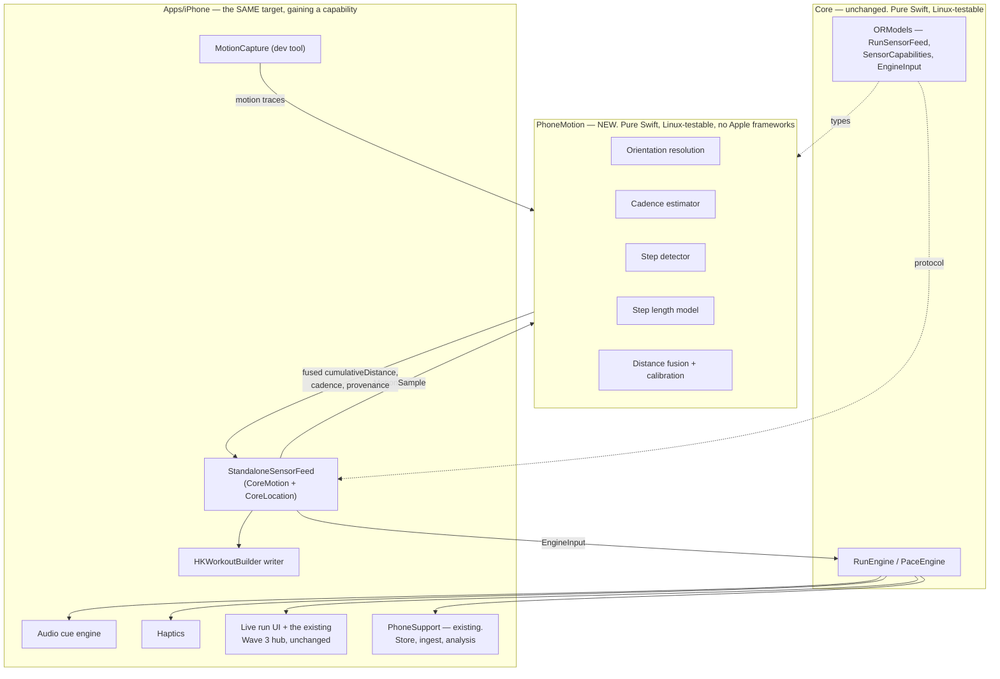
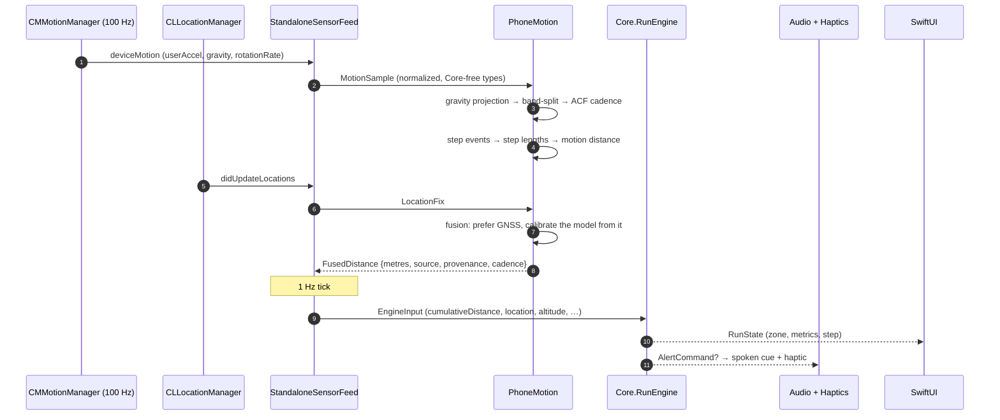
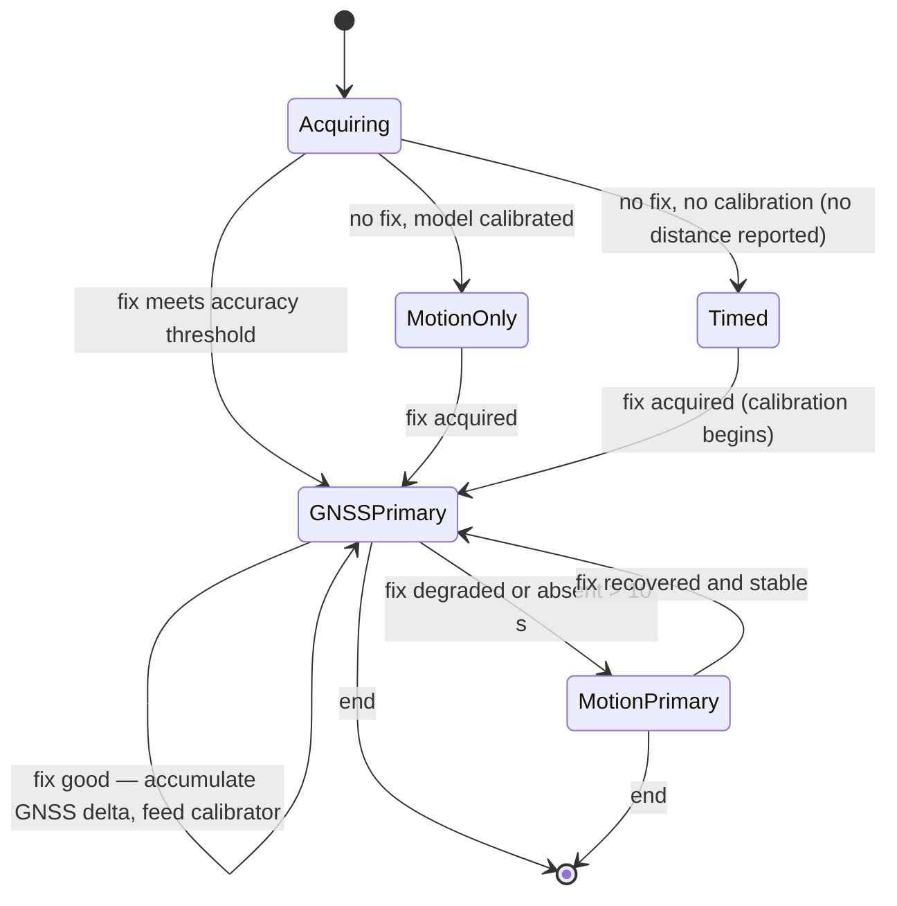

# OptimalRunner — Standalone iPhone Track: Technical Design

| Field | Value |
|---|---|
| Document | `docs/standalone/design.md` |
| Track | **Standalone** — pace management on iPhone alone, no paired watch |
| Version | 1.0 |
| Status | Draft for implementation |
| Last updated | 2026-07-27 |
| Companions | [`requirements.md`](./requirements.md), [`implementation.md`](./implementation.md) |
| Depends on | [`../design.md`](../design.md) — especially §5 (pace engine), §8 (sensor abstraction), §16 (testing) |

---

## Table of contents

1. [Architecture overview](#1-architecture-overview)
2. [Architecture decision records](#2-architecture-decision-records)
3. [The signal, and what is actually in it](#3-the-signal-and-what-is-in-it)
4. [Cadence and step detection](#4-cadence-and-step-detection)
5. [The step length model](#5-the-step-length-model)
6. [Distance fusion and calibration](#6-distance-fusion-and-calibration)
7. [The sensor contract extension](#7-the-sensor-contract-extension)
8. [Capture tooling and the motion trace format](#8-capture-tooling-and-the-motion-trace-format)
9. [Feedback design](#9-feedback-design)
10. [Testing architecture and CI](#10-testing-architecture-and-ci)
11. [Traceability map](#11-traceability-map)
12. [Open questions](#12-open-questions)

---

## 1. Architecture overview

The core product is one pure package (`Core`) surrounded by thin application shells
(`../design.md` §1). This track adds **one more pure package and one more sensor adapter**, and
changes nothing else.



### 1.1 The one-sentence version

`Core` already does not care where `EngineInput` comes from (`../design.md` §8) — so a third
`RunSensorFeed` implementation, backed by a new pure estimation package, gets the entire product
working on a phone alone without a single change to the pace engine, the interval machine, the alert
policy, the store, the charts or the statistics.

### 1.2 What is genuinely new

| New thing | Where | Why it cannot go anywhere else |
|---|---|---|
| `PhoneMotion` package | `Apps/iPhone/PhoneMotion/` | [ADR-S-03](#adr-s-03) |
| `StandaloneSensorFeed` | `Apps/iPhone/Sources/Standalone/` | Must import CoreMotion / CoreLocation |
| Capability contract fields | `Core/Sources/ORModels` | [ADR-S-02](#adr-s-02) |
| Audio cue engine | `Apps/iPhone/` + `PhoneSupport` | [ADR-S-05](#adr-s-05) |
| Motion capture tool | `Apps/iPhone/Sources/Standalone/Capture/` | [CON-S-1](./requirements.md#con-s-1) |

### 1.3 Data flow during a standalone run



---

## 2. Architecture decision records

<a id="adr-s-01"></a>
### ADR-S-01 — PhoneStandalone is a capability of the existing iPhone app, not a fourth app target

**Decision.** The standalone tier ships inside `Apps/iPhone`, as a new `RunSensorFeed`
implementation plus the UI to drive it. There is no `Apps/PhoneStandalone` target, no second bundle
identifier, and no second store.

This is the decision the track brief flagged as most likely to be wrong-if-assumed, so it is argued
rather than asserted — the way [ADR-002](../design.md#adr-002) argued the watch-tier split. And the
argument has to start by asking what ADR-002 was actually *for*, because "we split for the watch,
so we split for the phone" is precisely the reasoning that would produce the wrong answer here.

**What ADR-002 was actually solving.** The two watch targets exist because of a **deployment-target
conflict**: Series 3 requires watchOS 8, the flagship wants watchOS 10+, one target has exactly one
deployment target, and supporting both from one target means `if #available` on every modern API —
which [CON-3](../requirements.md#con-3) forbids and `Tools/check-no-availability.sh` mechanically
prevents. The split buys a real thing: neither tier's code contains a single version conditional,
and the Legacy tier's eventual deletion is `rm -rf` on one directory.

**None of that cause is present here.** PhoneStandalone runs on the *same OS floor* (iOS 17.0), the
*same SDK*, the *same device family*, in the *same process*, as the hub the user already has. There
is no version conditional to avoid, because there is no version split. A second target would pay
ADR-002's entire cost — duplicated app lifecycle, duplicated design system bridge, duplicated
navigation, a second scheme, a second CI lane, a second App Store listing — and buy none of its
benefit.

**Three concrete things a separate target would break.**

1. **The hub would stop being the hub.** Wave 3's whole point is that runs land in one store and one
   set of screens (`../design.md` §9.3, §13). A standalone app would hold its runs in its own
   SwiftData container. Getting them into the hub means either an App Group with a shared container
   — two processes writing one SwiftData store, which is a data-integrity problem nobody wants — or
   a transfer protocol between two apps on one device, which is [FR-E-1](../requirements.md#fr-e-1--transfer)
   reimplemented for the case where both endpoints are the same phone. That is a genuinely absurd
   amount of machinery to avoid an `if` that does not need to exist.
2. **Personal bests and aggregates would fragment.** `AggregateCache` is incremental and
   single-writer by construction (`../design.md` §15.1). Two writers means either two caches — so a
   5 k PB set on a standalone run does not count — or a rebuild path on every app switch, which
   [AC-FR-F-3-5](../requirements.md#fr-f-3--global-statistics) explicitly forbids on a UI path.
3. **The runner would have two apps.** For P5 ("Watchless Wren") the standalone app *is* the
   product; a hub app she also has to install to see her history is a worse product, not a
   better-factored one.

**The strongest argument for a separate target, and why it loses.** A standalone target would keep
the hub's permission and entitlement surface clean. Today `Apps/iPhone` requests only HealthKit
*read* — a hub-only user is never asked for location or motion. Adding standalone adds
`NSLocationWhenInUseUsageDescription`, `NSMotionUsageDescription`, HealthKit *write*, and
`UIBackgroundModes` of `location` and `audio` ([CON-S-4](./requirements.md#con-s-4)). That is a real
cost and it is the only one that survives scrutiny.

It loses on two counts. First, a declared `Info.plist` key costs a hub-only user nothing: iOS
prompts at the point of *use*, not at install, and
[AC-FR-S-A-1-2](./requirements.md#fr-s-a-1--starting-a-standalone-run) makes the request lazy at
first standalone run and forbids it anywhere else. Second, background modes are only *capabilities*
— they are declarations that the app may do a thing, and
[AC-FR-S-A-2-3](./requirements.md#fr-s-a-2--the-run-stays-alive-in-the-background) requires the app
to hold none of them outside an active run, asserted by the same teardown-style test that backs
[NFR-8](../requirements.md#92-battery) on the watch. The cost is a slightly larger declared surface;
the benefit would have been avoiding a problem that does not exist.

**What is kept from the separate-target instinct.** The instinct is not worthless — it wants the
standalone code to be *separable*. That is satisfied structurally rather than by a target boundary:
all estimation lives in `PhoneMotion` ([ADR-S-03](#adr-s-03)), all sensing behind `RunSensorFeed`,
and all standalone app code under `Apps/iPhone/Sources/Standalone/`. Lifting it into its own target
later would be moving one directory and adding a manifest — the same "one directory and one CI job"
property ADR-002 gave the Legacy tier.

**Consequence.** `Apps/iPhone` grows a second personality. The tier divergence matrix in
[§7.4](#74-tier-divergence-matrix-standalone-row) is extended so the difference stays legible, and
`DeviceTier` gains a `.phoneStandalone` case so a run's origin is never ambiguous in the store.

<a id="adr-s-01-the-enforced-half"></a>
#### The enforced half (Waves S3–S5)

"The UI depends on `Core`'s output" is the load-bearing sentence of this ADR, and on its own it is
only an intention. It is now a build failure:
[`Tools/check-phonemotion-isolation.sh`](../../Tools/check-phonemotion-isolation.sh) permits
`import PhoneMotion` in exactly two directories — the sensor-feed adapter
(`Apps/iPhone/Sources/Standalone/Sensors/`) and the capture tool, which writes the estimator's own
trace format — and forbids it everywhere else, forbids `PhoneSupport` and `Core` from declaring a
build dependency on it, and forbids any tunable named in `MotionEstimationConfiguration` from
appearing under a second name in the phone app (NFR-S-19).

**What it buys is specific and dated.** [S-063](./implementation.md#s-063) has a measured amplitude
exponent waiting to replace the shipped 0.25, [S-064](./implementation.md#s-064) has a calibration
over-read that has to be fixed first, and [amendment 2](#adr-s-06-amendment-2) would add a whole
gyroscope term to the step-length model. Each is a change to one package, and none should require
opening a screen. `Apps/iPhone/Tests/StandaloneBoundaryTests.swift` demonstrates that positively
rather than by absence: it swaps a field of the estimator's configuration, replays a committed
trace, and asserts that the run list, the lifetime statistics, the run detail screen and the live
screen all move — with no other file touched.

The rule for anything that needs a fact the estimator has: put it on `ORModels.MotionTelemetry` and
let the adapter fill it in.

<a id="adr-s-02"></a>
### ADR-S-02 — The sensor contract gains *typed* capability facts, not more booleans

**Decision.** `SensorCapabilities` (`../design.md` §8) is extended with two enum-valued fields, and
`DistanceSource` gains a fourth case. Both changes are additive and both are decided here rather
than bolted on at the call site.

```swift
/// How a tier arrives at distance, as a *static* property of the tier.
public enum DistanceCapability: String, Codable, Sendable, Hashable, CaseIterable {
    /// Position fixes are the primary source; a motion model exists only as a fallback.
    /// Both watch tiers and PhoneStandalone outdoors.
    case measuredWithEstimatedFallback
    /// No position source at all: distance is always inferred from motion.
    case estimatedOnly
    /// Position fixes only, with nothing to fall back on.
    case measuredOnly
}

/// Which workout-session facility the platform actually offers (CON-S-2).
public enum WorkoutSessionCapability: String, Codable, Sendable, Hashable, CaseIterable {
    /// A live, locally-owned HKWorkoutSession: watchOS, and iOS 26+.
    case localSession
    /// HKWorkoutBuilder only — no live session. iOS 17–25.
    case builderOnly
    /// Neither.
    case none
}
```

**Why two enums rather than four booleans.** `hasGPS: Bool` already exists and already fails to
answer the question: a tier can have GPS and still be reporting an estimate right now. The fact that
matters to a *caller* is not "is there a GNSS chip" but "is the number I am being handed an
observation or an inference", and that has three states, not two. Booleans would encode it as
`hasGPS && hasMotionModel && !isIndoor`, recomputed at each call site, each site free to get it
wrong. The same argument applies harder to the session question, where the naive boolean
(`supportsWorkoutSession`) would be true on watchOS and on iOS 26 and false on iOS 17, silently
hiding the fact that iOS 17 still has a perfectly good *builder* — and a caller that reads the
boolean as "can I record a workout at all" would then wrongly decline to write to HealthKit.

**Why a static capability is not enough on its own.** Whether *this tick's* distance was measured or
estimated is dynamic and belongs on the sample, not on the tier. The existing `DistanceSource`
already carries per-sample provenance and is already recorded in the run for diagnostics
(`../design.md` §8.2), so that is where the dynamic fact goes:

```swift
public enum DistanceSource: String, Codable, Sendable, Hashable, CaseIterable {
    case healthKit
    case location
    case pedometer
    case motionModel   // NEW — PhoneMotion's step-length model
}
```

**Why `.motionModel` is a new case rather than reusing `.pedometer`.** They are different claims.
`.pedometer` means "CMPedometer said so" — Apple's model, whose internals we do not know and whose
running behaviour we have not characterised. `.motionModel` means "our step-length model said so",
which is a number we can explain, bound, and validate against a trace. Collapsing them would make
[FR-S-E-2](./requirements.md#fr-s-e-2--provenance-is-visible-not-hidden)'s provenance display a lie
and would make the calibration diagnostics unreadable. It would also break a live behaviour:
`RunEngine` currently infers an indoor run from `distanceSource == .pedometer && location == nil`
(`ORPace/Engine/RunEngine.swift`), and a GPS-denied *outdoor* underpass is not a treadmill. A new
case keeps that inference exactly as it is.

**Compatibility, which is the part that can go wrong quietly.**

- `SensorCapabilities`' new fields take **defaults in the memberwise initializer**
  (`.measuredWithEstimatedFallback`, `.localSession` — what both watch tiers already are), so the
  three existing construction sites compile unchanged.
- `SensorCapabilities` also gains an explicit `init(from:)` using `decodeIfPresent` with the same
  defaults, so a value encoded before this change still decodes
  ([AC-FR-S-A-3-5](./requirements.md#fr-s-a-3--the-capability-contract-states-how-distance-is-obtained)).
  It is not currently carried in `RunEnvelope`, so this is belt-and-braces — but the type is
  `Codable` and public, and "nobody encodes it today" is not a property that stays true.
- Adding a `DistanceSource` case **does** break exhaustive switches. There are exactly two, both
  `rank(_:)` helpers in the watch tiers' tier-equivalence suites. They are updated to rank
  `.motionModel` last. This is a deliberate, named consequence rather than a surprise, and
  [AC-FR-S-A-3-4](./requirements.md#fr-s-a-3--the-capability-contract-states-how-distance-is-obtained)
  requires the committed watch goldens to pass **unmodified** afterwards — which is the actual proof
  that the extension changed no behaviour.

**Alternative considered: a parallel `StandaloneCapabilities` type.** Rejected. Two capability types
means every consumer branches on which one it has, which is the conditional soup
[CON-3](../requirements.md#con-3) exists to prevent, transplanted from the watch to the phone.

<a id="adr-s-03"></a>
### ADR-S-03 — The estimation algorithm is its own pure package, `PhoneMotion`

**Decision.** Raw motion samples in, step events / cadence / step lengths / fused distance out, in
`Apps/iPhone/PhoneMotion/` — a local Swift package importing only the standard library, Foundation,
and `ORModels`. No CoreMotion, no CoreLocation, no SwiftUI, no `PhoneSupport`. It builds and tests
on Linux.

**This extends [ADR-001](../design.md#adr-001) rather than departing from it.** ADR-001's rule is
that everything which can be *wrong* should be testable without a device. Distance estimation is the
most wrong-able code in this track by a wide margin, and [CON-S-1](./requirements.md#con-s-1) means
it has *no* runtime environment in CI otherwise — the Simulator has no accelerometer at all. If the
estimator lived in the app target it would be verifiable only on a phone, by hand, which for a
numerical algorithm is not verification.

**Why not in `Core`.** `Core` is the module whose entire value is being tier-agnostic — the reason
the two watch tiers cannot drift is that neither owns any judgement logic. Distance estimation from
a hand-held phone is the opposite of tier-agnostic: it is one tier's answer to one carry position on
one device class. Putting it in `Core` would mean the watch tiers link a step-length model they must
never use, and would make `Core`'s coverage gate answerable to code no watch runs. The precedent is
already set — [ADR-012](../design.md#adr-012) kept the watch tiers' fusion out of `Core` for exactly
this reason, and this is the same call with a heavier payload.

**Why not in `PhoneSupport`.** `PhoneSupport` declares a **macOS 14 floor** so `swift test` can host
SwiftData and the Observation macro ([ADR-013](../design.md#adr-013)). `PhoneMotion` has neither
dependency and should not inherit that floor: it is arithmetic over arrays of doubles, it belongs in
the fast Linux lane alongside `Core`, and putting it behind SwiftData's platform requirements would
cost the cheapest, fastest signal in the project for nothing.

> **As built — the package does declare platform floors, and the reason is worth recording.** The
> manifest was written with no `platforms:`, on the principle above. SwiftPM rejects that: `Core`
> declares `.macOS(.v13)` (added in the core track's Wave 4, T-063, so a watchOS 8 target would
> compile `RunSensorFeed`'s `async` methods), and a package may not depend on a product with a
> *higher* floor than its own — `error: the library 'PhoneMotion' requires macos 10.13, but depends
> on the product 'ORModels' which requires macos 13.0`. The floors are therefore restated from the
> dependency rather than claimed about deployment. **Nothing this ADR is protecting changes**:
> SwiftPM ignores `platforms:` on Linux entirely, so the fast Linux lane — the actual point — works
> exactly as intended. The distinction from `PhoneSupport` also survives, since what disqualified
> that package was never the floor number but SwiftData being attached to it.

**Why not in the CoreMotion adapter.** The adapter's job is to turn `CMDeviceMotion` into
`MotionSample` and hand it over. Mixing estimation into it makes the estimation untestable and the
adapter unreviewable, and it is the specific failure ADR-001 was written to prevent.

**Why depend on `ORModels` at all, rather than being dependency-free.** `PhoneMotion` needs `Pace`,
`Metres`-shaped conventions and `DistanceSource`. Redeclaring them would create a second definition
of pace in a project whose units convention is load-bearing (`../design.md` §4,
[ADR-003](../design.md#adr-003)), and a conversion layer between two identical `Pace` types is
exactly the kind of seam where a factor of 1609.344 goes missing. `ORModels` sits at the bottom of
the dependency graph, imports nothing, and builds on Linux, so depending on it costs nothing this
ADR is trying to protect.

**Consequence.** `Tools/check-core-imports.sh` is extended to scan `PhoneMotion/Sources` with the
same banned-import list, and `core.yml` gains a `swift test --package-path Apps/iPhone/PhoneMotion`
step in the Linux lane. The coverage gate applies to it on the same 85% terms as `Core`
([NFR-S-21](./requirements.md#96-maintainability)).

<a id="adr-s-04"></a>
### ADR-S-04 — Carry position is an explicit parameter with exactly one implemented case

**Decision.** Every entry point in `PhoneMotion` that depends on where the phone is takes a
`CarryPosition` value. Exactly one case, `.handHeld`, is implemented; the others do not exist as
cases yet.

```swift
public enum CarryPosition: String, Codable, Sendable, Hashable, CaseIterable {
    /// The only supported position (CON-S-3). Documented here rather than assumed.
    case handHeld
}
```

**Why an enum with one case rather than no parameter at all.** A single-case enum is a
compile-time-visible statement that this code is position-specific, and it makes adding a second
position a matter of adding a case and getting exhaustiveness errors at every place that needs to
care. With no parameter, the position assumption is invisible, distributed through filter cutoffs
and detector thresholds, and the person adding pocket support a year from now has to find it by
reading. The cost is one unused parameter today; the benefit is that
[CON-S-3](./requirements.md#con-s-3)'s "what it would take to add pocket/armband later" is a
checklist rather than an archaeology project.

**Why not a boolean `isHandHeld`.** Because there are more than two positions, and the second one
added would immediately need a third state.

<a id="adr-s-05"></a>
### ADR-S-05 — Audio is the primary channel; the alert *policy* is not duplicated

**Decision.** Spoken cues are the primary feedback channel ([CON-S-6](./requirements.md#con-s-6)),
and they are driven by **the existing `ORAlerts.AlertPolicy`**, unchanged. The standalone tier adds
a *renderer*, not a second policy.

**Why this matters more than it looks.** The single most valuable property of the alert design is
that "does it nag?" is answerable by a unit test (`../design.md` §7), and that property comes from
there being exactly one dwell/cooldown state machine, pure, with a proved bound
(`alerts ≤ duration / cooldown`). A separate "speech policy" with its own timing would double the
surface where nagging can be introduced, and — worse — would let audio and haptics disagree about
whether an excursion is worth mentioning, which for a runner reads as the app being confused.

**Consequence.** `AlertCommand` gains no cases. The standalone tier maps the existing four commands
to (utterance, haptic pattern) pairs, and everything the core track proved about alert frequency
holds verbatim. Where standalone needs something the watch does not — periodic split announcements
([AC-FR-S-D-1-5](./requirements.md#fr-s-d-1--audio-is-the-primary-feedback-channel)) — it is a
*separate*, distance-triggered channel with its own trivial state, deliberately not routed through
`AlertPolicy`, because a mile split is not an alert and should not consume an alert's cooldown.

<a id="adr-s-06"></a>
### ADR-S-06 — The step-length model has no fabricated constants; it is bootstrapped from GNSS

**Decision.** The step-length model ships with **no invented coefficient**. Its scale parameter is
learned from the first good GNSS window of the first run, persisted thereafter. Until it has been
learned even once, the motion leg reports *unavailable* and distance is GNSS-only.

**Why.** The model's form can be taken from the literature; its scale cannot. Every published
coefficient set for a step-length model was fitted to a specific sensor placement, population and
gait — and [CON-S-5](./requirements.md#con-s-5) establishes that nothing published covers a
hand-held phone at running speeds. Shipping a number lifted from a walking study and presenting the
resulting distance as an estimate would be exactly the false-confidence failure this track exists to
avoid. Learning it takes one 100 m window of good GPS — seconds, not runs — so the honest option is
also the cheap one.

**The fallback when GNSS never appears at all** ([DEG-S-2](./requirements.md#8-degraded-modes-standalone))
is the one place a literature prior is used, and it is used because the alternative is reporting
nothing: van Oeveren et al.'s published group-level stride-frequency/speed relation, inverted, gives
a step length from cadence alone with no free parameters ([§5.4](#54-the-no-gnss-prior)). Its
accuracy is poor and bounded and *stated* — [NFR-S-11](./requirements.md#93-accuracy) — which is a
different thing from being invented.

**Consequence.** The first-ever standalone run on a device with no GPS fix produces a timed run with
no distance, and says so. That is the correct behaviour and it is a requirement
([AC-FR-S-A-1-6](./requirements.md#fr-s-a-1--starting-a-standalone-run)), not a gap.

<a id="adr-s-06-amendment-1"></a>
#### ADR-S-06, amendment 1 (2026-07-29) — `CMPedometer` stays a baseline, never an input

**Decision.** `CMPedometer` is recorded in every trace and used for comparison only. It is **not**
adopted as a cadence prior, a stride/step disambiguator, or a fusion input. The boundary
[`MotionTrace.pedometer`](../../Apps/iPhone/PhoneMotion/Sources/PhoneMotion/Trace/MotionTrace.swift)
already states — "a comparison baseline, never an input" — is reaffirmed rather than relaxed.

**Why this was reconsidered.** [S-062](./implementation.md#s-062) found the estimator doubling
cadence below 120 spm, and Apple's pedometer was the obvious authority to lean on: it is
well-validated, it is already in the trace, and it costs nothing. That is a reasonable proposal and
it was taken seriously.

**Why it was rejected — measured, not assumed.** Against a step rate obtained by FFT directly from
the recorded signal, per 30 s window:

| Trace | Spectral arbiter | `PhoneMotion` | `CMPedometer` counted |
|---|---|---|---|
| 4.3 mi tempo (n=79) | 159.3 spm | **+0.1%**, 100% of windows within 3% | −1.7%, 62% within 3% |
| 1 mi slow (n=23) | 161.5 spm | **+0.1%**, 100% within 3% | **−20.7%**, 0% within 3% |

`CMPedometer` undercounts a hand-held slow run by a fifth. Wiring it in as a prior would have
imported a 20% error into the one quantity the distance model is most sensitive to, in exactly the
regime — slow, hand-held — where this tier most needs to be right. It is a black box tuned for a
pocketed phone at walking speeds, and [CON-S-5](./requirements.md#con-s-5) says the same thing about
every published model: what was fitted elsewhere does not transfer here.

**The wider point, which cost a day.** A second estimator is not an arbiter. Two estimators that
disagree tell you something is wrong; they cannot tell you which one. Trusting `CMPedometer` as
ground truth produced a confidently-argued and entirely wrong correction to
[S-061](./implementation.md#s-061), reversed only once the raw signal itself was consulted. When a
disagreement needs adjudicating, the adjudicator is the recording — or a
[`countedSteps` reference](../../Fixtures/motion/README.md), which is the only exact one obtainable
in the field.

**Consequence.** The stride/step ambiguity is resolved from the signal alone — periodicity for the
reading, amplitude for the gait — which keeps `PhoneMotion` a pure function of recorded samples
([ADR-S-03](#adr-s-03)) and keeps every trace replayable without a live pedometer.

<a id="adr-s-06-amendment-2"></a>
#### ADR-S-06, amendment 2 (2026-07-29) — rotation rate belongs in the step-length model

**Decision.** Record the finding and open the design question; do **not** change the model yet. The
capture already stores `rotationRate` on every sample and nothing reads it. On the evidence below it
should, and [S-064](./implementation.md#s-064) has to be resolved first.

**Why this was looked at.** Weinberg's amplitude-to-step-length relation was fitted for sensors on
the waist or in a pocket, where vertical acceleration is the centre-of-mass bounce. A phone at the
end of a swinging arm is a different mechanical system — a shoulder-elbow-wrist pendulum
superimposed on that bounce — so there is no reason the *feature*, not just its coefficient, should
transfer. That is a fair challenge to the whole model form and it deserved measuring rather than
assuming.

**What the pace ladder shows.** 27 non-overlapping 30 s windows, speed range 1.54×,
`log(step length)` regressed on log features:

| Model | R² | adj R² | AIC | coefficients |
|---|---|---|---|---|
| \|userAccel\| RMS **+ \|ω\| RMS** | **0.865** | **0.853** | **−164.1** | +0.447, +0.429 |
| \|ω\| RMS alone | 0.812 | 0.805 | −157.3 | +0.785 |
| \|userAccel\| RMS alone | 0.807 | 0.799 | −156.5 | +0.856 |
| per-step peak-to-peak (shipped feature) | 0.773 | 0.764 | −152.1 | +0.670 |
| cadence alone | 0.008 | −0.032 | −112.4 | +1.398 |

Three things follow. **The shipped feature works** — it is the weakest of the four but it is not
speed-blind, which was the hypothesis under test. **Angular velocity is the better single feature**,
narrowly. And most usefully, **the two are complementary rather than redundant**: together they cut
residual scatter from 5.1% to 4.3% and carry near-equal weight, so the gyroscope holds information
the accelerometer does not. The pair also transfers best across sessions, predicting the tempo run
and the slow mile with **+0.70%** and **−0.67%** bias.

Adding cadence worsens AIC in every combination. Its coefficient flips sign and wanders between
−0.18 and −1.47 depending on what it is paired with, which is what a variable carrying no signal
looks like.

**Where the literature sits.** Angular velocity is well established in handheld pedestrian dead
reckoning, but for **step detection and heading** — the arm's periodic rotation gives a clean
sinusoid to count against — rather than for step *length*, which is still dominated by
Weinberg-family amplitude models whose gain is calibrated per user and whose ¼ exponent is inherited
rather than refitted. The usual remedy for the speed range problem is speed-banded parameters, which
is the same instinct as this track's own per-cadence-band gain
([AC-FR-S-C-2-5](./requirements.md#fr-s-c-2--calibrating-the-step-length-model)). Using rotation rate
as a step-*length* feature is therefore an extension of the published work rather than a
contradiction of it, and it needs its own evidence, not a citation.

**Consequence.** `MotionSample` and the trace format already carry rotation rate, so this costs no
new capture and invalidates no committed trace — the eight traces on disk can all be re-analysed the
day the model changes. What it does need is [S-064](./implementation.md#s-064) resolved, a second
runner, and a carry position other than hand-held before any of it is a default.

<a id="adr-s-07"></a>
### ADR-S-07 — `HKWorkoutBuilder` at the iOS 17 floor, with the session path as a future backend

**Decision.** Standalone runs are written to HealthKit with `HKWorkoutBuilder` (available `ios(12.0)`),
not `HKWorkoutSession` + `HKLiveWorkoutBuilder` (both `ios(26.0)` — see
[CON-S-2](./requirements.md#con-s-2)). Background execution is earned with the `location` and
`audio` background modes, not with a workout session.

**Why not raise the floor to iOS 26.** It would cut off most in-service iPhones to obtain an API
whose unique contribution here is convenience — the builder writes the same `HKWorkout`, with the
same route, that a live builder would. It would also fork the phone app's deployment target away
from the hub it shares a binary with ([ADR-S-01](#adr-s-01)), which is the one thing that decision
was designed to avoid.

**Why record the distinction in the capability contract anyway.** Because the difference is real and
will matter: a live session on iOS 26 keeps sensors running and would replace the background-mode
scaffolding with something the OS understands as a workout.
[`WorkoutSessionCapability`](#adr-s-02) models it now so that adding the iOS 26 backend later is a
new conformer behind an existing seam, not a re-specification.

---

## 3. The signal, and what is in it

Everything downstream depends on being right about what a hand-held phone actually measures while
someone runs. This section states it explicitly, with the parts that are established separated from
the parts this track's own traces have to establish.

### 3.1 Three superimposed components

A phone carried in a swinging hand during running sees, in its accelerometer:

| Component | Frequency | Amplitude | Established? |
|---|---|---|---|
| **Arm swing** — pendular motion of the whole forearm-plus-phone | **stride** frequency, `f_step / 2`; 1.25–1.6 Hz at 150–192 spm | Large | Established. Shoulder acceleration during gait carries both stride- and step-frequency components; arm swing in running is actively driven rather than passive ([requirements §13](./requirements.md#13-references)) |
| **Footfall impact transients** — heel/mid-foot strike, transmitted up the skeleton | **step** frequency, 2.5–3.2 Hz, with energy up to ~20 Hz | Moderate, attenuated by the arm | Partly. Impact peaks are routinely detected in gait accelerometry at 100 Hz; that they are cleanly separable *at the hand during running* is a hypothesis these traces must test ([§10.4](#104-what-the-traces-must-settle)) |
| **Trunk vertical oscillation** — centre-of-mass rise and fall | **step** frequency | Moderate | Established |

The consequence is stated once and then relied on throughout: **the dominant periodicity in a
hand-held trace is at half the cadence.** A frequency estimator that returns "the strongest
periodic component" returns the stride rate, and a distance estimate built on it is wrong by a
factor of two — not noisy, *wrong*, and wrong in the direction of under-reporting, which is the
direction a runner is least likely to notice.

### 3.2 Orientation, and why it is less of a problem than it looks

The brief correctly identifies the hard part: a hand-held phone's orientation relative to the body
changes continuously through the swing, which pocket-based PDR does not have to handle in the same
way. Two things make it tractable.

**First, we only need distance, not position.** Classical pedestrian dead reckoning integrates step
length *along a heading* to get a position, and heading from a swinging hand is genuinely hard —
it is where most of the PDR literature's machinery goes. This track never needs a heading: GNSS owns
the route ([FR-S-C-1](./requirements.md#fr-s-c-1--distance-fusion)), and the motion model owns only
a scalar. Discarding heading discards most of the problem.

**Second, gravity gives a body-fixed reference for free.** `CMDeviceMotion` supplies a gravity
vector in the device frame, maintained by CoreMotion's own attitude filter. Projecting user
acceleration onto it yields a vertical channel that is invariant to how the phone is held:

$$a_v(t) = -\,\hat{g}(t) \cdot \mathbf{a}_\text{user}(t), \qquad \hat{g} = \frac{\mathbf{g}}{\lVert \mathbf{g} \rVert}$$

The sign convention makes `a_v` positive upward. This is what satisfies
[AC-FR-S-B-3-3](./requirements.md#fr-s-b-3--step-event-detection) — a phone rotated 180°, or held
screen-inward, produces the same `a_v`.

**And a second, gravity-free channel as insurance.** During vigorous arm swing the attitude filter
is working hard, and a gravity estimate degraded by sustained high dynamic acceleration would
corrupt `a_v` silently. So the pipeline also computes the magnitude channel

$$a_m(t) = \lVert \mathbf{a}_\text{user}(t) \rVert$$

which is orientation-invariant *without needing gravity at all*. `a_m` conflates the swing with the
impact and so is the worse channel for detection — but it is the channel that cannot be wrong for
the one reason `a_v` can be, and the cadence estimator cross-checks the two
([§4.4](#44-confidence)).

### 3.3 Filtering

| Band | Cutoffs | Purpose |
|---|---|---|
| **Gait band** | 0.7–7.0 Hz *(tunable)* | Carries the stride fundamental, the step fundamental, and the first harmonic above it. Input to cadence estimation. |
| **Impact band** | 5–25 Hz *(tunable)* | Footfall transients, with the swing removed. Input to step-event detection after enveloping. |

Both are 2nd-order Butterworth sections applied as a causal biquad cascade.

**Two choices here are deliberate and both would be easy to get wrong.**

*The gait band is not Renaudin's 3 Hz low-pass.* The reference handheld work low-passes at 3 Hz to
isolate the fundamental — correct for walking, where step frequency is around 1.6–2.0 Hz. At running
cadences the step fundamental is 2.5–3.2 Hz, sitting **on and above** that cutoff: a 3 Hz low-pass
would attenuate the very component this track needs most. Transplanting the published filter
unexamined is the single most likely way to build something that works on a walk test and fails on a
run.

*The filters are causal, never zero-phase.* Offline gait analysis normally uses a forward-backward
(`filtfilt`) pass to avoid phase distortion. That is unavailable to us, because live estimation and
fixture replay must produce **bit-identical** results
([NFR-S-14](./requirements.md#94-reliability)) and a backward pass is not causal. The cost is a
known group delay, which is accounted for once, at the detector, rather than being pretended away.

---

## 4. Cadence and step detection

### 4.1 Cadence by normalized autocorrelation

Cadence is estimated over a sliding window of **5.12 s** *(tunable, 2.5–8 s)* on the gait-band `a_v`,
using the normalized autocorrelation

$$r(\tau) = \frac{\sum_{t} a_v(t)\,a_v(t+\tau)}{\sqrt{\sum_t a_v(t)^2}\sqrt{\sum_t a_v(t+\tau)^2}}$$

evaluated over lags `τ ∈ [0.25 s, 1.0 s]` — the range that spans both interpretations of a
120–240 spm cadence ([§4.3](#43-resolving-the-stride-versus-step-ambiguity)).

**Why autocorrelation rather than an FFT.** Resolution. A 5.12 s window at 100 Hz gives an FFT bin
width of 0.195 Hz, which at a step frequency of 3 Hz is **11.7 spm** — four times coarser than
[NFR-S-7](./requirements.md#93-accuracy)'s ±3 spm bound, before any noise. Zero-padding and spectral
interpolation can recover it, but the autocorrelation reaches the same place more directly: its lag
resolution is one sample (10 ms), and a parabolic fit through the peak and its two neighbours
recovers a fraction of a sample. At a 0.333 s step period (180 spm), one sample of lag error is
3.0% — 5.4 spm, still not enough on its own, which is why the parabolic refinement is not optional
but part of the specified algorithm:

$$\hat{\tau} = \tau_k + \frac{h}{2}\cdot\frac{r(\tau_{k-1}) - r(\tau_{k+1})}{r(\tau_{k-1}) - 2r(\tau_k) + r(\tau_{k+1})}$$

**Why autocorrelation rather than plain peak-counting.** Because peak-counting is what the
stride/step ambiguity destroys. Autocorrelation exposes the *whole* periodic structure, which is
what makes the ambiguity resolvable rather than merely present.

### 4.2 Step events from the impact envelope

Step events come from a **different channel** than cadence, on purpose. The impact-band signal is
rectified and smoothed into an envelope, and peaks are detected with

- an **adaptive threshold** of `mean + k·σ` over a trailing window *(k tunable, default 0.6)* —
  Renaudin's sliding-window-mean approach with a dispersion term, so the detector follows a runner
  whose impact amplitude changes with terrain;
- a **refractory interval** of `0.6 × currentStepPeriod` *(tunable)*, derived from the live cadence
  estimate, which is what makes double-counting structurally impossible
  ([AC-FR-S-B-3-4](./requirements.md#fr-s-b-3--step-event-detection)).

The two-channel split is the point: the arm swing dominates the gait band and is the *best* signal
for measuring the *rate*; the impact band has the swing filtered out and is the best signal for
locating individual *events*. Trying to do both from one channel is how a detector ends up counting
arm swings.

**The phase-locked fallback, and why it is sound.** If impact detection degrades — a light-footed
runner on soft ground, a loose grip — the pipeline synthesises step boundaries at the estimated
cadence, anchored to the last confident event, and flags reduced confidence. This is not a fudge: a
motion-derived *distance* is `Σ stepLength(i)`, and step length is a function of cadence and
amplitude, not of the precise instant of foot strike. Getting the *rate* right and the individual
*timing* approximately right leaves distance essentially unaffected, while losing the rate would
halve it. The fallback therefore protects the thing that matters and concedes the thing that does
not.

### 4.3 Resolving the stride-versus-step ambiguity

This is the crux of the whole estimator, and the published answer does not work here.

**The published rule and exactly where it breaks.** Renaudin et al. face the same ambiguity for a
swinging hand and resolve it with a fixed frequency threshold: if the strongest frequency exceeds
**τ = 1.4 Hz** it is taken to be the step frequency; below, the stride frequency. Their
justification is that "for normal walking, the range of frequencies for a human step is generally
above 1.6 Hz" — which is true, for walking.

For running it fails in a way that is worth stating precisely, because the failure is not marginal:

| Cadence | Stride frequency (arm swing) | Renaudin's rule says | Result |
|---:|---:|---|---|
| 150 spm | 1.25 Hz | below 1.4 → it is the stride | ✅ cadence 150 |
| 160 spm | 1.33 Hz | below 1.4 → stride | ✅ cadence 160 |
| **168 spm** | **1.40 Hz** | **the threshold itself** | ⚠️ undefined |
| 172 spm | 1.43 Hz | above 1.4 → it is the *step* | ❌ cadence 86 |
| 180 spm | 1.50 Hz | above 1.4 → step | ❌ cadence 90 |
| 192 spm | 1.60 Hz | above 1.4 → step | ❌ cadence 96 |

The threshold sits at exactly the cadence 168 spm, straight through the middle of the recreational
running range (150–192 spm). Every runner above it gets **half** their true cadence — and therefore
roughly half their motion-derived distance. This is the single most consequential place where
copying a published method unexamined would produce a plausible-looking, catastrophically wrong
system.

**The replacement: a range-based interpretation, which is exact.** Let `L` be the refined lag of
the dominant autocorrelation peak. There are exactly two readings, and each admits a disjoint
interval of `L`:

| Reading | Cadence | Valid for cadence ∈ [120, 240] spm when |
|---|---|---|
| `L` is the **step** period | `60 / L` | `L ∈ [0.25, 0.50] s` |
| `L` is the **stride** period | `120 / L` | `L ∈ [0.50, 1.00] s` |

The intervals meet at a single point and do not overlap. So a physiological range gate — which the
requirement already demands
([AC-FR-S-B-2-3](./requirements.md#fr-s-b-2--cadence-estimation)) — *determines* the interpretation
rather than merely constraining it. No frequency threshold is needed, and no threshold can be
straddled, because the discrimination is between two disjoint intervals rather than across one line.

**Harmonic confirmation, for the cases the gate cannot see.** The gate is exact given a correct
dominant lag; it says nothing about whether the dominant lag is right. So the chosen reading is
confirmed against the signal's harmonic structure:

- If `L` was read as a stride period, `r(L/2)` should also show a local maximum — running has two
  footfalls per stride, so step-rate periodicity must be present. If it is absent, the estimate is
  still emitted (a stride-only signal is more likely a weak impact channel than a one-legged runner)
  but at reduced confidence.
- If `L` was read as a step period, `r(2L)` should show a local maximum at least as strong — the arm
  swing is the larger component. If `r(2L)` is *much* stronger, the dominant-peak search picked a
  harmonic and the estimate is re-derived from `2L`.
- The boundary region `L ∈ [0.47, 0.53] s` — cadence near 120 or 240 spm, both far outside normal
  running — is treated as low-confidence by construction, so a boundary case degrades rather than
  flipping.

**Testability.** [AC-FR-S-B-2-5](./requirements.md#fr-s-b-2--cadence-estimation) requires exactly
this to be exercised: a labelled synthetic signal at a known step frequency with an arm-swing
component of *equal or greater* amplitude at half that frequency, swept across 140–200 spm, must
return the step frequency for every case. That test would fail outright against Renaudin's
threshold, which is the point of writing it.

### 4.4 Confidence

Cadence confidence in `[0, 1]` is the product of three factors, so any one of them failing suppresses
the estimate:

| Factor | Meaning |
|---|---|
| Peak sharpness | Normalized autocorrelation value at the chosen lag |
| Harmonic consistency | Whether [§4.3](#43-resolving-the-stride-versus-step-ambiguity)'s confirmation held |
| Temporal stability | Agreement with the previous window's cadence, so a single anomalous window cannot move the model |

A fourth cross-check runs continuously and is deliberately *not* folded into the score: the same
estimator is run over the magnitude channel `a_m` ([§3.2](#32-orientation-and-why-it-is-less-of-a-problem-than-it-looks)),
and a persistent disagreement between the two channels is recorded as a degradation, because that is
the signature of a bad gravity estimate rather than of a bad cadence.

Confidence gates three things: whether cadence is reported at all
([AC-FR-S-B-2-4](./requirements.md#fr-s-b-2--cadence-estimation)), whether the calibrator is allowed
to learn from this window ([AC-FR-S-C-2-7](./requirements.md#fr-s-c-2--online-calibration-against-gnss)),
and whether [DEG-S-7](./requirements.md#8-degraded-modes-standalone)'s carry-position-change
detection fires.

---

## 5. The step length model

### 5.1 Why a cadence-only model cannot work for running

This is the quantitative core of the design, and it is short.

Van Oeveren et al. give the group-level relation between stride frequency and running speed, over
1.64–4.68 m·s⁻¹:

$$\mathrm{SF}\ [\text{strides}\cdot\text{min}^{-1}] = 75.01 + 3.006\,v\ [\text{m}\cdot\text{s}^{-1}]$$

Inverting it for step length (`stepLength = v / f_step`, with `f_step = SF/30` Hz) gives:

| Speed | Pace | Step frequency | Step length |
|---:|---:|---:|---:|
| 2.5 m/s | 10:44 /mi | 2.751 Hz | 0.909 m |
| 3.0 m/s | 8:56 /mi | 2.801 Hz | 1.071 m |
| 3.5 m/s | 7:40 /mi | 2.851 Hz | 1.228 m |
| 4.0 m/s | 6:42 /mi | 2.901 Hz | 1.379 m |
| 4.5 m/s | 5:58 /mi | 2.951 Hz | 1.525 m |

**Over an 80% increase in speed, cadence rises 7.3% and step length rises 68%.** Speed at running
intensities is almost entirely a step-length phenomenon. This is exactly opposite to walking, where
cadence carries much of the variation — which is why the walking literature's cadence-dominant
models exist and why they must not be transplanted.

The failure is not merely one of sensitivity; it is one of *conditioning*. Fitting the
Renaudin-form frequency model `s = h(αf + β)` through the 2.5 and 4.5 m/s rows above, at h = 1.75 m,
gives α = 1.760 s and β = −4.323. The resulting model's derivative is
`ds/df = h·α = 3.08 m per Hz`, so a cadence error of **2 spm** — well inside
[NFR-S-7](./requirements.md#93-accuracy)'s ±3 spm allowance — produces a step-length error of
0.103 m, which on a 1.07 m step is **9.6%**. A cadence-only model at running speeds amplifies
measurement error roughly tenfold. It is not a model that can be made to work by measuring cadence
better; the sensitivity is structural.

So the amplitude term is not a refinement. It is the load-bearing term, and
[AC-FR-S-B-4-3](./requirements.md#fr-s-b-4--step-length-estimation) requires it for this reason.

### 5.2 The model

$$\boxed{\ \text{stepLength} \;=\; g(c)\;\cdot\;C\;\cdot\;h\;\cdot\;\left(\frac{A}{h\,f_\text{step}^{2}}\right)^{p}\ }$$

| Symbol | Meaning | Source |
|---|---|---|
| `A` | Peak-to-peak gait-band vertical acceleration over the step interval, m·s⁻² | Weinberg's amplitude term |
| `h` | Runner height, m | Renaudin et al.'s height scaling |
| `f_step` | Current step frequency, Hz | — |
| `p` | Amplitude exponent. **Default 0.25** | Weinberg's fourth root |
| `C` | Scale. **No shipped default** — learned from GNSS | [ADR-S-06](#adr-s-06) |
| `g(c)` | Per-cadence-band calibration gain, default 1.0 | Apple's calibrate-against-GPS precedent |

**The dimensionless group.** `A / (h f²)` is dimensionless: `h·f²` has units of m·s⁻², the same as
`A`. It is the ratio of the acceleration actually observed to the acceleration a body of the
runner's scale would produce oscillating at the current step rate. Making the amplitude term
dimensionless is what lets `C` be a pure number of order unity rather than a quantity with units
that silently encodes a sampling rate or a unit convention — the class of bug that survives every
test until someone changes the sample rate.

**Term-by-term provenance**, as
[AC-FR-S-B-4-2](./requirements.md#fr-s-b-4--step-length-estimation) requires:

- The **fourth-root amplitude dependence** is Weinberg's `K·(a_max − a_min)^(1/4)`, the standard
  amplitude form in the PDR literature and the ancestor of most later models.
- The **height scaling** is Renaudin et al.'s, whose handheld model is `s = h(a·f + b) + c` — height
  enters multiplicatively there and does so here.
- The **step-frequency normalisation** inside the group is this design's own, and is stated as such:
  it is dimensional bookkeeping, not a published relation. Its practical effect is mild, since `f`
  varies by only ~7% across the running range ([§5.1](#51-why-a-cadence-only-model-cannot-work-for-running)).
- The **calibration gain** follows Apple's documented approach for the Watch: learn stride length at
  different speeds by comparing against GPS during outdoor runs, then use the learned model when GPS
  is unavailable.

### 5.3 Why `p = 0.25` is a starting point and not an answer

Weinberg's exponent was fitted for walking, at the hip. Applying it to running from the hand is an
assumption, and it is likely to be too compressive. A worked illustration makes the stake concrete —
**the acceleration figures below are assumed, not measured, and exist only to show the sensitivity**:

Suppose peak-to-peak gait-band vertical acceleration at the hand were 20 m·s⁻² at 3.0 m/s and
35 m·s⁻² at 4.0 m/s. Calibrating `C` at the 3.0 m/s point in each case:

| `p` | Predicted step length at 4.0 m/s | Truth (van Oeveren) | Error |
|---:|---:|---:|---:|
| 0.25 | 1.211 m | 1.379 m | −12.2% |
| 0.40 | 1.301 m | 1.379 m | −5.6% |
| 0.50 | 1.367 m | 1.379 m | −0.9% |

The point is not that `p = 0.5` is right — it is that **`p` is the parameter that determines whether
the model tracks pace changes at all**, that Weinberg's value would systematically under-report fast
running, and that no amount of reasoning settles it. `p` is fitted offline from committed traces
([S-021](./implementation.md#s-021)), and the fitted value is committed alongside the trace that
produced it so the provenance of the number is never in doubt. Until then the shipped default is
0.25, labelled as the literature prior it is.

### 5.4 The no-GNSS prior

When GNSS has never been available in a run and no persisted calibration exists
([DEG-S-2](./requirements.md#8-degraded-modes-standalone)), `C` cannot be learned. Rather than
report nothing forever, the estimator falls back to the van Oeveren inversion, which requires no
fitted parameter at all:

$$v = \frac{30 f_\text{step} - 75.01}{3.006}, \qquad \text{stepLength} = \frac{h}{h_\text{ref}}\cdot\frac{v}{f_\text{step}}, \qquad h_\text{ref} = 1.75\ \text{m}$$

This is the steep, error-amplifying model [§5.1](#51-why-a-cadence-only-model-cannot-work-for-running)
argued against — which is precisely why it is the *last* resort and why
[NFR-S-11](./requirements.md#93-accuracy) bounds it at 12% rather than 6%. `h_ref` is declared as a
normalisation anchor, not a fitted value: van Oeveren's relation is a group-level fit and does not
publish a cohort height, so scaling by `h/h_ref` assumes the group mean was near 1.75 m. That
assumption is stated here because it is the kind of thing that otherwise becomes invisible.

**The prior has a much narrower validity band than it looks, and this was found by implementing it
rather than by reading it.** The relation was fitted over 1.64–4.68 m·s⁻¹. Inverted, that entire
speed range maps to a cadence band of just **159.9 to 178.2 spm**:

| Speed | Cadence | Step length |
|---:|---:|---:|
| 1.64 m/s (published floor) | 159.9 spm | 0.616 m |
| 3.00 m/s | 168.1 spm | 1.071 m |
| 4.68 m/s (published ceiling) | 178.2 spm | 1.576 m |

Below the floor the inversion returns a **negative speed** — at 150 spm it gives −0.0033 m/s — and
above the ceiling it extrapolates hard, implying 6.65 m/s (a 4:02/mi pace) for anyone running at
190 spm. `StepLengthModel.priorStepLength` therefore returns `nil` outside
`[2.665 Hz, 2.969 Hz]` rather than extrapolating, and a runner outside that cadence band on a
GNSS-free first run gets a **timed run with no distance** — which is the honest outcome and the same
one [ADR-S-06](#adr-s-06) prescribes when no scale exists at all.

This narrowness is also the sharpest available statement of
[§5.1](#51-why-a-cadence-only-model-cannot-work-for-running)'s argument: **a 185% increase in
running speed shows up as an 11% increase in cadence.** A model that reads speed from cadence is
reading an 11% signal to explain a 185% effect.

Runs recorded under this prior are marked lower-confidence in the record
([AC-FR-S-E-2-4](./requirements.md#fr-s-e-2--provenance-is-visible-not-hidden)).

### 5.5 Bounds

- Step length is clamped to `[0.5 m, 2.5 m]` *(tunable)*, and a clamp is **flagged, not silent**
  ([AC-FR-S-B-4-4](./requirements.md#fr-s-b-4--step-length-estimation)).
- The implied speed `stepLength × f_step` is checked against the same plausibility band the core
  rolling-pace estimator already applies — `[2:00 /mi, 30:00 /mi]` (`../design.md` §5.1) — so an
  implausible pace is rejected at one consistent boundary rather than at two that can drift apart.
- The model is monotonically non-decreasing in `A` at fixed `h` and `f`, which follows from `p > 0`
  and is asserted as a property
  ([AC-FR-S-B-4-5](./requirements.md#fr-s-b-4--step-length-estimation)) rather than left to the
  reader.

---

## 6. Distance fusion and calibration

### 6.1 The fusion state machine

This is the standalone analogue of `../design.md` §8.2's priority-ordered fusion, with one
structural addition: the motion leg is not merely a fallback, it is *continuously computed and
continuously compared*, which is what makes it both calibratable and able to sanity-check GNSS.



**Deltas, never absolutes.** Cumulative distance is accumulated as a sum of per-tick deltas from
whichever source is active. A handover therefore contributes nothing of its own, which is what makes
[AC-FR-S-C-1-4](./requirements.md#fr-s-c-1--distance-fusion)'s 5 m bound trivially satisfiable
rather than something to be tuned. It is the same reasoning as the watch tiers'
`DistanceFusion.maxSwitchJumpMetres`, and the bound is likewise a **fixed correctness constraint,
not a tunable** — exposing it as configuration would imply a supported 50 m jump.

**Monotonicity.** Output cumulative distance is non-decreasing under every source-switch sequence,
asserted as a property over generated switch sequences, matching the guarantee the watch tiers
already carry (`../design.md` §8.2, T-035).

### 6.2 Calibration

A calibration observation is produced when a window closes that satisfies **all** of:

| Condition | Threshold | Why |
|---|---|---|
| GNSS good throughout | per [AC-FR-A-1-2](../requirements.md#fr-a-1--rolling-pace-estimation) | The reference must be trustworthy |
| Window distance | ≥ 100 m *(tunable)* | Below this, GNSS noise dominates the comparison |
| Cadence confidence | above threshold throughout | [AC-FR-S-C-2-7](./requirements.md#fr-s-c-2--online-calibration-against-gnss) |
| No disagreement flag | — | [§6.3](#63-sanity-checking-gnss) |
| Cadence roughly steady | within one band | Otherwise the observation belongs to no band |

For a qualifying window, the observed scale is

$$C_\text{window} = \frac{d_\text{GNSS}}{h \sum_i \left(A_i / (h f_i^2)\right)^{p}}$$

and the stored scale is updated by a **bounded** exponential update

$$C \leftarrow C + \operatorname{clamp}\!\big(\eta\,(C_\text{window} - C),\; -\delta,\; +\delta\big)$$

with `η` the learning rate and `δ` a per-window movement cap *(both tunable)*. The cap is what makes
[AC-FR-S-C-2-4](./requirements.md#fr-s-c-2--online-calibration-against-gnss) true — no single window
can move the model far — and it is the difference between a calibrator and an amplifier of GPS
noise.

**Bootstrap is the exception, and is deliberate.** The very first observation, when no `C` exists at
all, is taken **whole** rather than through the bounded update: `C ← C_window`
([ADR-S-06](#adr-s-06)). Averaging toward a nonexistent prior is meaningless, and the alternative —
a fabricated starting value — is what that ADR exists to forbid.

**Per-cadence-band gains.** `g(c)` is maintained per cadence band (three bands minimum: below,
around, and above the runner's median cadence), each learned from observations that fall in it, each
falling back to the global `C` until it has evidence. This is the direct analogue of Apple's
"learning your stride length at different speeds", and it is what lets one calibration serve both an
easy run and an interval session.

**Persistence.** `C`, `p`, the band gains, and their observation counts persist between runs through
the existing profile store, so a runner's second run starts calibrated
([AC-FR-S-C-2-2](./requirements.md#fr-s-c-2--online-calibration-against-gnss)).

### 6.3 Sanity-checking GNSS

Over each closed 200 m window in which both legs are nominally available, the two distances are
compared. A disagreement above 15% *(tunable)* raises a flag which:

1. **suspends calibration** for that window and the next — the damage a bad window can do is
   permanent, so this is the important half;
2. **records a degradation** on the run, so the analysis screen can say why a segment looks odd;
3. **does not override GNSS.**

The third is worth stating explicitly because the instinct runs the other way. GNSS on an open
course is good to roughly 1–3%; the motion model is 4–9% at best and unvalidated for running
([CON-S-5](./requirements.md#con-s-5)). Letting the weaker estimator veto the stronger one on
disagreement would be backwards, and would make the system's accuracy a function of its worst
component. What the check buys is that the calibrator refuses to learn from evidence it cannot
trust — and [AC-FR-S-C-1-7](./requirements.md#fr-s-c-1--distance-fusion) requires this to be
demonstrated by a fixture with a deliberately corrupted GNSS segment, not merely asserted.

### 6.4 What the pace engine sees

Nothing changes. The feed emits `EngineInput` with a fused `cumulativeDistance` and a
`distanceSource` of `.location` or `.motionModel`, and `Core` proceeds exactly as it does for a
watch:

- Rolling pace is computed by the unmodified `RollingPaceEstimator`
  ([AC-FR-S-C-3-1](./requirements.md#fr-s-c-3--pace-during-a-gnss-outage)).
- `RunEngine`'s existing rule — a sample with no acceptable location fix still anchors the pace
  window when the distance came from a trusted non-location source — applies to `.motionModel`
  unchanged, which is the correct behaviour and required no new code.
- `RunEngine`'s indoor inference (`.pedometer && location == nil`) is untouched, and `.motionModel`
  deliberately does not trip it: a GPS-denied underpass is not a treadmill
  ([ADR-S-02](#adr-s-02)).
- Band widening during estimated distance
  ([AC-FR-S-C-3-2](./requirements.md#fr-s-c-3--pace-during-a-gnss-outage)) reuses the core track's
  DEG-1 treatment rather than introducing a second widening rule.

---

## 7. The sensor contract extension

### 7.1 What `PhoneMotion` exposes

```swift
/// One motion sample, in Core-free terms. The adapter converts CMDeviceMotion into this.
public struct MotionSample: Sendable, Hashable, Codable {
    public let timestamp: TimeInterval          // seconds since capture start, monotonic
    public let userAcceleration: Vector3        // g-free, device frame, m/s²
    public let gravity: Vector3                 // device frame, m/s²
    public let rotationRate: Vector3            // device frame, rad/s
}

/// A position fix, in Core-free terms. Distinct from ORModels.LocationSample only in
/// carrying instantaneous speed, which the fusion layer uses and the engine does not.
public struct LocationFix: Sendable, Hashable, Codable { /* … */ }

/// The estimator. Pure: same samples in, same results out, forever.
public struct MotionEstimator {
    public init(configuration: MotionEstimationConfiguration,
                carryPosition: CarryPosition,
                runnerHeightMetres: Double?,
                calibration: CalibrationState?)

    public mutating func ingest(_ sample: MotionSample) -> [StepEvent]
    public mutating func ingest(_ fix: LocationFix)
    public mutating func tick(at: TimeInterval) -> MotionEstimate
    public var calibration: CalibrationState { get }
}

public struct MotionEstimate: Sendable, Hashable {
    public let cumulativeDistanceMetres: Double
    public let source: DistanceSource            // .location or .motionModel
    public let cadenceStepsPerMinute: Double?
    public let cadenceConfidence: Double
    public let measuredMetres: Double            // running totals, for FR-S-E-2
    public let estimatedMetres: Double
    public let stepCount: Int
    public let calibration: CalibrationSummary   // ORModels — see below
    public let flags: Set<MotionFlag>            // ORModels — see below
}
```

`tick(at:)` is the single output entry point, mirroring `RunEngine.tick` — one call, everything the
caller needs, no properties to read in the right order.

**`MotionFlag` and `CalibrationSummary` are declared in `ORModels`, not here**, and that is not an
accident of layering. Both have to reach the *run record* and the detail screen (AC-FR-S-E-2-4,
DEG-S-5), so a declaration inside this package could only get there by every screen that renders one
importing the estimator — which is exactly what [ADR-S-01](#adr-s-01)'s consequence forbids and
`Tools/check-phonemotion-isolation.sh` fails the build on. `PhoneMotion` depends on `ORModels`
already, so there is one declaration and two sides rather than two that can drift.

The same reasoning puts `MotionTelemetry` there — the per-tick companion to `EngineInput` that
carries cadence and the measured/estimated split to the screen and the store without the engine ever
seeing them — and `CalibrationStoring`, which is deliberately declared over opaque `Data` because the
calibration's encoded shape belongs to this package and will change when
[S-064](./implementation.md#s-064) lands.

### 7.2 The `SensorCapabilities` extension

As specified in [ADR-S-02](#adr-s-02). Declared values per tier:

| Tier | `distance` | `workoutSession` |
|---|---|---|
| Modern watch | `.measuredWithEstimatedFallback` | `.localSession` |
| Legacy watch | `.measuredWithEstimatedFallback` | `.localSession` |
| PhoneStandalone (iOS 17–25) | `.measuredWithEstimatedFallback` | `.builderOnly` |
| PhoneStandalone (iOS 26+, future) | `.measuredWithEstimatedFallback` | `.localSession` |

### 7.3 `DeviceTier`

`DeviceTier` gains `.phoneStandalone`. It is a `String`-raw-valued `Codable` enum, so the addition is
wire-compatible in the direction that matters: existing payloads decode unchanged. A *newer* payload
reaching *older* code would fail to decode — but there is no such path here, since the phone is the
only consumer of `RunEnvelope` and it ships in the same binary as the producer.

### 7.4 Tier divergence matrix (standalone row)

This table is normative in the same way `../design.md` §8.1's is, and must be kept accurate in
review.

| Concern | Modern / Legacy watch | **PhoneStandalone** |
|---|---|---|
| Primary distance | GNSS via HealthKit's fused estimate | GNSS via `CLLocationManager`, fused in `PhoneMotion` |
| Fallback distance | `CMPedometer` (Apple's model) | **This project's step-length model** ([§5](#5-the-step-length-model)) |
| Heart rate | Optical sensor | **None** ([DEG-S-4](./requirements.md#8-degraded-modes-standalone)) |
| Workout session | `HKWorkoutSession` + `HKLiveWorkoutBuilder` | **`HKWorkoutBuilder` only** at the iOS 17 floor ([CON-S-2](./requirements.md#con-s-2)) |
| Background execution | Workout session | **`location` + `audio` background modes** ([CON-S-4](./requirements.md#con-s-4)) |
| Primary feedback | Screen colour | **Spoken audio** ([ADR-S-05](#adr-s-05)) |
| Secondary feedback | Haptics | Haptics |
| Tertiary feedback | — | Screen colour |
| Interval segmentation | Native activities / workout events | Workout events on the builder |
| Sensor placement | Wrist, fixed orientation | **Hand, continuously changing orientation** ([CON-S-3](./requirements.md#con-s-3)) |
| Indoor support | Yes (pedometer) | **Timed only** — distance and pace suppressed *and stated as suppressed* ([CON-S-8](./requirements.md#con-s-8), DEG-S-6). The row previously read "No", which was accurate about distance and wrong about the run: an indoor standalone run is offered and recorded, it just has no distance to judge |
| Simulator testability | Watch simulator for UI | **No motion sensors at all** ([CON-S-1](./requirements.md#con-s-1)) |
| Tier logic package | `WatchSupport` / `LegacySupport` (macOS-hosted) | `PhoneMotion` (**Linux**) + `PhoneSupport` (macOS-hosted) |

---

## 8. Capture tooling and the motion trace format

[CON-S-1](./requirements.md#con-s-1) makes this section a prerequisite rather than a convenience.

### 8.1 The capture tool

A developer-facing screen inside the existing iPhone app — deliberately *inside* it, not a separate
scratch project, so that recording a trace requires building the one app that already exists and
already has the entitlements.

| Records | Rate | Why |
|---|---|---|
| `CMDeviceMotion` — user acceleration, gravity, rotation rate, attitude quaternion | 100 Hz | The raw material |
| `CLLocation` fixes — coordinate, horizontal accuracy, altitude, speed, timestamp | as delivered | The reference ([CON-S-7](./requirements.md#con-s-7)) |
| `CMPedometer` — cumulative steps, distance, cadence | as delivered | Apple's estimate as a *comparison baseline*, never as an input |
| Marks — a large one-tap button | on demand | Lap boundaries, counted-step segments, "phone changed hands" |
| Header — device model, OS, app version, sample rate, declared runner height, carry position | once | So a trace is interpretable years later |

Written incrementally with a bounded loss of 30 s
([AC-FR-S-F-1-6](./requirements.md#fr-s-f-1--on-device-raw-motion-capture)), exposed through the
Files app and the share sheet so retrieval needs no debugger.

### 8.2 The trace format

A versioned JSON envelope with the samples in **parallel columnar arrays**, mirroring the core
track's `PackedSamples` reasoning ([ADR-007](../design.md#adr-007)): a 60-minute capture at 100 Hz is
360 000 samples, and a JSON array of 360 000 objects with ten keys each is both enormous and
absurdly slow to parse.

```
Fixtures/motion/
├── README.md                        what each trace is and what it can validate
├── <trace>.motion.json              recorded on device — the only validation input
└── golden/<trace>.motion.golden.json  committed estimator output
```

Every trace's header states **what reference it carries** and therefore what it is able to validate
([AC-FR-S-F-2-4](./requirements.md#fr-s-f-2--motion-trace-fixtures)):

| Reference | Validates | Quality |
|---|---|---|
| Surveyed distance (track laps) | Distance, absolutely | Best available |
| Watch GNSS distance | Distance | ~1–3% |
| Phone GNSS distance | Distance, and the fusion handover | ~1–3%, correlated with the phone under test |
| Manually counted steps over a marked segment | Step count and cadence, absolutely | Exact, over a short segment |
| `CMPedometer` step count | Step count | Comparison only — not a truth |

### 8.3 Synthetic signals, and the wall between them

Synthetic motion signals live in a **separate type and a separate directory**, and are used for
exactly one thing: property tests where the generated label *is* the ground truth — a known step
count, a known cadence, a known stationary interval.

They are never used to assert a distance-accuracy percentage. A sine wave that produces "distance
error 3.2%" is measuring the generator's own step-length assumption round-tripped through the
estimator, which is a tautology dressed as a result — the same false-confidence failure mode as a
test that asserts what its author believed rather than what the code does.
[AC-FR-S-F-3-4](./requirements.md#fr-s-f-3--synthetic-signals-are-labelled-and-quarantined) makes
this a CI gate rather than a convention: `Tools/check-motion-fixtures.sh` fails if a test file
references a synthetic generator and an accuracy-bound assertion.

### 8.4 The replay CLI

`swift run motionreplay` — the analogue of the core track's `ORReplay` — takes a trace and prints
cadence over time, step count, step-length distribution, fused distance, provenance split, and the
comparison against whatever reference the trace carries. `--update-goldens` produces a reviewable
diff, under the same rule as the core track: regenerating a golden is a deliberate act with a
written justification.

---

## 9. Feedback design

### 9.1 Why audio is primary — the argument, once

[CON-S-6](./requirements.md#con-s-6) states the constraint; this is the design consequence.

The core product's first conviction is that a glance at the wrist answers "am I running this
correctly?" in under 250 ms. That budget is what buys the radically simple watch UI. It does not
survive the phone being in a swinging hand: reading it costs arresting the swing, raising and
stabilising the arm, and looking away from the road.

And there is a second, sharper problem that is specific to this design. **The pace being displayed
is derived from the arm swing.** A runner who stops swinging their arm to read the number has, in
that moment, removed the signal the number came from. On a wrist the display and the sensor are
independent; in a hand they are in direct conflict. A screen-first design here would be
self-undermining in a way no amount of layout work fixes.

So: **audio primary, haptic secondary, screen tertiary** — and, as
[FR-J-1](../requirements.md#fr-j-1--colour-is-never-the-only-channel) requires for the watch, no
channel is the only carrier. Here that principle is strengthened rather than weakened: each of the
three channels independently conveys the full zone state.

### 9.2 The cue vocabulary

Cues are short, fixed-form, and constructed from localizable components
([AC-FR-S-D-1-9](./requirements.md#fr-s-d-1--audio-is-the-primary-feedback-channel)) — never
concatenated fragments (NFR-23).

| Trigger | Utterance | Haptic |
|---|---|---|
| `paceTooFast` | "Ease off. *Twelve* seconds fast." | Descending double tap |
| `paceTooSlow` | "Pick it up. *Nine* seconds slow." | Ascending double tap |
| `stepTransition` | "Recovery. One thousand metres." | Distinct triple tap |
| `workoutComplete` | "Workout complete." | Long pattern |
| Split (own channel) | "Mile three. Seven fifty-eight. Average eight oh two." | Single tap |
| GNSS lost (once) | "GPS signal lost. Pace is estimated." | Single tap |

The direction words match the watch's captions (`../design.md` §11.4) so a runner who uses both
devices learns one vocabulary.

### 9.3 Audio session

`.playback` category with `.duckOthers` and `.mixWithOthers`. This is the combination that makes a
cue audible over music, resumes the music afterwards, and — importantly — is **not silenced by the
ring/silent switch**
([AC-FR-S-D-1-4](./requirements.md#fr-s-d-1--audio-is-the-primary-feedback-channel)). A runner whose
phone is on silent, which is most runners, must still hear the cue that is the product's primary
channel.

The session is active for the run's duration and deactivated at its end
([AC-FR-S-A-2-3](./requirements.md#fr-s-a-2--the-run-stays-alive-in-the-background)), and route
changes — headphones disconnecting — continue the run on the device speaker rather than silently
ceasing to alert ([DEG-S-9](./requirements.md#8-degraded-modes-standalone)).

### 9.4 The screen, when it is looked at

Unchanged in substance from the watch: full-bleed zone colour from the existing palettes, the same
direction glyph, the same signed delta, no new colour values
([AC-FR-S-D-3-1](./requirements.md#fr-s-d-3--the-screen-is-the-tertiary-channel)). The differences
are proportional — a much larger primary metric, sized for arm's-length reading in motion, and a
layout that does not reflow, so a glance lands where the last one did.

---

## 10. Testing architecture and CI

### 10.1 The pyramid, and where the floor is

| Layer | What | Where | Honest status |
|---|---|---|---|
| **Property** | Step detector, cadence estimator, model monotonicity, fusion monotonicity, handover bound | Linux | Fully automatable |
| **Labelled synthetic** | Known cadence, known step count, known stationary intervals | Linux | Automatable, and **bounded in what it may claim** ([§8.3](#83-synthetic-signals-and-the-wall-between-them)) |
| **Recorded-trace golden** | Cadence, step count, distance vs reference | Linux, once traces exist | **Blocked on hardware recording** |
| **Adapter integration** | CoreMotion/CoreLocation → `MotionSample` | iOS simulator | Partial — **no motion sensors**, measured, not assumed (below) |
| **UI** | Live run screen, cue triggering | iOS simulator | Automatable |
| **Field** | Accuracy, battery, background survival, audibility | Real device, real run | Manual protocol only |

The third row is the one that matters and the one that cannot be faked. Until a recorded trace
exists, this track's accuracy requirements are **unvalidated**, and
[requirements §12.1](./requirements.md#121-validation-status) says so in a table that is updated as
traces land rather than in prose that quietly ages.

**[CON-S-1](./requirements.md#con-s-1) is measured, not assumed.** The whole strategy above rests on
the Simulator having no motion sensors, so `MotionAvailabilityTests` ([S-004](./implementation.md#s-004))
asks it directly and prints the answer. On the iPhone 15 / iOS 17.5 simulator installed on this
machine:

```
motion sensor availability in this test environment:
  deviceMotion:   false
  accelerometer:  false
  gyroscope:      false
  pedometer:      false
```

Every one of them, false. The test passes on a device too, where they are all true — it asserts the
*invariant* (device motion cannot be available while the accelerometer and gyroscope are not) rather
than a simulator-only fact, because a simulator-only assertion would fail the first time someone ran
the suite on hardware and would train the next person to delete it. Its companion assertion covers
the failure mode this constraint actually produces in practice: not an error dialog, but
`startDeviceMotionUpdates()` appearing to succeed while recording nothing — which is the worst
possible way to discover the problem, from a run that cannot be repeated.

### 10.2 Property tests

Each defends a named requirement, in the style of `../design.md` §16.3.

| Property | Statement | Defends |
|---|---|---|
| No double counting | Over any labelled synthetic signal of *n* steps at 120–240 spm, detected count ∈ [n−1, n+1] | AC-FR-S-B-3-4 |
| Stationary silence | No step events during a labelled stationary interval | AC-FR-S-B-3-5 |
| Refractory | No two step events closer than the refractory interval, ever | AC-FR-S-B-3-2 |
| Ambiguity resolution | For any labelled cadence in 140–200 spm with a stride-frequency component of equal or greater amplitude, cadence is reported, not half of it | AC-FR-S-B-2-5 |
| Cadence range | Reported cadence is always in 120–240 spm or absent | AC-FR-S-B-2-3 |
| Orientation invariance | Applying any fixed rotation to a whole trace changes step count by zero | AC-FR-S-B-3-3 |
| Step length monotonicity | Non-decreasing in amplitude at fixed height and cadence | AC-FR-S-B-4-5 |
| Step length bounds | Always within the clamp, for all finite inputs including NaN and infinity | AC-FR-S-B-4-4 |
| Distance monotonicity | Fused cumulative distance is non-decreasing under any source-switch sequence | AC-FR-S-C-1-1 |
| Handover bound | No source switch moves cumulative distance by more than 5 m | AC-FR-S-C-1-4, NFR-S-12 |
| Calibration bounds | The gain stays inside its bounds under any observation sequence, including adversarial ones | AC-FR-S-C-2-3 |
| Calibration stability | No single window moves the gain by more than the cap | AC-FR-S-C-2-4 |
| Determinism | The same trace produces bit-identical output across repeated runs | NFR-S-14 |

### 10.3 CI

- `core.yml` gains a **Linux** job: `swift build`/`swift test --package-path Apps/iPhone/PhoneMotion`,
  plus the 85% coverage gate ([NFR-S-21](./requirements.md#96-maintainability)). It belongs in the
  fast lane precisely because [ADR-S-03](#adr-s-03) made it possible.
- `gates.yml` gains `check-motion-fixtures.sh` (the synthetic/accuracy wall,
  [§8.3](#83-synthetic-signals-and-the-wall-between-them)), and `check-core-imports.sh` is extended
  to scan `PhoneMotion/Sources`.
- `check-traceability.swift` is extended to parse `docs/standalone/*.md` with the `S`-prefixed
  identifier pattern, so a standalone requirement with no covering task fails the build exactly as a
  core one does.

### 10.4 What the traces must settle

Recorded here so the recording session has a purpose beyond "get some data". Each of these is a
question the design currently answers with an assumption:

1. **Is the footfall impact detectable at the hand during running?** [§4.2](#42-step-events-from-the-impact-envelope)
   assumes yes. If not, the phase-locked fallback becomes the primary path, which is a documented
   degradation rather than a redesign.
2. **What is `p`?** [§5.3](#53-why-p--025-is-a-starting-point-and-not-an-answer) assumes Weinberg's
   0.25 and predicts it is too low.
3. **How does peak-to-peak amplitude actually vary with running speed at the hand?** No published
   figure was found. This determines whether the amplitude term can carry the speed response at all.
4. **Does CoreMotion's gravity estimate survive vigorous arm swing?** [§3.2](#32-orientation-and-why-it-is-less-of-a-problem-than-it-looks)
   assumes mostly yes and cross-checks with the magnitude channel.
5. **How stable is cadence within a run?** Determines whether three cadence bands is the right
   number.

---

## 11. Traceability map

| Requirement group | Component | Primary tests |
|---|---|---|
| FR-S-A-1, FR-S-A-2 | `StandaloneRunController`, `StandaloneSensorFeed` | Adapter tests, teardown test, manual protocol |
| FR-S-A-3 | `ORModels.SensorCapabilities`, `DistanceSource` | Codable back-compat tests; **the unmodified watch goldens** |
| FR-S-A-4 | `WorkoutWriter` (`HKWorkoutBuilder`) | Simulator integration, manual protocol |
| FR-S-B-1 | `MotionSampleStream` | Adapter tests, starvation test |
| FR-S-B-2 | `PhoneMotion.CadenceEstimator` | Property suite, labelled synthetic sweep, trace goldens |
| FR-S-B-3 | `PhoneMotion.StepDetector` | Property suite, trace goldens |
| FR-S-B-4 | `PhoneMotion.StepLengthModel` | Property suite, offline fit against traces |
| FR-S-C-1, FR-S-C-2 | `PhoneMotion.DistanceFusion`, `Calibrator` | Property suite, corrupted-GNSS fixture |
| FR-S-C-3 | `Core.RollingPaceEstimator` (**unchanged**) | Existing core tests plus an outage fixture |
| FR-S-D-1, FR-S-D-2 | `CueEngine`, `HapticDispatcher`, `ORAlerts.AlertPolicy` (**unchanged**) | Cue-mapping tests, manual protocol |
| FR-S-D-3 | Standalone run view | Snapshot / resolution tests reusing `ORColor` |
| FR-S-E-1, FR-S-E-2 | `PhoneSupport` ingest (**unchanged**), run detail | Ingest tests with a standalone envelope |
| FR-S-F-1…3 | `MotionCapture`, trace format, `motionreplay` | Format round-trip, CLI smoke, the CI wall |
| NFR-S-7…S-11 | — | **Recorded traces only.** Unvalidated until then |
| NFR-S-2, S-4, S-5 | — | Manual protocol |
| NFR-S-18…S-21 | — | `gates.yml`, `core.yml` |

---

## 12. Open questions

Each has a stated default so work proceeds either way.

| # | Question | Default if unanswered |
|---|---|---|
| QS-1 | Should a paired-watch user be offered standalone at all, or is it hidden when a watch is present? | Offered, but not default. [P6](./requirements.md#2-personas) is a real persona. |
| QS-2 | Should the phone's own `CMPedometer` be used as a *third* fusion leg rather than only as a capture-time baseline? | No. Its running behaviour is uncharacterised and a black-box leg cannot be debugged from a trace. Revisit if our model underperforms it on recorded traces — which would itself be a useful finding. |
| QS-3 | Three cadence bands, or a continuous gain function of cadence? | Three bands. A continuous fit needs more data than a runner produces in a week; [§10.4](#104-what-the-traces-must-settle) item 5 informs this. |
| QS-4 | Should standalone runs be visually marked in the run list, or only in detail? | Detail only. A list badge implies a quality judgement the data may not support. |
| QS-5 | Is 100 Hz needed, or does 50 Hz suffice — halving the motion power budget? | 100 Hz for capture (so traces can answer the question), tunable for live running. Decide from the traces. |
| QS-6 | Should the audio cue rate be independent of the haptic rate? | No — one policy ([ADR-S-05](#adr-s-05)). Revisit only with evidence that runners want one and not the other. |
