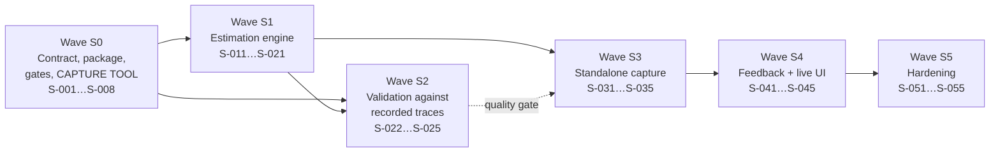

# OptimalRunner — Standalone iPhone Track: Implementation Plan

| Field | Value |
|---|---|
| Document | `docs/standalone/implementation.md` |
| Track | **Standalone** — pace management on iPhone alone, no paired watch |
| Version | 1.0 |
| Status | Executing |
| Last updated | 2026-07-27 |
| Companions | [`requirements.md`](./requirements.md), [`design.md`](./design.md) |
| Depends on | [`../implementation.md`](../implementation.md) — the core track's Waves 0–4 are complete and are the substrate this builds on |

---

## 0. How to execute this plan

Same contract as the core track (`../implementation.md` §0), with this track's own identifier space.

| Field | Meaning |
|---|---|
| **ID** | `S-###`. Stable forever. Never reused or renumbered. Unrelated to the core track's `T-###`. |
| **Wave** | `S0`…`S5`. A fresh sequence, not a continuation of the core Waves 0–7. |
| **Depends on** | Task IDs — `S-###` from this track, `T-###` where a core task is a genuine prerequisite. |
| **Satisfies** | Requirement IDs from [`requirements.md`](./requirements.md). |
| **Touches** | Paths this task may create or modify. Two tasks in a wave never overlap. |
| **Done when** | Objective, checkable conditions. |

The core track's rules apply unchanged, plus two that are specific to this track and are the whole
reason it is sequenced the way it is:

6. **No accuracy claim from a synthetic signal.** A test that asserts a distance-, cadence- or
   step-count *accuracy percentage* must read a recorded trace. Synthetic generators are for
   structural properties over labelled inputs only. This is a CI gate
   ([S-008](#s-008)), not a convention — see
   [CON-S-7](./requirements.md#con-s-7) and [design.md §8.3](./design.md#83-synthetic-signals-and-the-wall-between-them).
7. **Ground truth before tuning.** No estimator parameter is tuned against anything except a
   recorded trace or a first-principles argument written down in `design.md`. "It looked better on
   my walk to the kitchen" is not a justification and cannot be reviewed.

### Wave overview



The dotted edge is the important one. **Wave S3 onwards should not start until Wave S2 has produced
a real accuracy number**, because everything after S2 is UI and plumbing built on the assumption
that the estimator works. Building it first would mean discovering the estimator does not work after
paying for the app around it — and it is exactly the ordering the track brief asked for: estimation
first, UI only once the estimation layer is trustworthy.

### Milestone mapping

| Milestone | Waves | Tasks | Ships |
|---|---|---|---|
| M-S1 — Ground truth | S0 | S-001…S-008 | The contract, the pure package, the gates, and the on-device capture tool |
| M-S2 — Estimation engine | S1, S2 | S-011…S-025 | Cadence, steps, step length, fusion, calibration — property-tested, then trace-validated |
| M-S3 — Standalone capture | S3 | S-031…S-035 | A standalone run that records, saves, and lands in the hub |
| M-S4 — Feedback | S4 | S-041…S-045 | Spoken cues, haptics, the live run screen |
| M-S5 — Hardening | S5 | S-051…S-055 | Degraded modes, settings, performance, the manual protocol |

---

## Wave S0 — Contract, package, gates, and ground truth

Everything here is prerequisite. [S-006](#s-006) — the capture tool — is the one that unblocks
reality, and it is scheduled in this wave rather than later for the reason
[CON-S-1](./requirements.md#con-s-1) gives: nothing downstream can be honestly validated without it.

<a id="s-001"></a>
### S-001 — The `PhoneMotion` package and its Linux lane

| | |
|---|---|
| **Wave** | S0 |
| **Depends on** | T-001 |
| **Satisfies** | NFR-S-18, NFR-S-21, CON-S-1 |
| **Touches** | `Apps/iPhone/PhoneMotion/Package.swift`, `Apps/iPhone/PhoneMotion/Sources/PhoneMotion/**`, `Apps/iPhone/PhoneMotion/README.md`, `.github/workflows/core.yml` |

Create the pure estimation package per [ADR-S-03](./design.md#adr-s-03): depends on `ORModels` and
nothing else, declares no Apple-framework import, and carries **no `platforms:` floor** so it builds
on Linux alongside `Core`. Add it to `core.yml`'s Linux lane with the same 85% coverage gate.

**Done when:** `swift build --package-path Apps/iPhone/PhoneMotion` succeeds; `swift test` runs on
the Linux container image `core.yml` already uses; the README states what belongs in the package and
what does not; the coverage gate runs against it.

<a id="s-002"></a>
### S-002 — Extend the sensor contract

| | |
|---|---|
| **Wave** | S0 |
| **Depends on** | S-001 |
| **Satisfies** | FR-S-A-3, CON-S-2, CON-S-3 |
| **Touches** | `Core/Sources/ORModels/Domain/RunTypes.swift`, `Core/Sources/ORModels/Domain/Samples.swift`, `Core/Tests/ORModelsTests/**`, `Apps/WatchModern/WatchSupport/Tests/WatchSupportTests/TierEquivalenceTests.swift`, `Apps/WatchLegacy/LegacySupport/Tests/LegacySupportTests/TierEquivalenceTests.swift` |

Implement [ADR-S-02](./design.md#adr-s-02): `DistanceCapability`, `WorkoutSessionCapability`, the two
new `SensorCapabilities` fields with memberwise defaults and a `decodeIfPresent` decoder,
`DistanceSource.motionModel`, `DeviceTier.phoneStandalone`, and `CarryPosition`
([ADR-S-04](./design.md#adr-s-04)).

The two watch tiers' `rank(_:)` helpers are the only exhaustive switches over `DistanceSource`, and
they are updated here — a named, deliberate consequence rather than a surprise. **The proof that
this changed nothing is that the committed watch goldens still pass without modification**
(AC-FR-S-A-3-4).

**Done when:** both watch tiers' full suites pass with no golden regenerated; a `SensorCapabilities`
JSON written without the new keys decodes with the documented defaults; `DistanceSource.motionModel`
does not trip `RunEngine`'s indoor inference, asserted by a test; every new type is
`Codable, Sendable, Hashable` and round-trips.

<a id="s-003"></a>
### S-003 — `MotionEstimationConfiguration`

| | |
|---|---|
| **Wave** | S0 |
| **Depends on** | S-001 |
| **Satisfies** | NFR-S-19 |
| **Touches** | `Apps/iPhone/PhoneMotion/Sources/PhoneMotion/Configuration/**`, `Apps/iPhone/PhoneMotion/Tests/PhoneMotionTests/ConfigurationTests.swift` |

One `Codable, Sendable` struct holding every tunable this track declares — sample rate, filter
cutoffs, autocorrelation window, cadence range, refractory fraction, detector threshold factor, step
length clamps and exponent, calibration window length, learning rate, movement cap, gain bounds,
disagreement threshold — each with its documented default, its permitted range, and a `validate()`.

The 5 m handover bound is **deliberately not here**: it is a correctness constraint, not a tunable,
and lives in the type that enforces it, exactly as `DistanceFusion.maxSwitchJumpMetres` does on the
watch (`../design.md` §4).

**Done when:** every value marked *(tunable)* in `requirements.md` and `design.md` has a field;
`validate()` rejects each out-of-range value with a specific error; the type round-trips through
JSON; no estimation source file contains a numeric literal that belongs here.

<a id="s-004"></a>
### S-004 — Establish the Simulator's motion capability empirically

| | |
|---|---|
| **Wave** | S0 |
| **Depends on** | T-005 |
| **Satisfies** | CON-S-1 |
| **Touches** | `Apps/iPhone/Tests/MotionAvailabilityTests.swift` |

[CON-S-1](./requirements.md#con-s-1) is the constraint the whole track's testing strategy is built
on, so it is *measured*, not assumed. A test in the iOS app target records what
`CMMotionManager` reports in the environment it is running in — accelerometer, gyroscope, device
motion availability — and asserts the finding that the strategy depends on.

**Done when:** the test runs on an installed simulator and records the result; the finding is
written into `design.md` §10.1 as measured rather than asserted; the test is written so it passes on
a real device too, where the answer is different, rather than being a simulator-only assertion that
would fail the moment someone runs the suite on hardware.

<a id="s-005"></a>
### S-005 — Motion trace format and codec

| | |
|---|---|
| **Wave** | S0 |
| **Depends on** | S-001 |
| **Satisfies** | FR-S-F-2, NFR-S-16 |
| **Touches** | `Apps/iPhone/PhoneMotion/Sources/PhoneMotion/Trace/**`, `Apps/iPhone/PhoneMotion/Tests/PhoneMotionTests/TraceTests.swift`, `Fixtures/motion/README.md` |

The versioned columnar trace format from [design.md §8.2](./design.md#82-the-trace-format): header
(device, OS, app version, sample rate, height, carry position, declared references), parallel arrays
for motion, a location array, a pedometer array, and a marks array. Encoded and decoded in the pure
package so the estimator can read a trace with no Apple framework present.

**Done when:** a 60-minute 100 Hz trace encodes and decodes losslessly within stated per-column
resolution; the header states which references the trace carries; decode of a 360 000-sample trace
completes in under 2 s; `Fixtures/motion/README.md` states what belongs there and, explicitly, that
synthetic signals do not.

<a id="s-006"></a>
### S-006 — On-device raw motion capture

| | |
|---|---|
| **Wave** | S0 |
| **Depends on** | S-005, T-052 |
| **Satisfies** | FR-S-F-1, CON-S-1, CON-S-4 |
| **Touches** | `Apps/iPhone/Sources/Standalone/Capture/**`, `Apps/iPhone/project.yml` (Info.plist keys, background modes) |

The developer-facing capture screen from [design.md §8.1](./design.md#81-the-capture-tool). Records
device motion at 100 Hz, every location fix, `CMPedometer` output, and one-tap marks; writes
incrementally; exposes files through the Files app and the share sheet.

This task is the **critical path of the entire track**. Everything in Waves S1 and S2 that claims a
number depends on a file this produces.

**Done when:** a 60-minute capture completes on a real device without dropping below 90% of the
configured sample rate; the file is retrievable without a debugger; a kill mid-capture loses at most
30 s; the mark button is usable at running pace; the capture screen is reachable deliberately and
not discoverable by accident.

<a id="s-007"></a>
### S-007 — The recording protocol

| | |
|---|---|
| **Wave** | S0 |
| **Depends on** | S-006 |
| **Satisfies** | FR-S-F-2, CON-S-7 |
| **Touches** | `Tools/motion-recording-protocol.md` |

The written protocol for what to record, how, and what each recording is able to prove. See
[§ Recording protocol](#recording-protocol-what-to-capture-and-why) below for the version handed
over in this pass.

**Done when:** the protocol names, per session, the required duration, pace, route characteristics,
carry behaviour, and the reference that makes it useful; it states what each session validates and
what it cannot; it has a results template.

<a id="s-008"></a>
### S-008 — Structural gates for this track

| | |
|---|---|
| **Wave** | S0 |
| **Depends on** | S-001, S-005 |
| **Satisfies** | NFR-S-20, CON-S-7 |
| **Touches** | `Tools/check-core-imports.sh`, `Tools/check-motion-fixtures.sh`, `Tools/check-traceability.swift`, `.github/workflows/gates.yml` |

Three gate changes:

1. `check-core-imports.sh` scans `Apps/iPhone/PhoneMotion/Sources` with the same banned list, so
   [ADR-S-03](./design.md#adr-s-03)'s purity is mechanically enforced rather than reviewed.
2. `check-motion-fixtures.sh` — new. Fails when a test file references a synthetic motion generator
   *and* asserts an accuracy bound. This is the mechanical form of
   [CON-S-7](./requirements.md#con-s-7), and it is the gate that stops this track's central risk
   from being papered over by a green suite.
3. `check-traceability.swift` parses `docs/standalone/*.md` with the `S`-prefixed identifier
   pattern, and fails on the same two conditions as the core track.

**Done when:** each gate passes on the clean tree; each fails with a clear `::error::` when a
violation is planted; the traceability checker reports both tracks' counts and fails when a
standalone P0 requirement loses its covering task.

---

## Wave S1 — The estimation engine

All of Wave S1 is pure, Linux-testable, and property-tested. None of it can claim an accuracy figure
— that is Wave S2's job, and the gate from [S-008](#s-008) enforces the separation.

<a id="s-011"></a>
### S-011 — Vector maths and orientation resolution

| | |
|---|---|
| **Wave** | S1 |
| **Depends on** | S-001, S-003 |
| **Satisfies** | FR-S-B-1, AC-FR-S-B-3-3 |
| **Touches** | `Apps/iPhone/PhoneMotion/Sources/PhoneMotion/Signal/Vector3.swift`, `.../Signal/OrientationResolver.swift`, `Apps/iPhone/PhoneMotion/Tests/PhoneMotionTests/OrientationTests.swift` |

`Vector3`, and the two channels of [design.md §3.2](./design.md#32-orientation-and-why-it-is-less-of-a-problem-than-it-looks):
the gravity-projected vertical `a_v` and the gravity-free magnitude `a_m`.

**Done when:** applying any fixed rotation to a whole sample stream leaves `a_v` and `a_m` unchanged
to within floating-point tolerance, asserted as a property over generated rotations; a degenerate or
zero gravity vector yields *no* vertical channel rather than a division by zero; the sign convention
(`a_v` positive upward) is asserted with a named test rather than left to a comment.

<a id="s-012"></a>
### S-012 — Causal Butterworth filters

| | |
|---|---|
| **Wave** | S1 |
| **Depends on** | S-003 |
| **Satisfies** | FR-S-B-1, NFR-S-14 |
| **Touches** | `Apps/iPhone/PhoneMotion/Sources/PhoneMotion/Signal/Biquad.swift`, `Apps/iPhone/PhoneMotion/Tests/PhoneMotionTests/FilterTests.swift` |

Second-order Butterworth sections as a causal biquad cascade, for the gait band (0.7–7.0 Hz) and the
impact band (5–25 Hz) from [design.md §3.3](./design.md#33-filtering).

**Explicitly not zero-phase.** A forward-backward pass would be the standard offline choice and is
unavailable here: live estimation and fixture replay must produce bit-identical output
(NFR-S-14), and a backward pass is not causal.

**Done when:** the magnitude response is within 1 dB of the analytic Butterworth response at a set
of probe frequencies across each band; DC and a 30 Hz tone are attenuated by the gait band by at
least 20 dB; the filter is stable over 360 000 samples with no coefficient drift; identical input
produces identical output across repeated runs.

<a id="s-013"></a>
### S-013 — Normalized autocorrelation with parabolic refinement

| | |
|---|---|
| **Wave** | S1 |
| **Depends on** | S-012 |
| **Satisfies** | FR-S-B-2, NFR-S-1 |
| **Touches** | `Apps/iPhone/PhoneMotion/Sources/PhoneMotion/Cadence/Autocorrelation.swift`, `Apps/iPhone/PhoneMotion/Tests/PhoneMotionTests/AutocorrelationTests.swift` |

Normalized autocorrelation over the lag range, peak search, and the parabolic interpolation from
[design.md §4.1](./design.md#41-cadence-by-normalized-autocorrelation) — which is not an
optimisation but a requirement, since one sample of lag error at 180 spm is already 5.4 spm against
a ±3 spm bound.

**Done when:** a pure sinusoid at a known non-integer-sample period is recovered to within 0.3% of
its true period, across the whole lag range — the arithmetic that makes NFR-S-7 reachable at all; a
constant signal yields no peak rather than a spurious one; a 5.12 s window at 100 Hz is processed in
under 2 ms.

<a id="s-014"></a>
### S-014 — Cadence estimator and the stride/step ambiguity

| | |
|---|---|
| **Wave** | S1 |
| **Depends on** | S-013 |
| **Satisfies** | FR-S-B-2, NFR-S-3 |
| **Touches** | `Apps/iPhone/PhoneMotion/Sources/PhoneMotion/Cadence/CadenceEstimator.swift`, `Apps/iPhone/PhoneMotion/Tests/PhoneMotionTests/CadenceTests.swift` |

The estimator from [design.md §4.3](./design.md#43-resolving-the-stride-versus-step-ambiguity): the
disjoint-interval range rule, harmonic confirmation, the boundary treatment, and the three-factor
confidence of [§4.4](./design.md#44-confidence).

**The test that matters most** is the labelled sweep required by AC-FR-S-B-2-5: cadences from 140 to
200 spm, each with a stride-frequency component of equal or greater amplitude, every one of which
must return the step rate. That sweep fails against the published 1.4 Hz threshold for every case
above 168 spm, which is the point of writing it.

**Done when:** the sweep passes for every cadence in 140–200 spm at 1 spm resolution; out-of-range
input yields `nil` rather than a clamped value; confidence falls when the harmonic check fails; a
first estimate is available within 15 s of stream start (NFR-S-3); output is deterministic.

<a id="s-015"></a>
### S-015 — Step detector and the phase-locked fallback

| | |
|---|---|
| **Wave** | S1 |
| **Depends on** | S-014 |
| **Satisfies** | FR-S-B-3 |
| **Touches** | `Apps/iPhone/PhoneMotion/Sources/PhoneMotion/Steps/StepDetector.swift`, `Apps/iPhone/PhoneMotion/Tests/PhoneMotionTests/StepDetectorTests.swift` |

Impact-envelope peak detection with an adaptive threshold and a cadence-derived refractory interval,
plus the phase-locked fallback from
[design.md §4.2](./design.md#42-step-events-from-the-impact-envelope).

**Done when:** over labelled synthetic signals of *n* steps across 120–240 spm, the detected count is
in [n−1, n+1] with no double counting; no two events are ever closer than the refractory interval;
a labelled 20 s stationary interval produces no events; suppressing the impact channel entirely
drives the fallback and the step *rate* is preserved even though individual event times are not.

<a id="s-016"></a>
### S-016 — Step length model

| | |
|---|---|
| **Wave** | S1 |
| **Depends on** | S-015 |
| **Satisfies** | FR-S-B-4, NFR-S-11 |
| **Touches** | `Apps/iPhone/PhoneMotion/Sources/PhoneMotion/Steps/StepLengthModel.swift`, `Apps/iPhone/PhoneMotion/Tests/PhoneMotionTests/StepLengthTests.swift` |

The model from [design.md §5.2](./design.md#52-the-model), the clamps of
[§5.5](./design.md#55-bounds), and the no-GNSS van Oeveren prior of
[§5.4](./design.md#54-the-no-gnss-prior).

**No fabricated scale constant** ([ADR-S-06](./design.md#adr-s-06)): with no calibration the model
reports *unavailable* rather than a number, and the prior is used only on the explicit no-GNSS path.

**Done when:** the van Oeveren prior reproduces the [design.md §5.1](./design.md#51-why-a-cadence-only-model-cannot-work-for-running)
table to within 0.001 m at every listed speed — the check that the published relation was
transcribed correctly; step length is monotonically non-decreasing in amplitude at fixed height and
cadence, as a property; NaN and infinite inputs yield no estimate rather than propagating; an
uncalibrated model with no prior path returns `nil` and never a default.

<a id="s-017"></a>
### S-017 — Calibrator

| | |
|---|---|
| **Wave** | S1 |
| **Depends on** | S-016 |
| **Satisfies** | FR-S-C-2 |
| **Touches** | `Apps/iPhone/PhoneMotion/Sources/PhoneMotion/Fusion/Calibrator.swift`, `Apps/iPhone/PhoneMotion/Tests/PhoneMotionTests/CalibratorTests.swift` |

Window qualification, the bounded update, the whole-value bootstrap, per-cadence-band gains, and
persistable `CalibrationState`, per [design.md §6.2](./design.md#62-calibration).

**Done when:** the gain stays inside its bounds under any observation sequence including adversarial
ones, as a property; no single window moves it by more than the cap; the bootstrap takes the first
observation whole and every subsequent one through the cap; a window failing any qualification
condition contributes nothing; the state round-trips through JSON; convergence from bootstrap is
within the configured window count.

<a id="s-018"></a>
### S-018 — Distance fusion

| | |
|---|---|
| **Wave** | S1 |
| **Depends on** | S-017 |
| **Satisfies** | FR-S-C-1, FR-S-C-3, NFR-S-12, DEG-S-1, DEG-S-2, DEG-S-3, DEG-S-7, DEG-S-8 |
| **Touches** | `Apps/iPhone/PhoneMotion/Sources/PhoneMotion/Fusion/DistanceFusion.swift`, `.../Fusion/MotionEstimator.swift`, `Apps/iPhone/PhoneMotion/Tests/PhoneMotionTests/FusionTests.swift` |

The state machine of [design.md §6.1](./design.md#61-the-fusion-state-machine), delta accumulation,
the disagreement detector of [§6.3](./design.md#63-sanity-checking-gnss), and the `MotionEstimator`
facade of [§7.1](./design.md#71-what-phonemotion-exposes).

**Done when:** cumulative distance is non-decreasing under every generated source-switch sequence;
no switch moves it by more than 5 m; a corrupted-GNSS segment raises the disagreement flag,
suspends calibration, and does **not** override GNSS; motion-model samples are marked estimated and
the measured/estimated totals sum to the whole; the carry-position-change signature suppresses the
motion leg rather than feeding it out-of-domain input.

<a id="s-019"></a>
### S-019 — Labelled synthetic signal generator

| | |
|---|---|
| **Wave** | S1 |
| **Depends on** | S-005 |
| **Satisfies** | FR-S-F-3 |
| **Touches** | `Apps/iPhone/PhoneMotion/Sources/PhoneMotion/Synthetic/**`, `Apps/iPhone/PhoneMotion/Tests/PhoneMotionTests/SyntheticTests.swift` |

A generator producing signals with a *known* step count, cadence, stationary interval and
stride-frequency arm-swing component — in a type explicitly named and documented as synthetic, in
its own directory, so [S-008](#s-008)'s gate can see it.

**Done when:** generated signals carry their labels as data; the type name and directory make the
synthetic/recorded distinction unmissable; the gate from S-008 fires when a test uses this type to
assert an accuracy percentage.

<a id="s-020"></a>
### S-020 — Property test suite

| | |
|---|---|
| **Wave** | S1 |
| **Depends on** | S-018, S-019 |
| **Satisfies** | NFR-S-14, NFR-S-21 |
| **Touches** | `Apps/iPhone/PhoneMotion/Tests/PhoneMotionTests/PropertyTests.swift` |

Every property in [design.md §10.2](./design.md#102-property-tests), hand-rolled generators, seeded
so failures reproduce.

**Done when:** all thirteen properties pass with at least 500 cases each; each names the requirement
it defends; the suite runs in under 60 s; a deliberately introduced off-by-one in the refractory
logic is caught.

<a id="s-021"></a>
### S-021 — `motionreplay` CLI

| | |
|---|---|
| **Wave** | S1 |
| **Depends on** | S-018 |
| **Satisfies** | FR-S-F-2 |
| **Touches** | `Apps/iPhone/PhoneMotion/Sources/motionreplay/**` |

The offline replay tool of [design.md §8.4](./design.md#84-the-replay-cli): cadence over time, step
count, step-length distribution, fused distance, provenance split, and the comparison against the
trace's declared reference — plus `--update-goldens` producing a reviewable diff.

**Done when:** a trace replays and prints all of the above; the reference comparison names which
reference it used and what that reference's own accuracy is; `--update-goldens` writes a golden a
subsequent run matches exactly.

---

### Waves S0 and S1 — as built

Deviations and findings from executing this plan, recorded here rather than left in commit
messages — the discipline the core track's "Wave 4 — as built" section established.

**The environment, first, because it shaped how everything was verified.** This repository lived
under `~/Desktop` while Waves S0 and S1 were built, and `~/Desktop` on this machine is synced by
iCloud Drive. The effect was severe rather than cosmetic: `git rev-parse HEAD` took **93 seconds at
0% CPU**, and `swift build` stalled indefinitely. All verification was therefore run against an
`rsync` copy under `/private/tmp`, which is not synced.

The cause was identified afterwards and is worth writing down, because the natural conclusion from a
hanging `git status` is that the repository is broken and it is not. With the disk at 96% full,
macOS had **evicted 720 of the repository's 1121 files** to iCloud placeholders — most of `.git` and
several golden fixtures among them — and every read of an evicted file blocks on an on-demand
download. The 2.4 GB of SwiftPM `.build` directories inside the synced folder were both the largest
source of sync churn and the reason the disk had no headroom. The repository now lives at
`~/Downloads/running_app/OptimalRunning`, which is not synced; the same `git rev-parse` takes 0.02 s.
Keep it out of `~/Desktop` and `~/Documents`.

**S-001 — `PhoneMotion` declares platform floors after all**, restated from `Core` rather than
chosen. The manifest was written with none, on the correct principle that arithmetic over arrays of
doubles has no deployment target to state. SwiftPM disagrees: `Core` declares `.macOS(.v13)` (core
track T-063), and a package may not depend on a product with a higher floor than its own. The Linux
lane — the only thing [ADR-S-03](./design.md#adr-s-03) was protecting — is unaffected, because
SwiftPM ignores `platforms:` there entirely. Reconciled in that ADR.

**S-016 — the van Oeveren prior is valid over a far narrower band than reading the paper suggests,
and this was found by implementing it.** The relation was fitted over 1.64–4.68 m·s⁻¹; inverted,
that entire speed range maps to a cadence band of **159.9–178.2 spm**. Below the floor it returns a
*negative* speed — at 150 spm, −0.0033 m/s — and above the ceiling it implies 6.65 m/s for a runner
at 190 spm. `priorStepLength` now returns `nil` outside `[2.665 Hz, 2.969 Hz]` rather than
extrapolating, and a runner outside that band on a GNSS-free first run gets a timed run with no
distance, which is what [ADR-S-06](./design.md#adr-s-06) prescribes anyway. Written up in
[design.md §5.4](./design.md#54-the-no-gnss-prior).

This is also the sharpest available statement of [§5.1](./design.md#51-why-a-cadence-only-model-cannot-work-for-running)'s
argument, and it is worth the emphasis: **a 185% increase in running speed shows up as an 11%
increase in cadence.** A model that reads speed from cadence is reading an 11% signal to explain a
185% effect.

#### Five real bugs the tests caught

All five were caught by tests written to the acceptance criteria before the code was tuned, and all
five were in shipped-looking code that ran without complaint.

**1 — The autocorrelation picked an arbitrary *multiple* of the period.** A periodic signal
correlates with itself at every multiple of its period, and for a clean signal those peaks are
within floating-point noise of one another, so "take the largest" picks whichever one happened to
score higher. `testRecoversANonIntegerPeriodToWellUnderOneSample` reported a **200% period error** on
a pure sinusoid. Fixed by preferring the shortest lag within 85% of the best peak — the standard
fundamental-frequency rule — which is also provably safe for the stride-versus-step problem, since
`L` and `2L` map to the same cadence by construction ([§4.3](./design.md#43-resolving-the-stride-versus-step-ambiguity)).

**2 — The step detector had no refractory interval before the first cadence estimate existed.** The
refractory is derived from the live cadence, and `(cadence?.stepPeriodSeconds ?? 0)` is zero when
there is no cadence yet — so for the first several seconds of every run the gate was wide open, and
the property suite found event gaps of 0.08 s against a 0.15 s bound. Fixed with a floor at the
fastest physiologically admissible step period.

**3 — There was no stationarity gate at all, so the detector kept counting steps at a traffic
light.** [AC-FR-S-B-3-5](./requirements.md#fr-s-b-3--step-event-detection) requires no events during
a stationary interval and nothing implemented it. The adaptive threshold cannot do the job by
itself, and the reason is worth recording: being *relative* — mean plus kσ over a trailing window —
it follows the signal down and finds "peaks" in sensor noise. Worse, the phase-locked fallback keeps
synthesising steps at the last known cadence for as long as the correlation window remembers it. An
absolute RMS floor on the gait band now suppresses both, and `steps.stationaryRMSThreshold` is a new
tunable.

**4 — Calibration learned from a bad window before the disagreement check could see it.** The
disagreement comparison ran on a 200 m window while the calibration window is 100 m, so the first
calibration window closed and was **applied** before the first disagreement window had been
evaluated. `testCalibrationDoesNotMoveWhileDisagreementIsSuspended` caught the scale moving its full
per-window cap on data where GNSS reported double the motion leg. The check now runs on the
calibration window itself, immediately before applying it — suspension after the fact is no use when
the damage is already in the persisted state.

**5 — Window qualification was all-or-nothing and disqualified the first window of every run.**
[AC-FR-S-C-2-7](./requirements.md#fr-s-c-2--online-calibration-against-gnss) forbids learning from a
window "where cadence confidence was low", which was implemented as "where *any* step lacked a
confident cadence". Every run begins with a few seconds of no cadence estimate at all while the
correlation window fills, so every run's *first* window was disqualified — the exact window a
first-ever calibration depends on. `testSuppressingFixesAfterATimeProducesAnEstimatedTail` failed
with no calibration after a clean 60 s of GNSS. Now a window qualifies if ≥ 80% of its steps carried
a confident cadence.

#### Smaller things, recorded because they will look arbitrary otherwise

- **The filters are causal, never zero-phase.** Offline gait analysis normally uses a
  forward-backward pass; that is unavailable here because live estimation and fixture replay must be
  bit-identical ([NFR-S-14](./requirements.md#94-reliability)) and a backward pass is not causal.
- **`Rotation.axisAngle` is written out element by element.** The nine compound expressions in one
  array literal defeat Swift's type checker outright — a compile error, not a slow build.
- **`CadenceEstimator`'s analysis is `static`.** Passing `&vertical` while calling a `mutating`
  method on `self` is an exclusivity violation. The config and previous estimate are hoisted into
  locals instead.
- **The coverage gate and its summariser now take a package path and a source root.** They were
  hardcoded to `Core`; `PhoneMotion` is gated on the same 85% terms
  ([NFR-S-21](./requirements.md#96-maintainability)), and duplicating the script would have meant
  two copies of the llvm-cov-location logic to keep in step.
- **`DistanceFusion` takes the calibration configuration as an init parameter.** The first
  implementation reached for a mutable static, which is global mutable state in a package whose
  entire value is determinism.
- **Cadence *confidence* and the minimum autocorrelation *peak* were the same constant, and should
  not have been.** `minimumPeakCorrelation` (0.30) gates whether an estimate is emitted at all;
  confidence is a product of three factors ([§4.4](./design.md#44-confidence)) and lives on a
  different scale entirely. Reusing one for the other made the calibration gate far laxer than it
  read. `cadence.minimumTrustedConfidence` now exists and is shared by the calibrator and the
  phase-locked fallback, so the two cannot come to disagree about what "trusted" means.
- **Three literals moved into configuration** under [NFR-S-19](./requirements.md#96-maintainability)
  — the trusted-confidence threshold, the confident-step fraction, and the stationary RMS floor.
  Three others stayed as declared constants with their reasoning at the declaration, following the
  core track's own distinction (`design.md` §4): `Autocorrelator.fundamentalPreferenceRatio`,
  `StepDetector.fallbackLatenessFactor` and `CadenceEstimator.channelDisagreementThreshold` are
  algorithm correctness constants, not values a runner or a deployment might legitimately vary.
- **`Tools/check-motion-fixtures.sh` was committed without its executable bit**, which only the
  first push revealed. Every local run had invoked it as `bash Tools/check-motion-fixtures.sh`;
  `gates.yml` invokes it directly, so CI failed with exit 126 — `Permission denied` — while the
  gate passed on every machine it had ever been run on. The mode is now `100755`, and the other
  five CI-invoked scripts were checked the same way rather than one at a time. The lesson is the
  narrow one: a gate verified through an interpreter is not verified the way CI runs it.

#### What is *not* built, and is not pretended to be

- **No recorded trace exists**, so Wave S2 has not run and every accuracy requirement in
  [§9.3](./requirements.md#93-accuracy) remains **unvalidated**. The
  [validation-status table](./requirements.md#121-validation-status) says so, and
  `Tools/check-motion-fixtures.sh` makes it structurally impossible for a synthetic test to claim
  otherwise.
- **The capture tool has not been run on a device.** The app target builds and its suite passes, and
  [S-004](#s-004) measured the Simulator reporting `deviceMotion`, `accelerometer`, `gyroscope` and
  `pedometer` all **false** — which both confirms [CON-S-1](./requirements.md#con-s-1) and exercises
  the tool's refusal path. But "records a clean 60-minute trace" is a claim only a phone can
  support, and it has not been made.
- **Waves S3–S5 are specified and not built.** The gate between S2 and S3 is deliberate: the shape of
  the standalone app legitimately depends on what the traces measure.

---

<a id="s-056"></a>
### S-056 — The first field session recorded nothing, and why

**Satisfies** FR-S-F-1, AC-FR-S-F-1-6 · **Wave** S1 (unplanned)

The first attempt to record on a real phone produced **five consecutive captures of zero bytes**.
The app exited when *Start capture* was tapped, and when it stayed up the screen stopped responding,
so MARK could not be pressed. This is the failure mode [S-006](#s-006) exists to prevent, and it
reached a run because the capture tool shipped with **no tests at all** — the app target had six,
none of which touched capture. "It is only a developer tool" was exactly the wrong reason to leave
it unverified: a bug here is not a degraded feature, it is a run that cannot be re-recorded without
going outside again.

**What was ruled out by measurement, not by reading.** `CaptureWriter` was suspected first and is
innocent: `CaptureWriterTests` drives it directly and it writes, flushes, recovers a truncated
stream and assembles correctly. Two false leads were followed and are recorded because both are easy
to repeat — `plutil -extract` **rewrites the file in place** unless given `-o -`, which corrupts the
very plist being inspected; and `URL.resourceValues` caches, so reading a file's size before and
after an append returns the first answer twice and reads exactly like a product that never wrote.
Neither was a defect in the app.

**The defects that were real**, each independently capable of producing what the field session saw:

| | Defect | Consequence |
|---|---|---|
| 1 | The recorder was a `@StateObject` **inside** `MotionCaptureView`, a `NavigationLink` destination | Navigating away destroyed it mid-capture: sensors stopped, `finish` never ran, no trace assembled. Directly matches "I reopened the page and the recording had stopped" |
| 2 | Every sample hopped to the **main actor** to JSON-encode and `write(2)` | 100 main-actor hops a second, each doing file I/O |
| 3 | `@Published` counters mutated at **100 Hz** | SwiftUI rebuilt the whole screen every frame — an unresponsive UI, and an app whose main thread is wedged when the system asks it to suspend is one the watchdog terminates |
| 4 | `guard let data = try? encoder.encode(record) else { return }` | An encoding failure produced an empty capture, no error, and no way to distinguish that from a silent sensor. `JSONEncoder` rejects non-finite doubles by default |
| 5 | A fresh `JSONEncoder` per record | Built and torn down a hundred times a second |
| 6 | `isIdleTimerDisabled` never set | The screen slept, putting Face ID between the runner and the one control that has to work |
| 7 | Location authorisation never surfaced | Without it the `location` background mode cannot hold the process up ([CON-S-4](./requirements.md#con-s-4)), so capture dies at screen-lock with no error |

**The fix.** Capture work leaves the main thread entirely: `CaptureSink` is a serial queue that every
record passes through, which is also what makes `CaptureWriter`'s lack of an internal lock sound —
three sensor streams arrive on three queues and something has to serialise them. Motion at 100 Hz
touches neither the main actor nor the recorder. Location (~1 Hz) and the pedometer still build their
records on the main actor, because at that rate it costs nothing and the code is plainer for it.
Counters are read from the sink twice a second by the display timer instead of being published by the
sensor. Marks are written **synchronously** — a mark is the one record a runner cannot supply twice,
so it is on disk before the button's action returns rather than queued behind a backlog of samples.
The recorder is owned by `OptimalRunnerApp` and injected, so a capture outlives the screen.

**What killed the app was none of the above** — see [S-057](#s-057). This section originally closed by
naming "the watchdog terminated a wedged main thread" as the leading explanation, on the strength of
defects 2 and 3. The crash reports say otherwise: `EXC_BREAKPOINT` in a Swift isolation check, not
`0x8badf00d`. The guess is left recorded here rather than quietly deleted, because it is a fair
illustration of how far a plausible mechanism can be from the real one when the evidence has not been
read yet. Everything in the table above is a genuine defect and worth having fixed; none of them was
the crash.

**Tests.** Ten, where there were none: bytes-on-disk assertions for the writer (including a
deliberately non-finite sample, which must surface rather than vanish), and concurrent multi-queue
drivers for the sink asserting that no record is lost and no two writes interleave into invalid JSON.
Every one asserts on the file, because the failure being chased wrote nothing while reporting nothing.

---

<a id="s-057"></a>
### S-057 — The crash itself: a sensor callback that inherited main-actor isolation

**Satisfies** FR-S-F-1, CON-S-1 · **Wave** S1 (unplanned)

All five crash reports are identical, and none of them is a watchdog kill:

```
exception:   EXC_BREAKPOINT (SIGTRAP)
queue:       NSOperationQueue (QOS: USER_INITIATED)

  _dispatch_assert_queue_fail
  dispatch_assert_queue
  _swift_task_checkIsolatedSwift
  swift_task_isCurrentExecutorWithFlagsImpl
  closure #1 in MotionCaptureRecorder.startMotion()
  thunk for @escaping @callee_guaranteed (CMDeviceMotion?, Error?) -> ()
  -[NSBlockOperation main]
```

**The mechanism.** `CMDeviceMotionHandler` is a plain Objective-C block —
`typedef void (^CMDeviceMotionHandler)(CMDeviceMotion *, NSError *)` — with no
`NS_SWIFT_SENDABLE`. It therefore imports as a *non-Sendable* closure type, and a closure literal
written inside a method of a `@MainActor` type **inherits main-actor isolation**. No diagnostic is
possible: the imported block type carries no isolation information for the compiler to contradict.
CoreMotion then invokes the closure on the `NSOperationQueue` it was handed, Swift's runtime checks
the current executor, finds it is not the main one, and traps. The first motion sample arrives 10 ms
after `startDeviceMotionUpdates`, which is why every capture died within seconds and why all five
files were zero bytes: nothing survived long enough to be written.

**Both directions were verified before the fix was accepted**, because "add `@Sendable` and hope" is
not a diagnosis:

| | Result |
|---|---|
| Handler declared `@Sendable`, main-actor access added inside | `error: main actor-isolated property 'motionSampleCount' can not be mutated from a Sendable closure` |
| Original inline trailing closure, *identical* access added | `** BUILD SUCCEEDED **` |

The second row is the bug in one line: the same code that is a compile error in a non-isolated
closure compiles silently in an inferred-main-actor one, and only fails on hardware.

**The fix** is to write the handler's type out and mark it `@Sendable`, which opts the closure out of
isolation inference and moves the question to compile time. Any main-actor access added to a sensor
handler in future is now a build error rather than a crash on a run.

**Why the Simulator could never have caught it.** The handler is only invoked when a sample arrives,
and the Simulator has no accelerometer at all ([CON-S-1](./requirements.md#con-s-1)). The constraint
this whole track is built around turned up here as a crash rather than as a missing number — the
`swift_task_isCurrentExecutor` check simply never runs where there is nothing to deliver.

**Two more instances, found by the gate rather than by the crash.**
[`Tools/check-sensor-handler-isolation.sh`](../../Tools/check-sensor-handler-isolation.sh) was written
to prevent a recurrence and immediately failed on code that had shipped in Waves 2 and 4:

- `Apps/WatchModern/.../LiveSensorFeed.swift` — the pedometer handler called
  `MainActor.assumeIsolated` from CMPedometer's background queue. That is a hard fatal error, not a
  check that quietly passes.
- `Apps/WatchLegacy/.../LiveSensorFeed.swift` — the pedometer handler assigned to a main-actor
  property directly from the same background queue. On a Series 3 that traps about ten seconds into
  any run, as soon as the watch first reports distance.

Neither had been observed because neither watch app has been run on real hardware. Both are fixed the
same way. The altimeter calls in both tiers are left as they were and the gate exempts them: they
pass `to: .main`, so the closure genuinely does run on the main actor, and the exemption is written
in terms of the delivery queue rather than the API for exactly that reason.

**What this says about the testing strategy.** Three of the four defects on this track that reached a
device were invisible to every test that exists, because they live in the seam between a framework's
threading contract and Swift's isolation model. The gate is the response: not a test, which would
need the hardware it is trying to substitute for, but a structural rule that makes the dangerous form
unrepresentable.

---

<a id="s-058"></a>
### S-058 — What the first real trace said

**Satisfies** FR-S-B-2, FR-S-C-1, CON-S-1, CON-S-7 · **Wave** S1 (unplanned)

The first bench recording ran to 199 s on an iPhone 17e, hand-held, with a labelled timeline: 31 s
standing motionless including one deliberate jump, 29 s walking screen-on, 37 s walking **screen-off**,
then 99 s running. Both traces are committed under
[`Fixtures/motion/`](../../Fixtures/motion/). Neither declares a reference, so **neither validates an
accuracy bound** — what they establish is behaviour, and that turned out to be worth more at this
stage than a number.

**What held.** Sampling is better than the design assumed: 100.41 Hz mean, median interval 9.959 ms,
**worst gap 12.4 ms, and not one gap above 50 ms across the whole session** — including the 37 s with
the screen off. Background execution under the `location` mode ([CON-S-4](./requirements.md#con-s-4))
is now a measurement rather than a hope. The labelled segments separate cleanly in gait-band RMS —
**0.25 m/s² standing, 2.30 walking, 10.44 running** — and the jump appears as a 14.8 m/s² impulse at
t=29.12 s, so the orientation projection is doing its job on real, continuously rotating hand-held
data. The running segment produced a median 163 spm at 0.82 confidence, which is exactly what a
runner of this height and effort should produce. Both diagnostic flags fired correctly and the
calibrator refused to learn, which is the behaviour those mechanisms exist for.

**Two failure modes, both at rest, neither reachable by any synthetic signal.**

**1. Cadence was reported while standing perfectly still.** Across the stationary segment the
estimator emitted 175–231 spm at confidence up to **0.816** — above `minimumTrustedConfidence` of
0.4, so the calibrator would have treated it as evidence and a runner waiting at a crossing would
have been shown a running cadence.

The cause is that `stationaryRMSThreshold` was consulted **only** by `StepDetector`. Steps were
correctly suppressed; cadence was not, because `CadenceEstimator` had no amplitude gate at all. And
it needed one for a specific reason: **normalised autocorrelation is amplitude-blind.** It divides
out the window's energy, so noise correlates exactly as strongly as running. Confidence built on
correlation alone therefore cannot distinguish a stopped runner from a fast one — amplitude is the
information the correlation throws away, so it has to be carried alongside it.

The fix adds `Autocorrelator.rootMeanSquare` over precisely the window the correlation uses, and
gates the estimate on the step detector's existing floor — *the same* value, passed in by
`MotionEstimator`, not a second copy, because two numbers that must agree are one number waiting to
disagree. Replaying the trace, confident cadence during the standing segment falls from **15 of 32
seconds to 2**, and the two survivors are the seconds immediately after the jump, at confidence 0.164
and 0.195 — below the trust threshold, and correct, because a real 14.8 m/s² impulse genuinely does
put energy in the window. Walking and running are untouched (28/29, 36/36, 99/100), and the running
median moves by 0.45 spm. The floor of 1.0 sits with roughly ninefold margin on either side of the
measured boundary.

**2. GNSS accumulated 70.9 m while the phone was motionless.** Fifteen per cent of the session,
fabricated. The accuracy gate did not catch it and could not: horizontal accuracy was a healthy 5.1 m
throughout, which is exactly when position wander is admitted rather than rejected. This does not
stay in the distance column — the GNSS series is the reference the calibrator fits the step-length
model against, so the fabricated distance becomes a fabricated scale.

The gate is on speed rather than displacement, and the choice is forced by the fix rate: at 1 Hz a
walker covers ~1.4 m per fix, which is *below* the position noise, so a displacement threshold large
enough to reject jitter would also reject walking. `CLLocation.speed` is Doppler-derived and does not
have that problem — the same trace measured **0.07 m/s standing, 1.44 walking, 2.71 running**. The
threshold is 0.5 m/s, an order of magnitude clear of both sides. Replaying the recorded fixes through
it returns **401.9 m against CMPedometer's independent 384.5 m**, where the ungated figure was 476.6 m:
+4.5% instead of +24%, with 100% of the standing jitter removed and 3 m of genuine slow walking lost
with it.

An unavailable speed (`-1`) falls back to the implied speed rather than defaulting to "moving", since
an unknown speed is not evidence of motion.

**Why the synthetic suite could not have found either.** Both are *at-rest* failures, and the
synthetic generator's stationary intervals contain no signal — so there was nothing for a correlator
to lock onto and no GNSS to wander. Real sensor noise has structure; synthetic silence does not. This
is the same lesson as [S-057](#s-057) arriving from a different direction: thirty seconds of a runner
standing still was worth more than any amount of generated data, and it cost nothing to record.

**Still open.** The step-length model remains unvalidated — the calibration scale of 0.52 is fitted
against a GNSS reference now known to have been 24% high, so it says nothing yet. `motionOnlyDistance`
of 124.7 m over 168 s of movement is implausibly short and is the first thing the next trace should
settle. Walking is reported at ~225 spm because the configured range is 120–240 spm and a hand-held
walker's arm swing falls outside it; walking is out of scope for v1
([CON-S-3](./requirements.md#con-s-3)) and this is recorded rather than fixed.

---

<a id="s-059"></a>
### S-059 — A published trace is a home address

**Satisfies** CON-S-7 · **Wave** S1 (unplanned)

The two bench traces committed in the first revision of [S-058](#s-058) carried **276 absolute GNSS
fixes** at 42.28 N, 71.60 W — recorded during a real run, from the runner's home, in a public
repository. That commit was rewritten to exclude them and the history force-pushed; the traces
returned scrubbed.

Nothing in the estimator ever read `latitude` or `longitude` — distance arrives through
`cumulativeDistanceMetres` and speed through `speedMetresPerSecond`. The coordinates rode along
purely because the capture tool had them. `RecordedFix` therefore makes them optional and adds
`eastMetres`/`northMetres` measured from the trace's own first fix, which preserves displacement,
track shape, bearing change and turn radius while discarding the origin. Decoding tolerates both
shapes so older traces still load.

`Tools/scrub-trace.swift` performs the conversion and **re-reads its own output**, exiting non-zero
if a coordinate survived; `check-motion-fixtures.sh` fails the build on any committed trace carrying
one. Both were verified in both directions before being accepted — the gate flagged both files with
exact counts, then passed after the scrub.

**One consequence cannot be fixed from here.** A force-push removes the commit from `main` but GitHub
retains unreachable objects and still serves them by SHA. Purging them requires asking GitHub Support
to garbage-collect the repository. That is recorded because it is the part that is still outstanding,
not because it is comfortable.

---

<a id="s-060"></a>
### S-060 — An outage billed twice

**Satisfies** FR-S-C-1, AC-FR-S-C-1-1, NFR-S-10 · **Wave** S2

The 4.3 mi run produced a fused distance **worse than either leg feeding it**: +3.94%, against
+2.65% for GNSS and +1.13% for motion. A fusion that is worse than both its inputs is not a tuning
problem, it is an accounting error, and six laps of one loop made it visible by giving six
independent readings of the same distance.

**Two mechanisms, and only one is fixed by the obvious repair.**

`MotionCaptureRecorder` stamped every fix with `relativeTime()` — *now* — while CoreLocation buffers
fixes whenever delivery is deferred and hands the backlog over in one call. The trace therefore holds
**19 fixes at t=1126.071 spanning 50.9 m**, 34 at t=1171.4 spanning 97.2 m, and two smaller batches:
**184.7 m of real running recorded as having taken zero seconds.** The fusion re-anchors on one delta
when GNSS returns, so it discarded the first of those and added the other eighteen on top of motion
distance already accrued for the same stretch.

Using `CLLocation.timestamp` fixes the recorder. It does **not** fix the fusion, and reasoning about
why is the more useful half: with honest timestamps the backlog still describes time before the
handover, each delta is individually plausible, and the double-count returns by a route no
plausibility bound can see. Two guards are therefore needed, and they catch different things:

| Guard | Catches |
|---|---|
| `maxPlausibleSpeedMetresPerSecond` (12 m/s) | Deltas no elapsed time can justify. Zero elapsed admits zero distance — the general rule at its limit, not a special case |
| `motionCoveredUntil` | Backlog fixes describing time the motion leg already billed, whose deltas are individually reasonable |

**Verified in both directions**, per [S-057](#s-057)'s bar. Removing `motionCoveredUntil` makes the
backlog test re-bill 87.0 m; removing the plausibility bound makes the collapsed-timestamp test
contribute 51.3 m — against the 50.9 m the real trace actually holds. A third test asserts ordinary
GNSS is untouched and passes in every configuration, so neither guard is a false negative.

**Result on the real run:** fused error **+3.94% → +1.27%**, and the GNSS leg alone lands at −0.11%
of the true 4.3 mi.

---

<a id="s-061"></a>
### S-061 — The step-length model does not generalise across paces

**Satisfies** FR-S-B-4, NFR-S-11, CON-S-5 · **Wave** S2 · **Open**

One outing produced a hard tempo run and a slow mile from the same runner, in the same carry
position, an hour apart. That is the comparison [design.md §5.1](./design.md#51-why-cadence-alone-cannot-work)
was written to predict and had never been able to test.

| | Tempo | Slow mile | Ratio |
|---|---|---|---|
| Speed | 2.83 m/s | 2.16 m/s | 1.309 |
| Cadence | 159.6 spm | 161.4 spm | **0.989** |
| True step length | 1.075 m | 0.815 m | 1.318 |
| Calibration constant the model requires | 0.513 | 0.413 | **1.241** |

**§5.1's conclusion is confirmed, and understated.** It argued from van Oeveren that cadence carries
roughly 7% of a speed change and the amplitude term must carry the rest. Measured here, cadence
carries **−3.6%** — not merely little, but slightly the wrong way, while step length carries
essentially the whole of it. Any cadence-only model would have read these two runs as the same pace.

**But the model as shipped cannot express that.** The constant it needs differs by **24.1%** between
the two paces, which is the definition of not generalising: calibration can absorb a fixed scale
error, and this is not one. Solving for the exponent that would reconcile them gives **p ≈ 1.15**
against the shipped 0.25 — Weinberg's fourth root, which the literature fitted to *walking*.

**The default is deliberately left at 0.25.** Two paces from one runner in one session cannot
support replacing a published exponent with one nearly five times larger; that would be fabricating
a constant with extra steps, which is exactly what [ADR-S-06](./design.md#adr-s-06) exists to
forbid. What the data supports is the *finding*, which is recorded here, and a prescription for the
recording that would settle it: a deliberate **pace ladder** — five to six segments of two minutes
each from easy to near-threshold, marked, in one capture — which turns two points into six and makes
the exponent an actual fit rather than a line through two dots.

Until then [NFR-S-11](./requirements.md#93-accuracy) stays unvalidated, and the honest reading of the
calibrated distance figures is that they hold **at the pace the calibration was learned at**.

---

## Wave S2 — Validation against recorded traces

**This wave is blocked on hardware.** It cannot be started, let alone completed, without files from
[S-006](#s-006) recorded on a real phone during a real run. That is not a scheduling inconvenience —
it is the entire content of [CON-S-1](./requirements.md#con-s-1).

<a id="s-022"></a>
### S-022 — Commit the first recorded traces

| | |
|---|---|
| **Wave** | S2 |
| **Depends on** | S-006, S-007, S-021 |
| **Satisfies** | FR-S-F-2, CON-S-7 |
| **Touches** | `Fixtures/motion/*.motion.json`, `Fixtures/motion/README.md` |

**Done when:** at least one recorded hand-held running trace of ≥ 20 minutes is committed with its
reference data; the README states per trace what it carries and what it can validate; the traces
replay through `motionreplay` without error.

<a id="s-023"></a>
### S-023 — Fit the amplitude exponent and publish the coefficients

| | |
|---|---|
| **Wave** | S2 |
| **Depends on** | S-022 |
| **Satisfies** | FR-S-B-4, NFR-S-10 |
| **Touches** | `Apps/iPhone/PhoneMotion/Sources/PhoneMotion/Steps/StepLengthModel.swift`, `Apps/iPhone/PhoneMotion/Tests/PhoneMotionTests/FitTests.swift`, `docs/standalone/design.md` (§5.3) |

Fit `p` offline over the committed traces, per
[design.md §5.3](./design.md#53-why-p--025-is-a-starting-point-and-not-an-answer). Commit the fitted
value **with the trace that produced it named at the point of definition**, so the number's
provenance is permanent.

**Done when:** `p` is fitted, committed, and attributed; the fit's residuals are reported; if the
fitted `p` differs materially from Weinberg's 0.25 the design document is reconciled rather than
left claiming the prior; if the model does not fit the data at any `p`, that is recorded as a
finding and [R-S-1](./requirements.md#11-risks) is escalated rather than the number being forced.

<a id="s-024"></a>
### S-024 — Trace goldens and the accuracy report

| | |
|---|---|
| **Wave** | S2 |
| **Depends on** | S-023 |
| **Satisfies** | NFR-S-7, NFR-S-8, NFR-S-9, NFR-S-10, NFR-S-11 |
| **Touches** | `Fixtures/motion/golden/**`, `Apps/iPhone/PhoneMotion/Tests/PhoneMotionTests/TraceGoldenTests.swift`, `docs/standalone/requirements.md` (§12.1) |

Commit goldens for every trace and assert each accuracy NFR against the reference the trace
actually carries.

**Done when:** each of NFR-S-7 through NFR-S-11 is either **validated**, with the trace and number
recorded in [requirements §12.1](./requirements.md#121-validation-status), or **restated** to a
figure the data supports with the change explained; no NFR is left claiming an unmeasured bound.

<a id="s-025"></a>
### S-025 — Settle the open assumptions

| | |
|---|---|
| **Wave** | S2 |
| **Depends on** | S-024 |
| **Satisfies** | CON-S-5, NFR-S-2 |
| **Touches** | `docs/standalone/design.md`, `docs/standalone/requirements.md` |

Answer the five questions in
[design.md §10.4](./design.md#104-what-the-traces-must-settle) from the recorded data, and reconcile
both documents.

**Done when:** each of the five is answered with the evidence named; QS-3 and QS-5 in
[design.md §12](./design.md#12-open-questions) are resolved or restated; any assumption the data
contradicted is corrected in place rather than annotated.

---

## Wave S3 — Standalone capture

**Gated on S-024 producing an accuracy figure that supports the product.** If it does not, this wave
changes shape — the honest v1 may be GNSS-primary with motion providing cadence and a short coasting
fallback, which is a smaller product but a true one.

<a id="s-031"></a>
### S-031 — `StandaloneSensorFeed`

| | |
|---|---|
| **Wave** | S3 |
| **Depends on** | S-018, S-002 |
| **Satisfies** | FR-S-A-1, FR-S-B-1, CON-S-4 |
| **Touches** | `Apps/iPhone/Sources/Standalone/Sensors/**` |

The `RunSensorFeed` conformer: `CMMotionManager` device motion at the configured rate,
`CLLocationManager` configured for fitness with background updates, `CMAltimeter` for grade, feeding
`PhoneMotion` and emitting `EngineInput` at 1 Hz. Declares its `SensorCapabilities` per
[design.md §7.2](./design.md#72-the-sensorcapabilities-extension).

**Done when:** the feed emits at 1 Hz with correct provenance; capabilities report
`.measuredWithEstimatedFallback` and `.builderOnly`; authorization denial paths behave per
AC-FR-S-A-1-4/5/6; sample starvation raises the flag rather than degrading silently.

<a id="s-032"></a>
### S-032 — Standalone run controller and durability

| | |
|---|---|
| **Wave** | S3 |
| **Depends on** | S-031 |
| **Satisfies** | FR-S-A-2, NFR-S-13, NFR-S-6, DEG-S-11 |
| **Touches** | `Apps/iPhone/PhoneSupport/Sources/PhoneSupport/Standalone/**`, `Apps/iPhone/Sources/Standalone/Run/**` |

The observable object owning the feed, engine, sample store and cue engine; 30 s flush; orphan
recovery; background lifecycle; complete teardown.

**Done when:** a simulated run drives state end to end; a kill loses at most 30 s; the orphan is
offered on next launch; **after `end()`, no location subscription, motion update, audio session or
timer remains**, asserted by the same style of teardown test that backs NFR-8 on the watch.

<a id="s-033"></a>
### S-033 — HealthKit workout writer

| | |
|---|---|
| **Wave** | S3 |
| **Depends on** | S-032 |
| **Satisfies** | FR-S-A-4, CON-S-2 |
| **Touches** | `Apps/iPhone/Sources/Standalone/Health/**`, `Apps/iPhone/PhoneSupport/Sources/PhoneSupport/Standalone/WorkoutComposition.swift` |

`HKWorkoutBuilder` + `HKWorkoutRouteBuilder`, per [ADR-S-07](./design.md#adr-s-07). Step boundaries
as workout events. No fabricated heart rate.

**Done when:** a saved workout is readable in Health with distance and route; declined write
authorization records locally and says so; no HR sample is ever written; interval structure is
present.

<a id="s-034"></a>
### S-034 — Standalone runs in the hub

| | |
|---|---|
| **Wave** | S3 |
| **Depends on** | S-032 |
| **Satisfies** | FR-S-E-1, FR-S-E-2, DEG-S-4, DEG-S-5 |
| **Touches** | `Apps/iPhone/PhoneSupport/Sources/PhoneSupport/Standalone/**`, `Apps/iPhone/Sources/Features/RunDetail/**` |

Compose a `RunEnvelope` with `deviceTier == .phoneStandalone` and ingest it through the **existing**
`RunLibrary` path — no new store, no new ingest.

**Done when:** a standalone run appears in the run list, detail and statistics with no changes to
those screens beyond provenance; measured/estimated split and cadence are shown on detail; heart
rate reads `--` everywhere including aggregates, never zero; the existing ingest tests pass against
a standalone envelope.

<a id="s-035"></a>
### S-035 — Background execution and permissions

| | |
|---|---|
| **Wave** | S3 |
| **Depends on** | S-031 |
| **Satisfies** | FR-S-A-2, NFR-S-15, NFR-S-17, CON-S-4 |
| **Touches** | `Apps/iPhone/project.yml`, `Apps/iPhone/Sources/Standalone/Permissions/**` |

Background modes, usage descriptions that explain *why*, lazy authorization at first standalone run
only.

**Done when:** `plutil` confirms `location` and `audio` background modes and every usage
description; a hub-only session triggers no location or motion prompt, asserted by a test that
exercises the hub paths and checks the authorization request count; background survival is verified
on device and recorded in the manual protocol.

---

## Wave S4 — Feedback and the live run screen

<a id="s-041"></a>
### S-041 — Audio session and cue engine

| | |
|---|---|
| **Wave** | S4 |
| **Depends on** | S-032 |
| **Satisfies** | FR-S-D-1, DEG-S-9, DEG-S-10 |
| **Touches** | `Apps/iPhone/Sources/Standalone/Audio/**`, `Apps/iPhone/PhoneSupport/Sources/PhoneSupport/Standalone/CueComposer.swift` |

`.playback` + `.duckOthers` + `.mixWithOthers`; `AVSpeechSynthesizer`; the cue vocabulary of
[design.md §9.2](./design.md#92-the-cue-vocabulary), driven by the **unchanged** `ORAlerts.AlertPolicy`
([ADR-S-05](./design.md#adr-s-05)).

**Done when:** cues are composed from the existing `AlertCommand` cases with no new policy; music
ducks and resumes; the ring/silent switch does not suppress cues; a route change continues the run
on the speaker; an interrupting call pauses cues and resumes them.

<a id="s-042"></a>
### S-042 — Split announcements

| | |
|---|---|
| **Wave** | S4 |
| **Depends on** | S-041 |
| **Satisfies** | FR-S-D-1, NFR-S-19 |
| **Touches** | `Apps/iPhone/PhoneSupport/Sources/PhoneSupport/Standalone/SplitAnnouncer.swift` |

Distance-triggered split announcements on their **own** channel, deliberately not routed through
`AlertPolicy` — a mile split is not an alert and must not consume an alert's cooldown.

**Done when:** splits fire at exact unit boundaries in the runner's units; they do not suppress or
get suppressed by pace alerts; they are disableable independently; the strings are localizable and
unconcatenated.

<a id="s-043"></a>
### S-043 — Haptics

| | |
|---|---|
| **Wave** | S4 |
| **Depends on** | S-041 |
| **Satisfies** | FR-S-D-2 |
| **Touches** | `Apps/iPhone/Sources/Standalone/Haptics/**` |

Direction-distinct patterns for each `AlertCommand`, firing whether or not speech is enabled.

**Done when:** every command has a distinguishable pattern; disabling speech leaves haptics as a
complete channel; disabling pace haptics leaves interval haptics working; absence of a Taptic Engine
degrades rather than erroring; distinctness is verified on device and recorded in the manual
protocol.

<a id="s-044"></a>
### S-044 — Live run screen

| | |
|---|---|
| **Wave** | S4 |
| **Depends on** | S-032, S-043 |
| **Satisfies** | FR-S-D-3, DEG-S-6 |
| **Touches** | `Apps/iPhone/Sources/Standalone/Views/**` |

The tertiary-channel screen of [design.md §9.4](./design.md#94-the-screen-when-it-is-looked-at):
existing palettes, existing glyphs, phone-scaled proportions, stable layout, screen kept awake.

**Done when:** every zone renders its exact palette hex with no new colour literal; the glyph and
signed delta are present per FR-J-1; the layout does not reflow between zones; the idle timer is
restored when the screen is dismissed; an indoor standalone run shows the timed-only treatment.

<a id="s-045"></a>
### S-045 — Standalone start flow

| | |
|---|---|
| **Wave** | S4 |
| **Depends on** | S-044 |
| **Satisfies** | FR-S-A-1, CON-S-3 |
| **Touches** | `Apps/iPhone/Sources/Standalone/Start/**` |

Run type selection reusing the existing profile and presets, the carry-position statement, and the
three-tap start budget.

**Done when:** a run starts in ≤ 3 taps for the default type; all five run types are reachable; the
supported carry position is stated before the run and recorded on it.

---

## Wave S5 — Hardening

<a id="s-051"></a>
### S-051 — Degraded-mode coverage

| | |
|---|---|
| **Wave** | S5 |
| **Depends on** | S-044 |
| **Satisfies** | DEG-S-1, DEG-S-2, DEG-S-3, DEG-S-4, DEG-S-5, DEG-S-6, DEG-S-7, DEG-S-8, DEG-S-9, DEG-S-10, DEG-S-11, CON-S-8 |
| **Touches** | `Apps/iPhone/Sources/Standalone/Degradation/**`, `Apps/iPhone/PhoneMotion/Tests/PhoneMotionTests/DegradationTests.swift` |

Each of the eleven standalone degraded modes handled and surfaced.

**Done when:** each has a named test proving the required behaviour; each surfaces a clear message
rather than a raw error; none causes data loss.

<a id="s-052"></a>
### S-052 — Standalone settings and profile

| | |
|---|---|
| **Wave** | S5 |
| **Depends on** | S-034 |
| **Satisfies** | FR-S-G-1 |
| **Touches** | `Apps/iPhone/Sources/Features/Profile/Standalone/**` |

Height (offered from HealthKit), cue and haptic preferences, calibration state and reset.

**Done when:** height reads from HealthKit with permission and is editable without; every setting
persists and takes effect immediately; calibration state is legible and resettable; watch behaviour
is unaffected.

<a id="s-053"></a>
### S-053 — Performance and battery

| | |
|---|---|
| **Wave** | S5 |
| **Depends on** | S-044 |
| **Satisfies** | NFR-S-1, NFR-S-2, NFR-S-4, NFR-S-5 |
| **Touches** | `Apps/iPhone/PhoneMotion/Tests/PhoneMotionTests/PerformanceTests.swift`, `Tools/standalone-manual-protocol.md` |

Offline throughput asserted in CI; CPU and battery measured on device and recorded, **not** asserted
in a simulator where the figure would be meaningless — the same honesty T-072 applied to Series 3.

**Done when:** a 60-minute trace processes offline within NFR-S-1; on-device CPU and battery are
measured and recorded; the suite asserts no on-device threshold it cannot actually measure.

<a id="s-054"></a>
### S-054 — Standalone manual protocol

| | |
|---|---|
| **Wave** | S5 |
| **Depends on** | S-053 |
| **Satisfies** | NFR-S-2, NFR-S-4, NFR-S-5, CON-S-1, CON-S-6 |
| **Touches** | `Tools/standalone-manual-protocol.md` |

Everything CI cannot check: background survival, audibility at speed over wind and music, haptic
perceptibility in the hand, accuracy against a measured course, battery, and the
screen-never-looked-at run of AC-FR-S-D-1-6.

**Done when:** the protocol covers every item in
[requirements §12.2](./requirements.md#122-what-is-hardware-verification-only); it names the required
hardware; it has a results template.

<a id="s-055"></a>
### S-055 — Documentation reconciliation

| | |
|---|---|
| **Wave** | S5 |
| **Depends on** | S-054 |
| **Satisfies** | NFR-S-20 |
| **Touches** | `docs/standalone/**`, `Apps/iPhone/README.md`, `README.md` |

Every judgement call and deviation recorded in the documents, not in commit messages — the
discipline the core track's "Wave 4 — as built" section established.

**Done when:** the validation-status table is current; the tier divergence matrix is accurate; every
deviation from this plan is written up with its reasoning.

---

<a id="recording-protocol-what-to-capture-and-why"></a>
## Recording protocol — what to capture, and why

This is the concrete form of [S-007](#s-007), and it is written here because it is the one thing in
this track that cannot be done by writing code.

**Why it is being asked for.** [CON-S-1](./requirements.md#con-s-1): the Simulator has no
accelerometer. Every accuracy figure in [requirements §9.3](./requirements.md#93-accuracy) is either
recorded-trace-validated or unvalidated, and there is no third option. Substituting a synthetic
signal here would be the same false-confidence failure as a test that asserts what its author
believed — with worse consequences, because there would be no golden reference to catch it.

### Session A — the long run (highest value)

| | |
|---|---|
| **What** | The planned ~4.3 mi high-effort run |
| **Phone** | In the hand, held normally, screen orientation whatever is natural. **Do not** put it in a pocket, and do not consciously change how you carry it. |
| **Watch** | Worn and recording the same run — this is the distance reference |
| **Capture** | Start the capture tool immediately before starting the watch; stop it immediately after |
| **Marks** | Tap the mark button at: (1) the moment you start running, after any walk-up; (2) each mile, if you know where they are; (3) the moment you stop running |
| **Validates** | Distance over a long duration against the watch's GNSS; cadence at a sustained hard effort; whether calibration converges and stays converged; how amplitude tracks a genuinely varying pace |

**One optional addition that would roughly double this session's value:** if the route passes
anything with a known distance — a 400 m track, a marked parkrun kilometre, a measured loop — mark
the start and end of it. A surveyed reference is the only thing better than GNSS
([CON-S-7](./requirements.md#con-s-7)), and 400 m of it is worth more than 4 miles of GPS for
pinning the scale.

### Session B — the slow mile

| | |
|---|---|
| **What** | The planned ~1 mi easy run |
| **Phone** | Same hand, same grip |
| **Watch** | Worn and recording |
| **Marks** | Start of running; end of running; **plus one counted-steps segment** — see below |
| **Validates** | The low end of the cadence range; whether the model extrapolates across efforts or only fits the one it was calibrated at; the step-count accuracy of NFR-S-8 |

**The counted-steps segment is the single most valuable 60 seconds of this whole exercise.** At any
steady point in the slow mile: tap mark, count your steps out loud (both feet — every time either
foot lands) for a comfortable 30–60 seconds, tap mark again, and note the count. That gives an
*exact* step-count and cadence reference over a known interval, which no GPS trace can provide, and
it is what turns NFR-S-7 and NFR-S-8 from targets into measurements.

### What each session cannot validate

Stated so the results are not over-read:

- Neither session validates behaviour during a **GNSS outage**, since neither route is likely to
  contain one. That is [NFR-S-10](./requirements.md#93-accuracy), the single most important figure
  in this track, and it needs either a run through a tunnel/underpass/dense urban canyon, or an
  outage simulated post-hoc by deleting a segment of the recorded location track and replaying —
  which is a legitimate and honest substitute *because the motion data underneath it is real*, and
  is what [S-024](#s-024) will do.
- Neither validates **battery** ([NFR-S-4](./requirements.md#92-battery)) unless the phone's battery
  percentage is noted before and after. If it is convenient, note it; it costs nothing.
- Two sessions from one runner do not establish anything about **other runners**. The first traces
  fit and validate the model for one person; generalisation needs more people and is a later,
  explicitly-scoped exercise.

### Results template

Record alongside each file:

```
Session:              A (long) / B (slow mile)
Date, time:
Device model, iOS:                          (the capture header records this too)
Runner height (m):                          (the model uses it — design.md §5.2)
Watch-reported distance:
Watch-reported average pace:
Watch-reported average cadence:             (if available)
Phone battery before / after:
Counted steps segment: marks #__ to #__, count = ____
Known-distance segment: marks #__ to #__, distance = ____
Anything unusual: (changed hands, carried something, stopped at lights, rain)
```

---

## Appendix A — Scope of the first implementation pass

Recorded here so the boundary between "specified" and "built" is legible rather than inferred.

| Wave | Status after this pass |
|---|---|
| S0 | Built |
| S1 | Built |
| S2 | **Blocked on recorded traces.** Specified, tooling ready, cannot be executed without hardware |
| S3–S5 | Specified, not built |

The stopping point is deliberate and follows the track brief: the estimation engine done properly is
a better outcome than the estimation engine plus a shaky UI. The gate between S2 and S3 exists
because the shape of Wave S3 legitimately depends on what S2 measures.

## Appendix B — Definition of done (this track)

The core track's Appendix B applies unchanged, plus:

9. No accuracy figure is stated without naming whether it came from a recorded trace.
10. `PhoneMotion` imports no Apple framework and its tests run on Linux.
11. Any tuned parameter names the trace it was tuned against, at the point of definition.
12. `requirements.md` §12.1's validation-status table is current as of the change.

## Appendix C — Requirement coverage

Verified mechanically by [S-008](#s-008)'s extension to `check-traceability.swift`.

| Epic | Requirements | Covering tasks |
|---|---|---|
| S-A — Lifecycle | FR-S-A-1…4 | S-002, S-031, S-032, S-033, S-035, S-045 |
| S-B — Gait estimation | FR-S-B-1…4 | S-011, S-012, S-013, S-014, S-015, S-016, S-023, S-031 |
| S-C — Fusion & calibration | FR-S-C-1…3 | S-017, S-018 |
| S-D — Feedback | FR-S-D-1…3 | S-041, S-042, S-043, S-044 |
| S-E — Hub integration | FR-S-E-1, FR-S-E-2 | S-034 |
| S-F — Tooling | FR-S-F-1…3 | S-005, S-006, S-007, S-019, S-021, S-022 |
| S-G — Settings | FR-S-G-1 | S-052 |
| Constraints | CON-S-1…8 | S-001, S-002, S-004, S-006, S-007, S-008, S-025, S-031, S-033, S-035, S-051, S-054 |
| Degraded modes | DEG-S-1…11 | S-018, S-032, S-034, S-041, S-051 |
| Non-functional | NFR-S-1…21 | S-001, S-003, S-005, S-008, S-012, S-013, S-014, S-016, S-018, S-020, S-024, S-025, S-032, S-035, S-042, S-053, S-054, S-055 |
